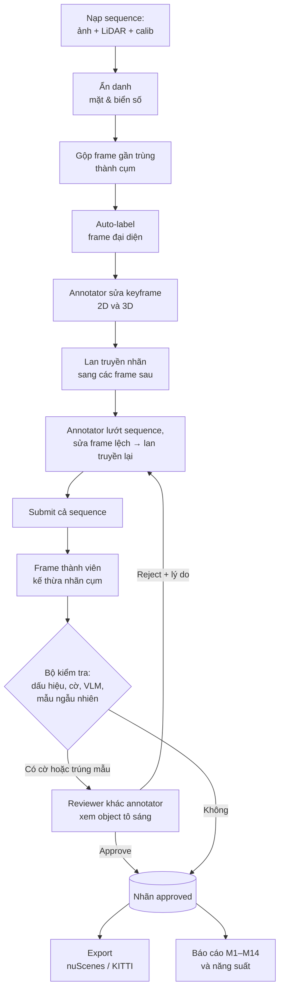
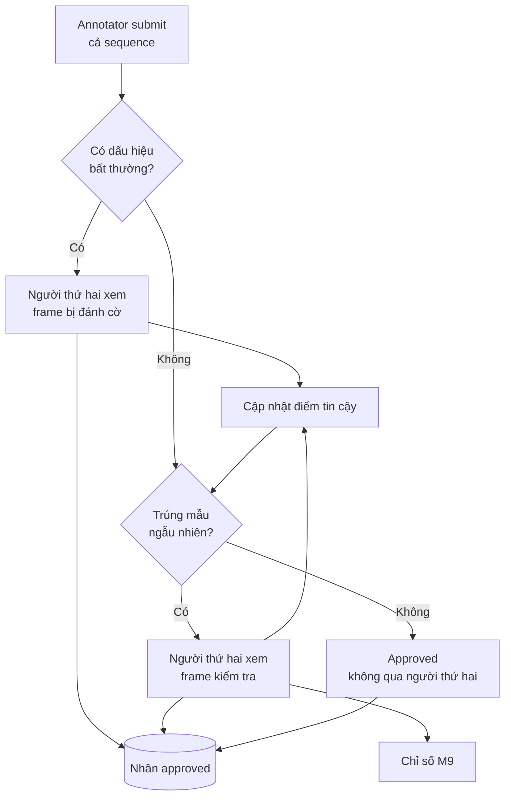
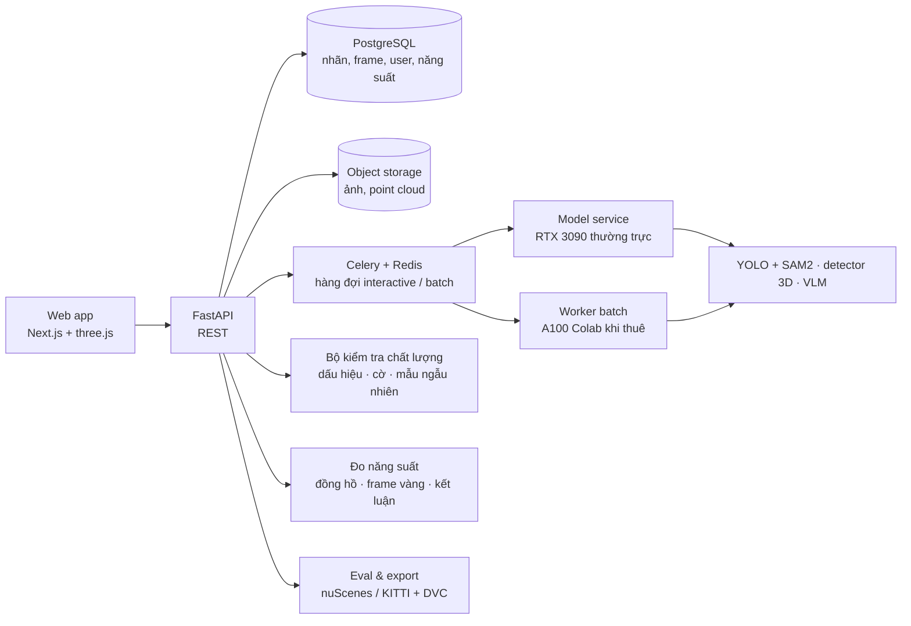

# PRD — AutoLabel 3D: Tự động gán nhãn Ảnh & LiDAR (human-in-the-loop)

2026-09-25 · Kiên · Nhóm 4 người · Thời lượng 6 tuần · cập nhật trạng thái triển khai 2026-09-30

## Thông tin tài liệu

| Mục | Nội dung |
| --- | --- |
| Tên đề tài | Công cụ tự động gán nhãn ảnh & LiDAR (2D/3D box, segmentation) với human-in-the-loop |
| Tên sản phẩm | AutoLabel 3D |
| Lĩnh vực | Perception cho xe tự hành — công cụ gán nhãn dữ liệu |
| Nhóm thực hiện | 4 thành viên (ML 2D, ML 3D, Backend, Frontend) |
| Thời lượng | 6 tuần, làm toàn bộ phạm vi trong kỳ |
| Hạ tầng | Kế hoạch: RTX 3090 (24 GB) chạy cả ngày làm model service thường trực; A100 trên Google Colab thuê thêm cho job nặng; backend và frontend chạy qua Docker. Thực tế (2026-09-30): một laptop RTX 4050 chạy web + suy luận 2D/3D, RTX 3090 dùng để fine-tune; có chế độ CPU; chưa dùng A100 |
| Phạm vi dữ liệu | Subset nuScenes mini / KITTI; dataset và danh sách lớp phương tiện mở rộng dần trong kỳ. Thực tế: nuScenes mini để demo, 27 scene val của nuScenes trainval để đánh giá (tách dev / held-out); trang Dự án nhận thêm KITTI, LiDAR + camera, video |
| Trạng thái | Bản hoàn chỉnh — ngưỡng các chỉ số chốt sau khi có baseline, cuối tuần 2. **2026-09-30:** MVP chạy đầu cuối (nạp dữ liệu → auto-label 2D/3D → QA chấm rủi ro → duyệt → lan truyền → xuất); còn thiếu đăng nhập / phân vai, gộp frame, VLM, mẫu ngẫu nhiên, đo năng suất P/Q/E. Xem [Trạng thái triển khai](#trạng-thái-triển-khai-cập-nhật-2026-09-30) |

## Mục lục

1. [Tóm tắt](#tóm-tắt)
2. [Bối cảnh và vấn đề](#bối-cảnh-và-vấn-đề)
3. [Mục tiêu và chỉ số thành công](#mục-tiêu-và-chỉ-số-thành-công)
4. [Phạm vi](#phạm-vi)
5. [Sản phẩm cần nộp](#sản-phẩm-cần-nộp)
6. [Người dùng và vai trò](#người-dùng-và-vai-trò)
7. [Chân dung người dùng và user stories](#chân-dung-người-dùng-và-user-stories)
8. [Luồng người dùng chính](#luồng-người-dùng-chính)
9. [Luồng duyệt và kiểm soát chất lượng](#luồng-duyệt-và-kiểm-soát-chất-lượng)
10. [Xử lý video](#xử-lý-video)
11. [Đo năng suất annotator](#đo-năng-suất-annotator)
12. [Yêu cầu chức năng](#yêu-cầu-chức-năng)
13. [Tiêu chí chấp nhận chi tiết](#tiêu-chí-chấp-nhận-chi-tiết)
14. [Tình huống biên và cách xử lý](#tình-huống-biên-và-cách-xử-lý)
15. [Yêu cầu phi chức năng](#yêu-cầu-phi-chức-năng)
16. [Hạ tầng tính toán](#hạ-tầng-tính-toán)
17. [Kiến trúc và công nghệ](#kiến-trúc-và-công-nghệ)
18. [Đặc tả API và schema](#đặc-tả-api-và-schema)
19. [Mô hình dữ liệu và định dạng nhãn](#mô-hình-dữ-liệu-và-định-dạng-nhãn)
20. [Công thức đo và hàm tính điểm](#công-thức-đo-và-hàm-tính-điểm)
21. [Kế hoạch đánh giá](#kế-hoạch-đánh-giá)
22. [Kịch bản demo và danh sách màn hình](#kịch-bản-demo-và-danh-sách-màn-hình)
23. [Kế hoạch 6 tuần cho 4 người](#kế-hoạch-6-tuần-cho-4-người)
24. [Rủi ro và giả định](#rủi-ro-và-giả-định)
25. [Hướng mở rộng sau kỳ này](#hướng-mở-rộng-sau-kỳ-này)
26. [Checklist nghiệm thu](#checklist-nghiệm-thu)
27. [Trạng thái triển khai (cập nhật 2026-09-30)](#trạng-thái-triển-khai-cập-nhật-2026-09-30)
28. [Công cụ và lệnh](#công-cụ-và-lệnh)

## Tóm tắt

AutoLabel 3D là công cụ web sinh nhãn sơ bộ cho ảnh và point cloud bằng mô hình pretrained, rồi đưa nhãn đó vào giao diện để annotator và reviewer sửa, xác nhận trước khi nhãn được dùng cho tập train.

Sản phẩm làm việc ở hai mức hạt. Với một frame: tự sinh 2D box, segmentation mask và 3D box; sửa được ở cả hai không gian với chiếu 2D↔3D; duyệt bởi người khác người gán; xuất theo chuẩn nuScenes/KITTI. Với cả một sequence video: gộp các frame gần trùng để không làm một việc nhiều lần, annotator chỉ gán frame đầu rồi hệ thống lan truyền nhãn sang các frame sau, và khi annotator xong việc thì các nhãn máy chưa ai kiểm mà có confidence thấp — hoặc bị VLM nghi sai lớp — được đánh cờ cho một reviewer khác xem.

Giá trị đo được của sản phẩm là thời gian gán nhãn giảm so với làm thủ công, với điều kiện chất lượng nhãn cuối không giảm. Vì vậy PRD coi thời gian mỗi frame, tỷ lệ nhãn tự động phải sửa và tỷ lệ nhãn kém lọt qua là tiêu chí nghiệm thu chính, không phải số lượng tính năng. Năng suất của từng annotator cũng được đo và kết luận đạt hay chưa đạt ngưỡng — luôn đi kèm chất lượng, để làm nhanh bằng cách làm ẩu không bao giờ được tính là đạt.

**Cập nhật 2026-09-30.** MVP đã chạy đầu cuối trên web. Phần đã làm khác kế hoạch ở ba điểm chính: duyệt theo ngoại lệ ở mức box (QA Agent chấm rủi ro từng box, box rủi ro thấp duyệt theo lô) thay cho bộ kiểm tra sau submit; lan truyền 2D bằng tracker + optical flow thay cho SAM2 video; chạy trên một GPU laptop thay cho 3090 + A100. Trạng thái từng yêu cầu ở cột cuối bảng [Yêu cầu chức năng](#yêu-cầu-chức-năng); số đo và phần còn thiếu ở mục [Trạng thái triển khai](#trạng-thái-triển-khai-cập-nhật-2026-09-30).

Hệ thống chỉ xử lý dữ liệu đã ghi, không điều khiển phương tiện và không có thành phần thời gian thực trên xe. Mọi frame đều qua tay ít nhất một người trước khi được approved; frame bị cờ hoặc trúng mẫu kiểm tra thì qua thêm một người thứ hai. Không nhãn nào được xuất khi frame chưa approved.

## Bối cảnh và vấn đề

Gán nhãn dữ liệu perception là khâu tốn kém nhất trong vòng đời một mô hình AV. Một frame đầy đủ gồm 2D box và segmentation trên ảnh, cộng 3D box trên point cloud, và phải nhất quán giữa hai không gian đó. Dữ liệu lại đến theo sequence: hàng trăm frame liên tiếp của cùng một cảnh.

Năm vấn đề cụ thể mà sản phẩm nhắm tới:

1. **Chi phí thời gian.** Vẽ thủ công 3D box trên point cloud chậm hơn nhiều lần so với 2D box, vì annotator phải xoay góc nhìn và ước lượng kích thước, hướng (yaw) từ tập điểm thưa.
2. **Công việc lặp trong video.** Các frame liền nhau chứa gần như cùng một tập vật thể; khi xe dừng đèn đỏ thì hàng chục frame gần như giống hệt. Gán từng frame là trả công — và trả GPU — nhiều lần cho cùng một thông tin.
3. **Không đồng nhất giữa người gán nhãn.** Cùng một vật thể, hai annotator cho ra box lệch nhau về biên và lớp, kéo chất lượng tập train xuống mà không ai đo được độ lệch đó.
4. **Thiếu đồng bộ 2D–3D.** Nhãn ảnh và nhãn LiDAR thường làm rời ở hai công cụ, nên một vật thể có thể mang ID hay lớp khác nhau giữa hai modal.
5. **Duyệt tốn công mà vẫn lọt lỗi.** Duyệt lại toàn bộ thì gấp đôi chi phí; không duyệt thì không biết lỗi ở đâu. Reviewer cần được chỉ đúng chỗ đáng ngờ.

Hướng giải quyết là đảo ngược vai trò của người: thay vì vẽ từ đầu, người chỉ sửa và duyệt đề xuất của máy, và máy chỉ ra cho người những chỗ nó không chắc. Human-in-the-loop là bắt buộc chứ không phải tùy chọn: mô hình pretrained không đủ tin cậy để nhãn đi thẳng vào tập train, còn người thì không cần làm lại phần máy đã làm đúng.

## Mục tiêu và chỉ số thành công

Mục tiêu sản phẩm: giảm thời gian gán nhãn một frame camera + LiDAR và một sequence video mà không làm giảm chất lượng nhãn cuối cùng, và làm cho cả chất lượng lẫn năng suất trở nên đo được.

| # | Chỉ số | Cách đo | Cách đọc | Hiện có (2026-09-30) |
| --- | --- | --- | --- | --- |
| M1 | Thời gian gán nhãn mỗi frame | Đồng hồ thao tác trong app, từ lúc mở frame tới lúc submit, chỉ tính thời gian đang thao tác | Giảm so với baseline thủ công của chính nhóm | Có thời gian duyệt mỗi frame từ log thao tác (tab Metrics, CSV). Chưa có baseline thủ công và A/B |
| M2 | mAP của nhãn tự động 3D | So với ground truth của dataset, IoU 3D ≥ 0.5 và 0.7 | Báo cáo theo từng lớp | Tập test 24 scene (957 keyframe): ensemble 4 mô hình LiDAR + track mAP 0.668 / NDS 0.713; CenterPoint voxel đơn 0.578 / 0.655. AP từng lớp: `eval/results/det3d_heldout.md` |
| M3 | mAP của nhãn tự động 2D | So với ground truth, IoU 2D ≥ 0.5 và 0.7 | Báo cáo theo từng lớp | YOLOE-26L zero-shot mAP50: dev 0.395 (119 keyframe), held-out 0.452 (40 keyframe) |
| M4 | Tỷ lệ nhãn phải sửa | Số object bị người chỉnh hoặc xóa / tổng object máy sinh, tách theo nguồn model / propagated / inherited | Theo dõi xu hướng giảm dần | Tính từ log thao tác thật (tab Metrics). Chưa có phiên duyệt thật đủ lớn để báo số |
| M5 | Chất lượng sau khi duyệt | IoU trung bình của nhãn đã approve so với ground truth | Không thấp hơn nhánh làm thủ công | Chưa đo (cần A/B) |
| M6 | Độ trễ auto-label một frame | Từ lúc bấm nút tới lúc nhãn hiển thị, trên RTX 3090 | Mục tiêu ≤ 5 giây | Laptop RTX 4050: 2D ~1 s/frame; 3D ~3.1 s dự đoán + ~1.1 s kiểm chứng. CPU: detect 2D 17.7 s/frame |
| M7 | Ẩn danh | Tỷ lệ khuôn mặt / biển số được làm mờ trong ảnh hiển thị | Đo trên tập kiểm thử thủ công | Đã làm mờ phía server; chưa đo tỷ lệ trên tập kiểm thử |
| M8 | Tỷ lệ frame không cần người thứ hai | Số frame đi thẳng sang approved / tổng frame submit | Càng cao càng tiết kiệm, chỉ có nghĩa khi đọc cùng M9 | Chưa đo ở mức frame. Ở mức box: QA 3D đưa 51% box vào nhóm duyệt theo lô, 93% trong đó đúng |
| M9 | Tỷ lệ nhãn kém lẽ ra đã lọt | Chỉ trên frame trúng mẫu ngẫu nhiên: số frame người duyệt phải sửa / số frame được kiểm tra | Phải thấp; đây là cái giá của M8 | Chưa có mẫu ngẫu nhiên. Lỗi lọt qua duyệt theo lô đo bằng người duyệt mô phỏng theo GT (`eval/results/temporal/report.md`) |
| M10 | Số object người phải chạm mỗi frame | Tổng object được tạo, sửa hoặc xóa tay trong sequence / số frame của sequence | So có lan truyền với chỉ có tracking | Đo bằng người duyệt mô phỏng, có / không lan truyền (`eval/review_simulation.ipynb`) |
| M11 | Tỷ lệ gộp và chất lượng nhãn kế thừa | Số frame thành viên / tổng frame; IoU của nhãn kế thừa so với ground truth | IoU nhãn kế thừa không được thấp rõ so với frame đại diện | Chưa (chưa gộp frame) |
| M12 | Precision của cờ | Số object bị cờ mà reviewer phải sửa hoặc xóa / tổng object bị cờ; tách cờ confidence và cờ VLM | Quyết định ngưỡng cờ và việc bật VLM mặc định | Tab Metrics có precision từng loại cờ từ thao tác thật. QA 3D bắt 86% box sai. Chưa có VLM |
| M13 | GPU-giờ tiết kiệm | Số frame không phải auto-label × thời gian auto-label trung bình, quy ra giờ 3090 và giờ A100 | Đọc cùng M11 | Chưa (chưa gộp frame) |
| M14 | Năng suất annotator | Chỉ số năng suất P của từng người mỗi kỳ và tỷ lệ người-kỳ đạt ngưỡng | Xem mục Đo năng suất annotator | Có frame/giờ theo người và theo phiên; chưa có P, Q2D, Q3D, E |

Ngưỡng đạt cho các chỉ số chưa chốt. Cách đặt hợp lý nhất là đợi đủ hai số gốc — baseline thời gian gán nhãn thủ công (tuần 1) và mAP của mô hình pretrained trên dataset đã chọn (tuần 2) — rồi chốt ngưỡng cuối tuần 2 và ghi ngược vào bảng này. Đặt ngưỡng trước khi có hai số đó chỉ là đoán.

M1 và M14 phụ thuộc một baseline đo trước: tuần 1, mỗi thành viên gán nhãn thủ công ít nhất 5 frame, có đồng hồ thao tác. Không có số này thì không có gì để so.

**Non-goals.** Huấn luyện hay fine-tune mô hình mới; điều khiển phương tiện hay bất kỳ thành phần thời gian thực nào trên xe; đạt SOTA về độ chính xác detection; thay thế hoàn toàn annotator; hỗ trợ dataset ngoài nuScenes và KITTI.

## Phạm vi

Nhóm làm toàn bộ phạm vi dưới đây trong 6 tuần; không chia mức.

- **Nạp và tiền xử lý:** nạp frame hoặc cả sequence gồm ảnh camera + point cloud LiDAR + calibration từ subset nuScenes mini / KITTI; làm mờ khuôn mặt và biển số phía server; phát hiện và gộp các frame gần trùng trong một sequence.
- **Auto-label:** 2D box và segmentation mask trên ảnh; 3D box trên point cloud; chạy batch cả sequence có hàng đợi, tiến độ và checkpoint; tracking giữ `object_id` qua frame; lan truyền nhãn từ keyframe sang các frame sau; nội suy giữa hai keyframe; tối ưu throughput inference.
- **Sửa nhãn:** editor 2D và 3D (thêm, xóa, chỉnh biên, đổi lớp, chỉnh vị trí–kích thước–yaw); chiếu 2D↔3D và highlight hai chiều; dải sequence để xem cả đoạn video.
- **Duyệt và kiểm soát chất lượng:** hai vai trò annotator và reviewer; bộ kiểm tra sau submit; đánh cờ nhãn máy chưa ai chạm có confidence thấp; VLM kiểm tra lớp và vật thể bị sót; mẫu kiểm tra ngẫu nhiên mù; điểm tin cậy theo người; review theo object; duyệt theo lô; gán reviewer luân phiên; so sánh hai annotator.
- **Hàng đợi và năng suất:** xếp hạng frame khó lên trước (active learning); đo năng suất từng annotator và kết luận đạt hay chưa đạt ngưỡng; frame vàng có ground truth chèn mù vào hàng đợi; thống kê theo người và theo phiên.
- **Xuất và báo cáo:** xuất nhãn đã duyệt theo nuScenes hoặc KITTI; phiên bản hóa bằng DVC; trang báo cáo cho mọi chỉ số M1–M14.

**Ngoài phạm vi kỳ này.**

- Huấn luyện lại mô hình từ nhãn đã duyệt; active learning dừng ở xếp hạng frame khó.
- Nhiều người cùng sửa một frame theo thời gian thực.
- 3D semantic segmentation trên point cloud; chỉ làm 3D box.
- Nhiều camera mỗi frame; chỉ một camera.
- Triển khai production, SSO, phân quyền chi tiết, audit log đầy đủ.

Ranh giới quan trọng nhất: hệ thống chỉ xử lý dữ liệu đã ghi. Không có module nào gắn vào phương tiện đang chạy, không có đầu ra nào đi vào hệ điều khiển.

## Sản phẩm cần nộp

Bảng dưới ánh xạ từng yêu cầu nộp của đề tài sang yêu cầu chức năng tương ứng, để không sót mục nào khi nghiệm thu.

| Yêu cầu đề bài | Yêu cầu chức năng | Tuần hoàn thành |
| --- | --- | --- |
| Web tool nạp frame ảnh + LiDAR | FR-01, FR-02 | 2–3 |
| Tự sinh box và segmentation sơ bộ | FR-06, FR-07 | 2 |
| Giao diện sửa nhãn 2D và 3D | FR-16 → FR-23 | 3–4 |
| Xuất nhãn chuẩn nuScenes/KITTI | FR-43, FR-44 | 4 |
| Ít nhất 2 vai trò (annotator, reviewer) | FR-25, FR-26, FR-36 | 4 |
| Báo cáo IoU/mAP so ground truth | FR-46 | 5 |
| Auto-label batch cả sequence, đồng bộ 2D–3D | FR-09 | 3 |
| Tracking object qua frame | FR-10, FR-14 | 4 |
| Tối ưu throughput inference | FR-15 | 5 |
| Thống kê năng suất và độ chính xác | FR-39 → FR-42 | 5 |
| Active learning ưu tiên frame khó | FR-38 | 6 |

Ngoài các mục đề bài, sản phẩm có thêm lan truyền nhãn (FR-11 → FR-13), gộp frame gần trùng (FR-04, FR-05), luồng duyệt có đánh cờ (FR-28 → FR-35) và VLM kiểm tra chất lượng (FR-30, FR-31). Đây là phần giảm công sức người lớn nhất trên dữ liệu video.

## Người dùng và vai trò

| Vai trò | Mục tiêu khi dùng | Được làm | Không được làm |
| --- | --- | --- | --- |
| Annotator | Sửa nhãn máy cho đúng, nhanh nhất có thể | Chạy auto-label và lan truyền, sửa/thêm/xóa nhãn 2D và 3D, tách cụm frame, submit; xem năng suất của chính mình | Approve frame của chính mình, xuất dữ liệu, xem năng suất người khác |
| Reviewer | Đảm bảo nhãn đủ chất lượng trước khi vào tập train | Xem frame được kéo vào review, giữ/sửa/xóa object, approve hoặc reject kèm lý do, xuất dữ liệu | Duyệt frame do chính mình sửa |
| ML Engineer (kiêm quản lý gán nhãn) | Theo dõi chất lượng mô hình, năng suất và chi phí | Xem báo cáo M1–M14, xem kết luận năng suất của mọi người, chỉnh ngưỡng, chọn checkpoint, chạy batch, bật/tắt VLM, xuất dữ liệu | Sửa nhãn đã approve mà không đổi trạng thái frame |

Trong đồ án, bốn thành viên đổi vai cho nhau giữa các sequence. Quy tắc human-in-the-loop áp ở tầng backend, không chỉ ở giao diện:

- Nhãn do máy sinh mang nguồn `model`, `propagated` hoặc `inherited` và không bao giờ được xuất khi frame chưa approved.
- API export chỉ trả về frame ở trạng thái `approved`.
- Mỗi frame `approved` ghi lại ai submit, ai duyệt (nếu có), duyệt lúc nào và frame đi đường nào (qua người thứ hai hay qua bộ kiểm tra).
- Người duyệt phải khác người gán nhãn.

## Chân dung người dùng và user stories

**Persona 1 — Annotator.** Sinh viên hoặc nhân viên gán nhãn, làm theo ca vài giờ liên tục trên cùng một màn hình. Quen 2D box, lúng túng với point cloud. Sợ nhất là mất công đã làm vì trình duyệt treo hoặc bấm nhầm. Muốn biết mình đang làm đủ nhanh và đủ đúng chưa, và vì sao.

**Persona 2 — Reviewer.** Thành viên nắm tiêu chuẩn nhãn, duyệt việc của người khác. Cần được chỉ thẳng tới chỗ đáng ngờ thay vì soát lại từng object, và cần lý do từ chối đến đúng người gán nhãn.

**Persona 3 — ML Engineer.** Người dùng tập nhãn để train và quản lý nhóm gán nhãn. Quan tâm chất lượng và truy vết (nhãn do mô hình nào sinh, ai duyệt, phiên bản dataset nào), chi phí GPU, và ai trong nhóm cần hỗ trợ.

| Mã | Vai trò | Mong muốn | Để mà |
| --- | --- | --- | --- |
| US-01 | Annotator | Mở một frame và thấy ngay nhãn sơ bộ trên cả ảnh và point cloud | Tôi sửa thay vì vẽ lại từ đầu |
| US-02 | Annotator | Điều chỉnh ngưỡng confidence để ẩn nhãn rác | Khung hình không bị phủ kín bởi box sai |
| US-03 | Annotator | Chọn một object ở khung ảnh và thấy nó sáng lên trong point cloud | Tôi biết hai bên đang nói về cùng một vật thể |
| US-04 | Annotator | Chỉnh vị trí, kích thước và hướng của 3D box bằng chuột hoặc nhập số | Tôi sửa được box lệch mà không phải xóa đi vẽ lại |
| US-05 | Annotator | Được lưu nháp tự động | Mất mạng hay lỡ tải lại trang không mất công đã làm |
| US-06 | Annotator | Chỉ gán frame đầu của sequence, các frame sau có nhãn sẵn | Tôi không phải gán cùng một chiếc xe hàng chục lần |
| US-07 | Annotator | Sửa một frame giữa chừng thì các frame sau cập nhật theo, không đè lên chỗ tôi đã sửa | Công của tôi không bị máy ghi đè |
| US-08 | Annotator | Các frame gần như giống hệt được gộp lại | Tôi không phải duyệt lại những frame trùng |
| US-09 | Annotator | Gửi đi và thấy lý do khi bị trả về | Tôi sửa đúng chỗ reviewer chê |
| US-10 | Annotator | Xem mình đạt ngưỡng năng suất chưa và chỉ số nào kéo xuống | Tôi biết cần cải thiện tốc độ hay độ chính xác |
| US-11 | Reviewer | Mở frame là nhảy thẳng tới object đáng ngờ, kèm dấu vết chỉnh sửa | Tôi không phải soát lại cả frame |
| US-12 | Reviewer | Approve hoặc reject kèm lý do | Nhãn kém không lọt vào tập train |
| US-13 | Reviewer | Xuất nhãn đã duyệt theo chuẩn nuScenes/KITTI | Nhóm dùng được ngay bằng devkit có sẵn |
| US-14 | ML Engineer | Xem mAP/IoU của nhãn tự động so với ground truth | Tôi biết mô hình pretrained đang giúp được đến đâu |
| US-15 | ML Engineer | Chạy auto-label cả một sequence trên A100 rồi quay lại xem kết quả | Tôi không phải ngồi bấm từng frame |
| US-16 | ML Engineer | Thấy frame trùng không bị chạy auto-label và GPU-giờ tiết kiệm được | Tôi kiểm soát được chi phí thuê A100 |
| US-17 | ML Engineer | Xem ai đạt, ai chưa đạt ngưỡng năng suất và vì sao | Tôi biết ai cần hỗ trợ và hỗ trợ về mặt nào |
| US-18 | ML Engineer | Hàng đợi đưa frame khó lên trước | Công sức của người đổ vào chỗ mô hình yếu nhất |

## Luồng người dùng chính



Annotator mở sequence và thấy nó đã được chia thành các cụm frame gần trùng. Annotator chạy auto-label cho frame đầu, sửa cho đúng, bấm lan truyền; các frame sau có nhãn sẵn. Annotator lướt dải sequence, sửa những frame lệch — mỗi lần sửa, lan truyền chạy lại từ frame đó — rồi submit cả sequence. Bộ kiểm tra quyết định frame nào cần người thứ hai; frame bị reject quay về annotator kèm lý do.

Ba điểm cần giữ đúng trong luồng này:

- Ẩn danh chạy trước khi ảnh được trả về trình duyệt, không làm mờ ở phía client.
- Đồng hồ thao tác chỉ chạy khi annotator đang làm việc: dừng khi tab mất focus quá 60 giây hoặc không có thao tác nào quá 120 giây.
- Mỗi lần chạy lại auto-label hoặc lan truyền trên frame đã có người sửa phải hỏi xác nhận, nói rõ số object sẽ bị ảnh hưởng; object nguồn `human` không bao giờ bị ghi đè.

## Luồng duyệt và kiểm soát chất lượng

Duyệt không phải một bước cố định. Mặc định annotator sửa xong thì frame sang `approved`. Người thứ hai chỉ được gọi vào trong hai trường hợp: frame trúng mẫu kiểm tra ngẫu nhiên, hoặc bộ kiểm tra sau submit thấy dấu hiệu bất thường.

**Nguyên tắc: chấm phần việc của người, và chấm output của máy mà chưa người nào kiểm — không chấm output của máy mà người đã sửa.** Confidence thấp chỉ có nghĩa object khó, mà object khó thì annotator thường đã sửa rồi; sửa xong nó không còn là nhãn của máy nữa. Lấy confidence thấp của những nhãn đó để bắt review là phạt người ta vì được giao frame khó, và với mô hình pretrained thì gần như frame nào cũng bị bắt. Ngược lại, nhãn lan truyền, nhãn kế thừa hay nhãn model mà annotator chỉ lướt qua, chưa sửa, vẫn là sản phẩm của máy — confidence thấp của chúng là tín hiệu hợp lệ.



Sáu dấu hiệu bất thường. Bốn dấu hiệu đầu nói về việc người làm, hai dấu hiệu sau nói về nhãn máy chưa ai kiểm:

1. **Sửa ít hơn mức frame đòi hỏi.** Frame có N object confidence dưới 0.62 nhưng annotator đụng vào dưới 40% số đó.
2. **Xong nhanh bất thường.** Thời gian thao tác dưới 45% thời gian kỳ vọng của frame đó (công thức ở mục Đo năng suất annotator).
3. **Còn object chưa ghép cặp 2D–3D khi gửi đi.**
4. **Không thêm object nào** trong khi frame cùng cảnh thường còn vật thể model bỏ sót.
5. **Còn nhãn máy chưa ai chạm có confidence thấp.** Object có `edited = false`, nguồn `model`, `propagated` hoặc `inherited`, và confidence (c\_prop với nhãn lan truyền, confidence detector với nhãn model) dưới ngưỡng cờ τ\_flag.
6. **VLM bất đồng lớp.** VLM chọn lớp khác lớp đang gán cho một object chưa ai chạm hoặc vừa bị đổi lớp.

**Thời điểm chấm.** Sau khi annotator submit cả sequence, không chấm từng frame — vì annotator có thể sửa ở frame sau và lan truyền lại làm frame trước tốt lên.

**Review theo object.** Reviewer luôn khác annotator và được gán luân phiên, không ai làm reviewer toàn thời gian. Mở frame là nhảy thẳng tới các object được tô sáng; với mỗi object, reviewer giữ, sửa hoặc xóa. Sửa object nào thì lan truyền lại từ frame đó để các frame sau hưởng luôn. Frame kéo vào cùng đợt được xem dạng lưới thumbnail + BEV để approve theo lô, mở riêng frame nào thấy ngờ.

**Mẫu ngẫu nhiên.** Tỉ lệ mặc định 15%, điều chỉnh được, và thay đổi theo từng người: điểm tin cậy dưới 0.7 thì nhân đôi, dưới 0.4 thì kiểm tra hết. Mức giám sát vì vậy đi theo lịch sử từng người chứ không đồng loạt.

Bốn ràng buộc khiến thiết kế này đứng được:

- **Cold start.** Lúc đầu chưa có dữ liệu để chấm điểm ai, nên mọi frame đều bị kiểm tra; chỉ nới dần khi mỗi người đã có đủ số frame được duyệt sạch.
- **Mẫu ngẫu nhiên không bao giờ được tắt.** Nếu chỉ xem frame bị cờ thì không ai biết tỉ lệ sai trong đám đi thẳng, và hệ thống tự khen chính nó.
- **M9 chỉ tính trên frame trúng mẫu ngẫu nhiên**, không tính frame bị cờ. Frame bị cờ là mẫu thiên lệch; gộp vào sẽ thổi phồng tỉ lệ lỗi.
- **Mẫu ngẫu nhiên phải mù.** Mọi frame trong hàng đợi review, kể cả frame trúng mẫu ngẫu nhiên, đều có k object được tô sáng (với frame không có cờ, đó là k object chưa ai chạm có confidence thấp nhất), và reviewer chịu trách nhiệm cho cả frame. Lý do thật frame bị kéo vào chỉ hiện sau khi reviewer bấm xong. Biết trước là frame kiểm tra thì reviewer soát kỹ hơn bình thường và M9 mất giá trị.

### VLM kiểm tra chất lượng

VLM không sinh nhãn và không bao giờ tự sửa nhãn. Nó là người kiểm tra thứ hai, chỉ tạo cờ.

- **Kiểm lớp.** Cắt vùng ảnh quanh từng 2D box, hỏi VLM chọn một lớp trong taxonomy hiện hành. VLM không đồng ý thì object bị cờ với lý do VLM bất đồng lớp. Có ích nhất với các lớp phương tiện mới thêm trong kỳ — đúng chỗ detector pretrained yếu nhất.
- **Kiểm sót.** Đưa cả ảnh đã vẽ box, hỏi còn phương tiện hay người nào chưa có box. Kết quả là một vùng nghi ngờ hiển thị cho reviewer như một cờ.

VLM là một mô hình mã nguồn mở cỡ khoảng 7B (ứng viên: họ Qwen-VL hoặc InternVL, chốt sau spike tuần 3), chỉ nhận ảnh đã ẩn danh, và chỉ chạy trên object chưa ai chạm hoặc vừa đổi lớp — không chạy toàn bộ object, để giữ chi phí. VLM được bật mặc định khi precision cờ của nó (M12) trên tập đánh giá đạt ngưỡng nhóm chốt. Nếu phần lớn cờ VLM là báo nhầm, reviewer sẽ quen bỏ qua cờ — kể cả cờ đúng; khi đó VLM tắt và kết quả được trình bày như một phát hiện của đồ án.

## Xử lý video

Hai cơ chế làm cho một sequence rẻ hơn nhiều so với tổng các frame lẻ: gộp frame gần trùng và lan truyền nhãn. Gộp chạy trước để lan truyền và auto-label chỉ chạy trên frame đại diện.

### Gộp frame gần trùng

Hai frame liền nhau chỉ được coi là gần trùng khi thỏa **cả ba** điều kiện:

1. Ego gần như đứng yên: dịch chuyển dưới 0.2 m và quay dưới 1° giữa hai frame, tính từ ego pose.
2. Ảnh gần giống: khoảng cách embedding ảnh (hoặc SSIM) nằm trong ngưỡng.
3. Point cloud gần giống: sai khác Chamfer giữa hai point cloud đã downsample nằm trong ngưỡng.

Không được dùng mỗi điều kiện 1: xe mình đứng yên nhưng xe khác vẫn chạy qua. Điều kiện 3 bắt được trường hợp đó, vì vật thể đang chạy làm point cloud đổi rõ.

Chỉ gộp các frame liên tiếp, không gộp xuyên đoạn. Mỗi cụm tối đa 20 frame để lỗi không lan xa, và có một frame đại diện (frame giữa cụm). Chỉ frame đại diện được auto-label, lan truyền và gán nhãn; frame thành viên kế thừa nhãn với nguồn `inherited`. Export vẫn ghi đủ nhãn cho mọi frame thành viên — gộp chỉ tiết kiệm công sức và GPU, không làm thiếu dữ liệu. Annotator xem cụm trên dải sequence và tách cụm tại bất kỳ frame nào. Ngưỡng gộp mặc định để chặt, chỉ nới sau khi đo M11.

### Lan truyền nhãn từ keyframe

Annotator gán đầy đủ frame đầu (keyframe). Hệ thống lan truyền từng object sang các frame sau:

- **2D:** SAM2 ở chế độ video, khởi tạo từ mask của keyframe.
- **3D:** giữ nguyên w, l, h của box keyframe — xe là vật rắn, và người đã sửa kích thước thì máy không được đổi lại. Chỉ cập nhật x, y, z, yaw: dự đoán bằng bù chuyển động ego (ego pose có sẵn trong nuScenes/KITTI) cộng mô hình chuyển động hằng tốc của object, rồi hiệu chỉnh theo box detector khớp nhất về IoU 3D.
- Object mới xuất hiện giữa chừng lấy từ detector như bình thường, nguồn `model`, và được tracking nối `object_id`.

**Dừng lan truyền.** Mỗi object dừng khi confidence lan truyền c\_prop tụt dưới ngưỡng dừng, hoặc khi ra khỏi tầm nhìn camera và vùng LiDAR. Không lan truyền mù tới hết sequence.

**Sửa giữa chừng.** Annotator sửa một object ở frame k thì frame k thành keyframe của object đó và lan truyền chạy lại từ k về sau. Frame nào đã có người sửa object đó thì không bị ghi đè — lan truyền dừng tại đó; đoạn nằm giữa hai keyframe dùng nội suy.

**Tracking và nội suy.** Tracking ghép box giữa hai frame liền nhau theo IoU 3D để giữ `object_id` ổn định; nội suy điền box cho đoạn giữa hai keyframe người đã sửa. Cả hai đánh dấu nhãn sinh ra là nguồn máy, nên cũng đi qua dấu hiệu 5.

## Đo năng suất annotator

Mục tiêu: với từng annotator, theo từng kỳ đo (mặc định một tuần, xem được theo từng ca), trả lời rõ **đạt hay chưa đạt ngưỡng năng suất** — mà không bao giờ thưởng cho việc làm nhanh bằng cách làm ẩu.

Bốn nguyên tắc:

1. **Năng suất và chất lượng đo cùng lúc.** Chỉ kết luận đạt khi cả hai qua ngưỡng.
2. **Chuẩn hóa theo khối lượng việc.** Frame 20 xe không so với frame 2 xe; nhãn lan truyền hay kế thừa đã đúng sẵn không được tính là công của người.
3. **Chỉ tính thời gian thao tác thật.** Đồng hồ dừng khi tab mất focus quá 60 giây hoặc không có thao tác nào quá 120 giây.
4. **Đủ mẫu mới kết luận.** Kỳ có dưới 20 frame thì kết luận là chưa đủ dữ liệu, không phải chưa đạt.

**Thời gian kỳ vọng mỗi frame.** Hồi quy tuyến tính trên dữ liệu baseline tuần 1–2 của cả nhóm:

```latex
\hat{T}(f) = t_0 + t_{add}\,n_{add}(f) + t_{fix}\,n_{fix}(f) + t_{chk}\,n_{chk}(f)
```

Trong đó n\_add là số object phải tạo mới, n\_fix là số object phải sửa (theo định nghĩa của M4), n\_chk là số object chỉ cần kiểm mà không sửa. Các hệ số fit lại mỗi khi dataset hoặc taxonomy mở rộng.

**Chỉ số năng suất** của annotator u trong kỳ là tỉ số giữa thời gian kỳ vọng và thời gian thực tế trên các frame người đó làm; P = 1 là đúng mức kỳ vọng, P = 1.3 là nhanh hơn 30%:

```latex
P_u = \frac{\sum_{f \in F_u} \hat{T}(f)}{\sum_{f \in F_u} T(f)}
```

**Chất lượng** đo trên hai nguồn không phụ thuộc lời khai của chính annotator:

- **Frame vàng:** frame có ground truth của dataset, chèn mù vào hàng đợi với tỉ lệ 5–10%, trông giống hệt frame thường. Q2D và Q3D là IoU trung bình 2D và 3D của nhãn annotator so với ground truth trên các frame này. Nhãn trên frame vàng chỉ dùng để đo, không đi vào export.
- **Tỉ lệ lỗi E:** số frame của người đó bị người thứ hai sửa hoặc trả về trong mẫu ngẫu nhiên, chia cho số frame được kiểm tra.

Vì n\_fix đếm từ log chỉnh sửa, người bỏ qua lỗi sẽ có thời gian kỳ vọng thấp đi — nhưng cũng chính người đó sẽ trượt Q và E. Đây là lý do cổng chất lượng là bắt buộc, không phải phụ.

**Kết luận mỗi kỳ:**

| Năng suất (P ≥ τ\_P) | Chất lượng (Q2D ≥ τ\_Q2D, Q3D ≥ τ\_Q3D, E ≤ τ\_E) | Kết luận |
| --- | --- | --- |
| Đạt | Đạt | **Đạt ngưỡng** |
| Đạt | Không đạt | Chưa đạt — nhanh nhưng chưa đủ chính xác |
| Không đạt | Đạt | Chưa đạt — chính xác nhưng chưa đủ nhanh |
| Không đạt | Không đạt | Chưa đạt |
| Dưới 20 frame trong kỳ | — | Chưa đủ dữ liệu |

**Ngưỡng khởi điểm:** τ\_P = 1.0; τ\_Q2D = 0.80; τ\_Q3D = 0.70; τ\_E = 10%. Đây là giá trị để hệ thống chạy được ngay; nhóm chốt lại cuối tuần 2 dựa trên baseline của chính mình và ghi ngược vào đây. Ngưỡng chỉnh được trong cấu hình, và mỗi kết luận lưu kèm bộ ngưỡng đã dùng để so được giữa các kỳ.

**Hiển thị.** Annotator thấy kết luận của chính mình kèm chỉ số nào kéo xuống; ML Engineer thấy của mọi người. Kết luận dùng để biết ai cần hỗ trợ về tốc độ hay độ chính xác, không tự động thay đổi quyền hay hàng đợi của ai. Điểm tin cậy dùng cho mẫu ngẫu nhiên (FR-33) là một cơ chế riêng, không lấy từ kết luận năng suất.

## Yêu cầu chức năng

Tất cả yêu cầu dưới đây nằm trong phạm vi 6 tuần. Cột "Trạng thái" cập nhật ngày 2026-09-30: 18 Xong, 14 Một phần, 14 Chưa.

| ID | Yêu cầu | Tiêu chí chấp nhận | Trạng thái (2026-09-30) |
| --- | --- | --- | --- |
| FR-01 | Nạp một frame gồm ảnh, point cloud (.pcd/.bin) và calibration | Upload sai định dạng báo lỗi rõ; frame hợp lệ hiển thị được cả hai khung trong 3 giây | Xong — trang Dự án nhận zip nuScenes, KITTI (.bin + calib), LiDAR + camera (.pcd/.bin), video; sai định dạng báo lỗi |
| FR-02 | Chọn frame hoặc sequence từ subset nuScenes mini / KITTI đã nạp sẵn | Danh sách có trạng thái và người đang xử lý | Một phần — hàng đợi frame và danh sách video / scene có trạng thái; chưa có "người đang xử lý" (không đăng nhập) |
| FR-03 | Ẩn danh khuôn mặt và biển số trên ảnh trước khi hiển thị | Ảnh trả về client đã bị làm mờ; đạt M7 | Xong — biển số bằng detector chuyên dụng, mặt bằng YOLOE, làm ở server, có cache. Ảnh BEV ghép chưa làm mờ |
| FR-04 | Phát hiện frame gần trùng theo ego pose + ảnh + point cloud, gộp thành cụm liên tiếp | Cụm tối đa 20 frame; ego đứng yên nhưng có xe khác chạy qua thì không bị gộp | Chưa |
| FR-05 | Frame thành viên kế thừa nhãn của frame đại diện; tách cụm bằng tay | Frame thành viên không chạy auto-label; export có đủ nhãn cho từng frame | Chưa |
| FR-06 | Auto-label 2D: box + segmentation mask trên ảnh | Trả về danh sách object có lớp, box, mask, confidence | Xong — YOLOE-26 seg: box + mask đa giác + score |
| FR-07 | Auto-label 3D: box trên point cloud | Trả về box dạng (x, y, z, w, l, h, yaw), lớp, confidence | Xong — MMDetection3D (CenterPoint, PointPillars, SSN, FCOS3D, PGD); mặc định gộp 4 mô hình LiDAR + tinh chỉnh theo track |
| FR-08 | Ngưỡng confidence điều chỉnh được để lọc nhãn tự động | Thanh trượt 0–1, số object hiển thị đổi ngay | Xong — thanh "Score ≥" ở UI 2D và 3D |
| FR-09 | Auto-label batch cả sequence, có hàng đợi, tiến độ và checkpoint | Worker A100 bị ngắt thì job chạy tiếp từ frame dở, trên A100 mới hoặc trên 3090 | Xong — dự án chạy nền từng bước, có tiến độ; cache detection theo frame; dự án dở tự chạy tiếp khi server khởi động lại. Một GPU local, không có worker A100 |
| FR-10 | Tracking: giữ object\_id ổn định qua các frame | Cùng một xe giữ nguyên id qua ít nhất 10 frame liên tiếp; người tách và gộp được id | Một phần — `track_id` giữ qua lan truyền 2D / 3D và khi xuất nuScenes; chưa tách / gộp id bằng tay |
| FR-11 | Lan truyền nhãn từ keyframe: 2D bằng SAM2 video, 3D giữ kích thước và bù chuyển động ego | Gán xong frame đầu của sequence 20 frame thì mọi object còn trong tầm nhìn có nhãn nguồn propagated ở các frame sau | Xong, khác cách làm — 2D: tracker trên ảnh 12 Hz dùng detection + optical flow + ghép kiểu ByteTrack (không SAM2); 3D: giữ kích thước người đặt, bù chuyển động xe + vận tốc, khớp detection theo khoảng cách tâm |
| FR-12 | Sửa object ở frame giữa thì frame đó thành keyframe và lan truyền chạy lại về sau | Không ghi đè object người đã sửa ở bất kỳ frame nào | Xong — approve frame nào thì lan truyền lại từ frame đó; dừng trước frame người đã mở nên không ghi đè |
| FR-13 | Confidence lan truyền c\_prop cho từng nhãn; dừng lan truyền dưới ngưỡng dừng | Mỗi nhãn propagated có prop\_conf; object bị che hẳn thì dừng chứ không trôi theo vật khác | Xong — c_prop cho từng nhãn lan truyền (cờ `PROP_LOW_CONF`, `PROP_COASTING`); track mất detection quá số ảnh cho phép thì dừng |
| FR-14 | Nội suy box giữa hai keyframe | Các frame giữa được điền và đánh dấu nguồn máy | Chưa — thay bằng lan truyền tiến |
| FR-15 | Tối ưu throughput inference: half precision, batch nhiều frame, cache kết quả theo frame | Báo cáo frame/giờ trên 3090 và A100, trước và sau tối ưu | Một phần — half precision, cache detection theo frame, đo thời gian từng bước và frame/giờ auto-label; chưa có bảng trước / sau tối ưu trên 3090 / A100 |
| FR-16 | Chiếu 3D box xuống ảnh và gợi ý ghép cặp với 2D box | Cặp có IoU chiếu ≥ 0.5 được ghép tự động; người sửa được cặp ghép | Một phần — box 3D chiếu xuống 6 camera và được kiểm chứng tự động bằng detector 2D; chưa ghép cặp bằng tay |
| FR-17 | Chọn object ở một khung thì khung kia highlight object tương ứng | Hai chiều, độ trễ dưới 200 ms | Một phần — chọn box 3D thì box chiếu sáng trên ảnh camera (tự chọn camera tốt nhất); chiều ảnh → 3D chưa có |
| FR-18 | Editor 2D: thêm, xóa, kéo biên box, đổi lớp | Thao tác bằng chuột; có undo/redo | Xong — thêm, xoá, kéo, đổi lớp, undo / redo 50 bước; sửa được cả ở sweep t−2…t+2 |
| FR-19 | Editor 2D cho mask: tô thêm, xóa bớt bằng brush | Brush đổi kích thước được | Chưa |
| FR-20 | Viewer 3D: xem point cloud, xoay, zoom, chọn box | Hiển thị mượt ở mức khoảng 100k điểm | Xong — three.js, màu theo độ cao, nền ảnh BEV ghép 6 camera |
| FR-21 | Chỉnh vị trí, kích thước và yaw của 3D box | Có cả gizmo kéo và ô nhập số; có chế độ nhìn từ trên xuống (BEV) | Xong — kéo / đổi cỡ / xoay trên BEV, phím, ô nhập số, co khít theo điểm LiDAR |
| FR-22 | Phím tắt cho các thao tác hay dùng | Ít nhất: chuyển object, xóa, đổi lớp, lưu, submit, sang frame kế | Xong — K, D, C, E, B, A, Enter, R, T, N/P, Ctrl+Z / Ctrl+Y |
| FR-23 | Lưu nháp tự động | Mất kết nối hoặc tải lại trang không mất quá 30 giây công việc | Xong — mỗi thao tác ghi ngay lên server |
| FR-24 | Dải sequence: thumbnail theo thời gian, keyframe, cụm frame, đường c\_prop của object đang chọn | Nhảy tới frame bất kỳ bằng một cú bấm; thấy ngay đoạn nào c\_prop tụt | Một phần — dải t−2…t+2 dưới ảnh và timeline video (trạng thái, nhãn lan truyền, kéo thả để mở frame); chưa có cụm frame và đường c_prop |
| FR-25 | Đăng nhập và phân vai annotator / reviewer / ML Engineer | Người dùng chỉ thấy hành động thuộc vai của mình | Chưa — không đăng nhập; tên người duyệt ghi vào log |
| FR-26 | Submit, approve, reject kèm lý do | Trạng thái frame chuyển đúng; reject bắt buộc nhập lý do | Một phần — approve và trả lại (lý do bắt buộc); không có bước submit riêng |
| FR-27 | Ghi lịch sử: ai sửa gì, lúc nào, nhãn nào do máy sinh và nhãn nào do người sửa | Mỗi annotation có trường nguồn, edited và dấu vết chỉnh sửa | Xong — `corrections.jsonl` + `events.jsonl`; nguồn model / track / human / propagated; giữ box gốc |
| FR-28 | Bộ kiểm tra sau submit sinh danh sách dấu hiệu bất thường | Frame không có dấu hiệu nào và không trúng mẫu thì đi thẳng sang approved | Một phần — QA Agent chấm rủi ro từng box ngay sau auto-label (confidence, LiDAR, temporal, hình học); box rủi ro thấp duyệt theo lô. Chưa có dấu hiệu 1–4 về việc của người |
| FR-29 | Đánh cờ object chưa ai chạm có confidence dưới τ\_flag | Object có edited = true không bao giờ bị cờ vì confidence | Một phần — nhãn máy có cờ `LOW_CONFIDENCE`, nhãn lan truyền có `PROP_LOW_CONF`; ngưỡng chỉnh được trong config |
| FR-30 | VLM kiểm lớp trên vùng cắt quanh 2D box | VLM không tự sửa nhãn; chỉ chạy trên object chưa ai chạm hoặc vừa đổi lớp; tắt được bằng cấu hình | Chưa |
| FR-31 | VLM kiểm object bị sót trên toàn ảnh | Vùng nghi ngờ hiển thị cho reviewer như một cờ | Chưa |
| FR-32 | Mẫu kiểm tra ngẫu nhiên, mù với reviewer | Tỉ lệ mặc định 15%; reviewer không phân biệt được với frame bị cờ; chỉ mẫu này dùng tính M9 | Chưa |
| FR-33 | Điểm tin cậy theo người, cập nhật sau mỗi lần duyệt | Dưới 0.4 thì kiểm tra hết, dưới 0.7 thì nhân đôi tỉ lệ mẫu | Chưa |
| FR-34 | Review theo object: nhảy tới object tô sáng, giữ / sửa / xóa | Sửa xong thì lan truyền lại; lý do hiện sau khi bấm xong | Một phần — thẻ object sắp theo rủi ro, giữ / xoá / đổi lớp / sửa; lan truyền lại khi approve; chưa mù với reviewer |
| FR-35 | Duyệt theo lô cho các frame kéo vào cùng đợt | Lưới thumbnail + BEV, approve nhiều frame một lần | Một phần — "Approve low-risk" duyệt theo lô các box rủi ro thấp trong một frame; chưa có lưới nhiều frame |
| FR-36 | Gán reviewer luân phiên, chặn tự duyệt | Reviewer luôn khác người sửa; không ai làm reviewer toàn thời gian | Chưa |
| FR-37 | So sánh nhãn của hai annotator trên cùng frame | Báo cáo IoU giữa hai người (inter-annotator agreement) | Chưa |
| FR-38 | Active learning: xếp hạng frame theo độ khó và ưu tiên trong hàng đợi | Hàng đợi sắp theo điểm độ khó; xem được lý do một frame bị xếp khó | Xong — hàng đợi sắp theo điểm rủi ro, issue code giải thích lý do (công thức khác D(f)) |
| FR-39 | Đồng hồ thao tác cho từng frame | Dừng khi mất focus quá 60 giây hoặc không thao tác quá 120 giây; lưu theo phiên | Một phần — thời gian duyệt mỗi frame tính từ log thao tác, phiên tách khi nghỉ quá 30 phút; chưa dừng theo focus / không thao tác |
| FR-40 | Frame vàng có ground truth chèn mù vào hàng đợi | Tỉ lệ 5–10%; không phân biệt được với frame thường; nhãn trên frame vàng không vào export | Chưa |
| FR-41 | Chỉ số năng suất P, chất lượng Q và E, và kết luận đạt / chưa đạt ngưỡng mỗi kỳ | Đúng năm loại kết luận ở mục Đo năng suất; lưu kèm bộ ngưỡng đã dùng; dưới 20 frame thì chưa đủ dữ liệu | Chưa |
| FR-42 | Thống kê theo người và theo phiên, kèm throughput inference | Frame/giờ mỗi người, frame chuẩn/giờ, frame/giờ inference mỗi GPU | Một phần — frame/giờ theo người và theo phiên, frame/giờ auto-label, thời gian từng bước; chưa có frame chuẩn/giờ |
| FR-43 | Export nhãn đã approve theo định dạng nuScenes hoặc KITTI | File xuất đọc được bằng devkit tương ứng mà không lỗi | Xong — COCO (2D), nuScenes detection + bảng annotation (3D), KITTI; đọc lại bằng nuscenes-devkit |
| FR-44 | Export chặn frame chưa duyệt | Frame chưa approved và frame vàng không xuất hiện trong file xuất | Xong (chưa có frame vàng) |
| FR-45 | Quản lý phiên bản nhãn bằng DVC | Mỗi lần export tạo một phiên bản truy lại được | Chưa — mỗi lần xuất là một thư mục riêng có manifest |
| FR-46 | Trang báo cáo M1–M14 | Cập nhật sau mỗi frame approve; M4 tách theo nguồn; xuất CSV | Một phần — tab Metrics: M1, M4, precision từng loại cờ, mAP/NDS 3D từng mô hình, đánh giá 2D trước / sau, CSV; chưa đủ M1–M14 |

## Tiêu chí chấp nhận chi tiết

Viết theo cấu trúc Given – When – Then. Mỗi kịch bản phải chạy được tay trước buổi demo.

### FR-06, FR-07 — Auto-label 2D và 3D

```gherkin
Scenario: Sinh nhãn sơ bộ cho một frame
  Given một frame có đủ ảnh, point cloud và calibration
  And model service trên RTX 3090 đang chạy
  When annotator bấm "Chạy auto-label"
  Then hệ thống trả về danh sách object có lớp, hình học và confidence cho cả 2D và 3D trong tối đa 5 giây
  And mỗi object được đánh dấu nguồn là `model`
  And hệ thống ghi lại tên model, phiên bản checkpoint và ngưỡng confidence đã dùng
```

### FR-16, FR-17 — Đồng bộ 2D–3D

```gherkin
Scenario: Chọn object ở một khung thì khung kia sáng theo
  Given một frame đã có nhãn 2D và 3D, các cặp đã được ghép
  When annotator chọn một 3D box trong khung point cloud
  Then 2D box tương ứng trên ảnh được highlight trong dưới 200 ms
  And khi chọn ngược lại từ khung ảnh thì 3D box tương ứng cũng sáng

Scenario: Object chưa được ghép cặp
  Given một 3D box không tìm được 2D box nào có IoU chiếu ≥ 0.5
  When annotator chọn 3D box đó
  Then hệ thống báo object chưa có cặp và cho phép ghép thủ công
```

### FR-03 — Ẩn danh trước khi hiển thị

```gherkin
Scenario: Ảnh rời server đã ẩn danh
  Given một frame có khuôn mặt người đi đường và biển số xe trong ảnh
  When client yêu cầu ảnh của frame đó
  Then ảnh trả về đã được làm mờ ở phía server
  And không có endpoint nào trả về ảnh gốc chưa làm mờ
```

### FR-04, FR-05 — Gộp frame gần trùng

```gherkin
Scenario: Gộp frame khi xe đứng đèn đỏ
  Given frame 30 → 42 ego đứng yên và cảnh gần như không đổi
  When bộ phát hiện frame gần trùng chạy
  Then frame 30 → 42 thành một cụm với một frame đại diện
  And chỉ frame đại diện được chạy auto-label
  And export vẫn có nhãn đầy đủ cho cả 13 frame

Scenario: Không gộp khi có xe khác chạy qua
  Given ego đứng yên ở frame 50 → 55 nhưng một xe máy chạy ngang qua
  When bộ phát hiện frame gần trùng chạy
  Then các frame có xe máy không bị gộp vì point cloud khác nhau
```

### FR-09 → FR-14 — Batch, tracking và lan truyền

```gherkin
Scenario: Worker A100 bị ngắt giữa job batch
  Given một job auto-label đang chạy trên sequence 50 frame và đã xong 20 frame
  When phiên Colab A100 bị ngắt
  Then 20 frame đã xong vẫn giữ nguyên nhãn
  And job chạy tiếp từ frame 21 trên worker còn lại chứ không làm lại từ đầu

Scenario: Gán frame đầu, các frame sau có nhãn sẵn
  Given một sequence 20 frame chưa có nhãn nào
  When annotator gán đầy đủ frame 1 và bấm "Lan truyền"
  Then các object còn trong tầm nhìn có nhãn nguồn `propagated` ở frame 2 → 20
  And 3D box lan truyền giữ nguyên w, l, h của keyframe
  And mỗi nhãn lan truyền có `prop_conf` và `keyframe_id`

Scenario: Sửa giữa chừng không ghi đè công của người
  Given object obj_37 đã được lan truyền từ frame 1
  And annotator đã sửa obj_37 ở frame 15
  When annotator sửa obj_37 ở frame 8
  Then lan truyền chạy lại từ frame 8
  And obj_37 ở frame 15 giữ nguyên bản người sửa
  And frame 9 → 14 được nội suy giữa hai keyframe 8 và 15

Scenario: Object bị che thì dừng lan truyền
  Given một xe bị xe tải che hoàn toàn từ frame 12
  When lan truyền chạy qua frame 12
  Then `prop_conf` của xe đó tụt dưới ngưỡng dừng và lan truyền dừng
  And không có box nào của xe đó trôi theo xe tải

Scenario: Giữ object_id qua các frame
  Given một sequence đã chạy auto-label và tracking
  When người dùng xem cùng một chiếc xe ở frame 10 và frame 20
  Then hai box mang cùng một `object_id`
```

### FR-26, FR-43, FR-44 — Duyệt và xuất

```gherkin
Scenario: Frame bị từ chối quay về annotator
  Given một frame đang ở hàng đợi review
  When reviewer bấm "Reject" và nhập lý do
  Then frame chuyển về `rejected` và hiện trong hàng đợi của annotator kèm lý do
  And hệ thống không cho bấm Reject khi lý do để trống

Scenario: Export chỉ lấy nhãn đã duyệt
  Given tập dữ liệu có frame ở mọi trạng thái, kèm vài frame vàng
  When người dùng gọi chức năng export
  Then file xuất chỉ chứa frame `approved` và không chứa frame vàng
  And file đọc được bằng devkit nuScenes hoặc KITTI mà không lỗi
```

### FR-28 → FR-36 — Kiểm soát chất lượng

```gherkin
Scenario: Frame bình thường không cần người thứ hai
  Given annotator đã sửa frame và thời gian thao tác nằm trong khoảng kỳ vọng
  And không còn object chưa ghép cặp hay nhãn máy chưa ai chạm có confidence thấp
  And frame không trúng mẫu kiểm tra ngẫu nhiên
  When bộ kiểm tra sau submit chạy
  Then frame chuyển thẳng sang `approved`

Scenario: Chỉ nhãn chưa ai chạm mới bị cờ vì confidence
  Given frame 10 có một object `propagated`, edited = false, prop_conf 0.3
  And frame 11 có một object confidence 0.3 nhưng annotator đã sửa
  When bộ kiểm tra sau submit chạy
  Then frame 10 vào hàng đợi review với object đó được tô sáng
  And frame 11 không bị kéo vào vì confidence

Scenario: Bắt được annotator bấm qua loa
  Given một frame có 6 object confidence dưới 0.62
  When annotator gửi đi sau 30 giây mà không sửa object nào
  Then hệ thống bắt được ít nhất hai dấu hiệu: sửa ít hơn mức đòi hỏi, và xong nhanh bất thường

Scenario: Mẫu ngẫu nhiên là mù
  Given frame 5 không có dấu hiệu nào nhưng trúng mẫu ngẫu nhiên
  When reviewer mở frame 5
  Then k object chưa ai chạm có confidence thấp nhất được tô sáng như frame bị cờ
  And lý do frame được kéo vào chỉ hiện sau khi reviewer bấm xong
  And kết quả cộng vào M9; frame bị cờ thì không

Scenario: VLM chỉ tạo cờ, không sửa nhãn
  Given một object chưa ai chạm đang gán lớp `car`
  When VLM trả lời lớp `truck`
  Then object đó bị cờ với lý do VLM bất đồng lớp
  And lớp của object vẫn là `car` cho tới khi reviewer quyết định

Scenario: Tỉ lệ kiểm tra đi theo từng người
  Given thành viên A có điểm tin cậy 0.35 và thành viên B có 0.85
  When cả hai gửi frame không có dấu hiệu bất thường
  Then mọi frame của A đều bị kiểm tra
  And frame của B chỉ bị kiểm tra ở tỉ lệ mẫu cơ bản

Scenario: Không ai được duyệt frame của chính mình
  Given một frame được kéo vào hàng đợi và người sửa là thành viên A
  When hệ thống gán người xem
  Then người được chọn khác A
  And nếu A tự mở frame đó thì không thấy nút duyệt
```

### FR-39 → FR-41 — Đo năng suất

```gherkin
Scenario: Đạt ngưỡng năng suất
  Given annotator A làm 40 frame trong tuần với P = 1.15
  And Q2D = 0.84, Q3D = 0.73 trên frame vàng và E = 6%
  When hệ thống tính kết luận tuần
  Then kết luận của A là "Đạt ngưỡng"

Scenario: Nhanh nhưng ẩu thì không đạt
  Given annotator B làm 60 frame trong tuần với P = 1.6
  And Q3D = 0.58 trên frame vàng
  When hệ thống tính kết luận tuần
  Then kết luận của B là "Chưa đạt — nhanh nhưng chưa đủ chính xác"
  And trang năng suất của B chỉ rõ Q3D là chỉ số kéo xuống

Scenario: Không kết luận khi thiếu dữ liệu
  Given annotator C chỉ làm 12 frame trong tuần
  When hệ thống tính kết luận tuần
  Then kết luận của C là "Chưa đủ dữ liệu"

Scenario: Thời gian rảnh không bị tính
  Given annotator mở một frame rồi chuyển sang tab khác 5 phút
  When annotator quay lại và submit sau 2 phút thao tác
  Then thời gian thao tác ghi nhận khoảng 2 phút cộng tối đa 60 giây chờ
```

## Tình huống biên và cách xử lý

| Mã | Tình huống | Hậu quả nếu bỏ qua | Cách xử lý |
| --- | --- | --- | --- |
| EC-01 | RTX 3090 tắt hoặc model service lỗi | Annotator bấm auto-label rồi chờ vô vọng | Job tự chuyển sang worker A100 nếu đang thuê; nếu không thì nút auto-label bị vô hiệu kèm thông báo, giao diện sửa nhãn vẫn dùng được với nhãn đã sinh |
| EC-02 | Phiên Colab A100 bị ngắt giữa job batch | Mất hàng chục phút tính toán và tiền thuê | Checkpoint sau mỗi frame; job chạy tiếp từ frame dở trên A100 mới hoặc trên 3090 |
| EC-03 | Mô hình không phát hiện được object nào | Annotator tưởng hệ thống hỏng | Báo rõ không tìm thấy object ở ngưỡng hiện tại, gợi ý hạ ngưỡng, vẫn cho vẽ tay |
| EC-04 | Mô hình sinh quá nhiều box rác | Sửa lâu hơn vẽ tay | Thanh trượt confidence; xóa hàng loạt theo ngưỡng; ghi nhận vào M4 |
| EC-05 | Frame thiếu hoặc sai calibration | Chiếu 2D↔3D lệch hoàn toàn | Kiểm tra khi nạp; thiếu calibration thì chặn auto-label 3D và báo lý do |
| EC-06 | Hai người mở cùng một frame hoặc sequence | Ghi đè công của nhau | Khóa mềm: người thứ hai vào chế độ chỉ xem, kèm tên người đang giữ |
| EC-07 | Chạy lại auto-label trên frame người đã sửa | Mất chỉnh sửa thủ công | Hỏi xác nhận, nói rõ số object bị ảnh hưởng; không ghi đè nhãn nguồn human |
| EC-08 | Thêm lớp mới giữa kỳ | Nhãn cũ đổi lớp hoặc mất khi xuất | Lớp có id riêng trong CSDL; migration có test trên nhãn đã duyệt |
| EC-09 | Point cloud quá lớn so với trình duyệt | Tab đơ hoặc sập | Giới hạn 200k điểm, lấy mẫu bớt khi vượt và báo đang xem bản lấy mẫu |
| EC-10 | Mất kết nối khi đang sửa | Mất công nửa chừng | Lưu nháp cục bộ và đồng bộ lại khi có mạng |
| EC-11 | Reviewer cũng là người gán nhãn frame đó | Human-in-the-loop chỉ còn trên giấy | Backend chặn; reviewer được gán luân phiên |
| EC-12 | Tracking ghép nhầm hai xe khác nhau | Nhãn sai lan ra cả sequence | Tách object\_id tại frame bất kỳ; nhãn máy luôn đi qua dấu hiệu 5 |
| EC-13 | Keyframe gán sai | Lỗi lan ra cả sequence | Lan truyền tự dừng khi c\_prop tụt; sửa keyframe thì lan truyền lại, hỏi xác nhận kèm số nhãn bị ghi đè |
| EC-14 | Object bị che vài frame rồi xuất hiện lại | Một xe mang hai object\_id | Tracking gợi ý nối id theo vị trí dự đoán; annotator gộp id bằng một thao tác |
| EC-15 | Gộp nhầm frame có vật thể nhỏ di chuyển | Nhãn kế thừa sai mà không ai xem | Ngưỡng gộp mặc định chặt; mẫu ngẫu nhiên được phép rơi vào frame thành viên; M11 đo IoU nhãn kế thừa |
| EC-16 | VLM trả lời ngoài taxonomy hoặc sai định dạng | Cờ rác | Coi như VLM không có ý kiến; ghi log để đo tỷ lệ trả lời hỏng |
| EC-17 | Không có GPU trống cho VLM lúc chấm | Sequence kẹt | Sequence đi tiếp chỉ với cờ confidence; VLM chạy bù sau và chỉ thêm cờ cho frame chưa approved |
| EC-18 | Gần như mọi object đều bị cờ (lớp mới, model yếu) | Reviewer quá tải | Giới hạn số object tô sáng mỗi frame; báo cáo nêu τ\_flag cần chỉnh cho lớp đó |
| EC-19 | Annotator để frame mở rồi đi làm việc khác | Năng suất bị tính sai | Đồng hồ dừng khi mất focus hoặc không thao tác; chỉ tính thời gian thao tác |
| EC-20 | Kỳ đo có quá ít frame vàng cho một người | Q2D, Q3D dao động mạnh | Cần tối thiểu 3 frame vàng mỗi kỳ; thiếu thì hệ thống tăng tỉ lệ chèn frame vàng cho người đó ở kỳ sau và kết luận chưa đủ dữ liệu |

## Yêu cầu phi chức năng

| Nhóm | Yêu cầu |
| --- | --- |
| Hiệu năng | Auto-label một frame ≤ 5 giây trên RTX 3090. Tải frame và hiển thị point cloud khoảng 100k điểm ≤ 3 giây. Thao tác sửa box phản hồi dưới 100 ms. Lan truyền 20 frame ≤ 1 phút trên 3090. |
| Chi phí GPU | 3090 gánh toàn bộ việc tương tác. A100 chỉ bật khi có job batch hoặc đánh giá đã xếp lịch, tắt ngay khi hàng đợi batch rỗng; giờ A100 đã dùng hiện trên trang báo cáo. |
| Chịu lỗi | Job batch checkpoint sau mỗi frame; mọi job chạy tiếp được trên worker còn lại. Kết quả auto-label cache theo frame để không chạy lại. |
| Riêng tư | Ảnh chỉ rời server sau khi đã ẩn danh; VLM chỉ nhận ảnh đã ẩn danh. Ảnh gốc không được cache ở client. Kết luận năng suất của một người chỉ người đó và ML Engineer xem được. |
| Bảo mật | API yêu cầu token; endpoint export chỉ mở cho reviewer và ML Engineer. |
| Khả năng tái lập | Mỗi lần auto-label, lan truyền hay chạy VLM ghi lại tên model, checkpoint, ngưỡng và prompt đã dùng. Mỗi kết luận năng suất lưu kèm bộ ngưỡng và hệ số T̂ đã dùng. |
| Khả năng dùng | Annotator mới làm xong một frame đầy đủ sau ≤ 10 phút hướng dẫn. |
| Tương thích | Chrome và Edge bản mới, màn hình ≥ 1440×900. Không hỗ trợ mobile. |
| Triển khai | Toàn bộ hệ thống dựng được bằng một lệnh `docker compose up`. |

Giới hạn đã biết và chấp nhận trong kỳ này: một người sửa một frame tại một thời điểm (khóa mềm), không xử lý point cloud quá 200k điểm, và chỉ một camera cho mỗi frame.

## Hạ tầng tính toán

| Tài nguyên | Vai trò | Chạy gì |
| --- | --- | --- |
| RTX 3090 24 GB, máy nội bộ, chạy cả ngày | Model service thường trực, hàng đợi interactive | Auto-label từng frame khi annotator bấm; lan truyền sequence ngắn; gộp frame; VLM kiểm lớp (lượng tử hóa 4-bit); ẩn danh |
| A100 trên Google Colab, thuê thêm | Worker hàng đợi batch, bật theo lịch | Auto-label batch sequence dài; lan truyền SAM2 video cho sequence dài; VLM chạy lô và kiểm sót; đánh giá trên tập đánh giá |
| CPU | Dự phòng | Hiển thị và sửa nhãn đã cache khi không có GPU |

Quy tắc phân việc: hàng đợi `interactive` chỉ chạy trên 3090 để annotator không phải chờ. Hàng đợi `batch` chạy trên A100 khi đang thuê; khi không thuê thì chạy trên 3090 ngoài giờ gán nhãn (ví dụ ban đêm). Detector 2D, detector 3D và SAM2 luôn nạp sẵn trên 3090; VLM nạp theo nhu cầu nếu tổng VRAM không đủ giữ cả bốn — ngân sách VRAM đo thật ở tuần 1 và ghi vào đây.

Worker A100 là một notebook Colab nối về hệ thống qua đường hầm (ngrok hoặc tương đương), đăng ký với hàng đợi khi mở và tự hủy đăng ký khi đóng. Vì phiên Colab có thể bị ngắt bất kỳ lúc nào, mọi job trên A100 phải checkpoint theo frame.

## Kiến trúc và công nghệ



Lý do chọn từng mảnh:

- **FastAPI** — cùng ngôn ngữ Python với phần model, đỡ một lớp chuyển đổi.
- **Hai hàng đợi** — việc tương tác cần phản hồi trong vài giây nên không được xếp sau một job batch dài; tách hàng đợi là cách đơn giản nhất để 3090 luôn rảnh cho annotator.
- **Model service tách riêng** — giữ model nạp sẵn trong VRAM, tránh load lại mỗi lần gọi, và cho phép cùng một mã chạy trên 3090 và A100.
- **three.js** — render point cloud trên trình duyệt, không cần cài đặt gì phía annotator.
- **PostgreSQL** — nhãn, trạng thái duyệt, cờ và số liệu năng suất cần truy vấn và ràng buộc, không hợp để ở file JSON rời.
- **DVC** — phiên bản hóa tập nhãn đã xuất, để mỗi lần train biết mình dùng nhãn phiên bản nào.

Nhóm tự xây giao diện thay vì dùng CVAT hay Label Studio. Lý do: đồng bộ chọn object 2D↔3D, dải sequence với lan truyền, review theo object và đồng hồ thao tác đều cần kiểm soát giao diện ở mức mà công cụ có sẵn không cho, và đây cũng là phần đóng góp riêng của đồ án.

## Đặc tả API và schema

Chốt schema sớm để người làm frontend không phải chờ người làm model.

| Endpoint | Mục đích | Vai trò được gọi |
| --- | --- | --- |
| `GET /frames` | Danh sách frame kèm trạng thái, người đang giữ, điểm độ khó | Tất cả |
| `GET /frames/{id}` | Ảnh đã ẩn danh, point cloud, calibration, nhãn hiện có | Tất cả |
| `POST /frames/{id}/autolabel` | Tạo job auto-label cho một frame (hàng đợi interactive) | Annotator |
| `POST /sequences/{id}/autolabel` | Tạo job batch cho cả sequence | ML Engineer |
| `POST /sequences/{id}/dedup` | Chạy phát hiện frame gần trùng | ML Engineer, Annotator |
| `GET /sequences/{id}/groups` | Danh sách cụm frame | Tất cả |
| `POST /frame-groups/{id}/split` | Tách cụm tại một frame | Annotator |
| `POST /frames/{id}/propagate` | Lan truyền từ frame này (keyframe) về sau | Annotator, Reviewer |
| `GET /jobs/{id}` | Trạng thái, tiến độ, worker đang chạy | Tất cả |
| `PUT /frames/{id}/annotations` | Lưu nhãn sau khi sửa | Annotator, Reviewer |
| `POST /sequences/{id}/submit` | Submit cả sequence, kích hoạt bộ kiểm tra | Annotator |
| `GET /review/queue` | Hàng đợi review của người đang đăng nhập | Reviewer |
| `POST /frames/{id}/review` | Approve hoặc reject kèm lý do | Reviewer |
| `POST /flags/{id}/resolve` | Ghi kết quả giữ / sửa / xóa cho một cờ | Reviewer |
| `POST /work-sessions/heartbeat` | Nhịp đồng hồ thao tác từ client | Annotator, Reviewer |
| `GET /productivity` | Chỉ số P, Q, E và kết luận theo người và kỳ | Annotator (của mình), ML Engineer |
| `POST /export` | Xuất nhãn đã duyệt theo định dạng chọn | Reviewer, ML Engineer |
| `GET /metrics` | Số liệu M1–M14 | Tất cả |

### Schema nhãn của một frame

```json
{
  "frame_id": "scene0061_f012",
  "status": "editing",
  "group_id": null,
  "is_gold": false,
  "annotations": [
    {
      "id": "ann_10482",
      "object_id": "obj_37",
      "type": "box3d",
      "label": "car",
      "geometry": {"x": 12.4, "y": -3.1, "z": 0.8, "w": 1.9, "l": 4.6, "h": 1.5, "yaw": 1.57},
      "confidence": 0.82,
      "source": "propagated",
      "keyframe_id": "scene0061_f001",
      "prop_conf": 0.74,
      "edited": false
    },
    {
      "id": "ann_10483",
      "object_id": "obj_37",
      "type": "box2d",
      "label": "car",
      "geometry": {"x1": 420, "y1": 310, "x2": 690, "y2": 468},
      "confidence": 0.91,
      "source": "human",
      "edited": true
    }
  ]
}
```

### Schema job auto-label

```json
{
  "job_id": "job_221",
  "scope": "sequence",
  "target": "scene0061",
  "queue": "batch",
  "worker": "a100-colab-01",
  "status": "running",
  "frames_total": 50,
  "frames_skipped_dedup": 12,
  "frames_done": 21,
  "model": {"2d": "yolo11x-seg", "3d": "bevfusion-nus", "conf_threshold": 0.3},
  "started_at": "2026-09-25T08:10:00Z",
  "resumable_from": 22
}
```

### Schema kết luận năng suất

```json
{
  "user_id": "u_annotator_a",
  "period": "2026-W40",
  "frames": 40,
  "gold_frames": 4,
  "P": 1.15,
  "Q2D": 0.84,
  "Q3D": 0.73,
  "E": 0.06,
  "verdict": "pass",
  "thresholds": {"P": 1.0, "Q2D": 0.8, "Q3D": 0.7, "E": 0.1},
  "t_hat_coeffs": "fit_2026-W39"
}
```

### Mã lỗi cần xử lý rõ

| Mã | Khi nào | Frontend làm gì |
| --- | --- | --- |
| `GPU_UNAVAILABLE` | 3090 không phản hồi và không có worker A100 nào đăng ký | Vô hiệu nút auto-label, vẫn cho sửa nhãn đã có |
| `MISSING_CALIBRATION` | Frame thiếu file calibration | Chặn auto-label 3D, cho phép làm 2D |
| `FRAME_LOCKED` | Người khác đang giữ frame hoặc sequence | Mở ở chế độ chỉ xem, hiện tên người giữ |
| `SELF_REVIEW_FORBIDDEN` | Reviewer duyệt frame do chính mình sửa | Ẩn nút approve, giải thích lý do |
| `PROPAGATION_OVERWRITE` | Lan truyền lại sẽ ảnh hưởng nhãn đã có | Hỏi xác nhận, hiện số nhãn bị ảnh hưởng |
| `VLM_UNAVAILABLE` | Không có GPU trống cho VLM | Tiếp tục với cờ confidence, ghi chú VLM sẽ chạy bù |
| `NOTHING_TO_EXPORT` | Không có frame nào ở trạng thái approved | Báo số frame đang chờ duyệt |

## Mô hình dữ liệu và định dạng nhãn

| Thực thể | Trường chính |
| --- | --- |
| `frame` | id, sequence\_id, sample\_token, đường dẫn ảnh và point cloud, calibration, ego pose, trạng thái (`new` / `auto` / `editing` / `submitted` / `in_review` / `approved` / `rejected`), người đang giữ, group\_id, is\_gold |
| `annotation` | id, frame\_id, object\_id, loại (`box2d` / `mask2d` / `box3d`), lớp, hình học, confidence, nguồn (`model` / `human` / `propagated` / `inherited`), edited, keyframe\_id, prop\_conf |
| `frame_group` | id, sequence\_id, frame đại diện, danh sách frame thành viên, ngưỡng gộp đã dùng |
| `review` | id, frame\_id, reviewer\_id, kết quả, lý do, lý do bị kéo vào (dấu hiệu / cờ / mẫu ngẫu nhiên), thời điểm |
| `flag` | id, annotation\_id, loại (`low_conf` / `vlm_class` / `vlm_missing` / dấu hiệu 1–4), điểm, kết quả reviewer (giữ / sửa / xóa) |
| `run` | id, frame\_id, loại (auto-label / lan truyền / VLM), tên model, checkpoint, ngưỡng, prompt, worker, thời gian chạy |
| `work_session` | id, user\_id, frame\_id, thời gian thao tác, số thao tác, bắt đầu, kết thúc |
| `productivity_period` | user\_id, kỳ, số frame, số frame vàng, P, Q2D, Q3D, E, kết luận, bộ ngưỡng và hệ số T̂ đã dùng |

`object_id` là khóa nối 2D và 3D: một chiếc xe có cùng `object_id` ở cả box2d, mask2d và box3d, và giữ nguyên qua các frame nhờ tracking và lan truyền.

Hệ tọa độ và quy ước:

- 3D box lưu trong hệ tọa độ LiDAR sensor, dạng `(x, y, z, w, l, h, yaw)`, `z` là tâm box.
- Chiếu 3D→2D dùng `camera_intrinsic` và phép biến đổi LiDAR→camera lấy từ calibration của dataset.
- Danh sách lớp không cố định: bắt đầu với `car`, `pedestrian`, `cyclist`, `truck` và bổ sung dần các lớp phương tiện khác. Taxonomy lưu trong CSDL chứ không hardcode; bảng ánh xạ lớp nội bộ sang lớp nuScenes/KITTI là file cấu hình; thêm lớp mới không được phá nhãn cũ. VLM luôn đọc taxonomy hiện hành từ CSDL.
- Chuyển sang KITTI phải đổi quy ước: KITTI lưu tọa độ trong hệ camera và `z` ở đáy box. Hàm chuyển đổi cần unit test riêng, vì đây là chỗ hay sai lặng.

Lưu trữ nội bộ dùng một schema JSON trung gian; nuScenes và KITTI đều là bộ chuyển đổi đầu ra từ schema đó, không phải hai đường lưu song song.

## Công thức đo và hàm tính điểm

Các công thức dưới đây quyết định mọi con số trong báo cáo, nên phải viết thành code dùng chung, không để mỗi người tự tính một kiểu.

**IoU 3D.** Tính giao trên mặt phẳng BEV rồi nhân với phần chồng theo trục đứng:

```latex
\mathrm{IoU}_{3D}(A,B) = \frac{\mathrm{Area}_{BEV}(A \cap B)\cdot h_{\cap}}{V_A + V_B - \mathrm{Area}_{BEV}(A \cap B)\cdot h_{\cap}}
```

**mAP.** Với mỗi lớp, sắp các dự đoán theo confidence giảm dần, ghép với ground truth theo ngưỡng IoU, lấy diện tích dưới đường precision–recall; mAP là trung bình AP của các lớp:

```latex
AP_c = \int_0^1 p_c(r)\,dr, \qquad mAP = \frac{1}{|C|}\sum_{c \in C} AP_c
```

Báo cáo ở hai ngưỡng IoU 0.5 và 0.7, tách 2D và 3D, tách theo lớp. Vì danh sách lớp mở rộng dần, tập lớp C lấy theo các lớp có mặt trong lần đo đó và ghi kèm vào báo cáo.

**Ghép cặp 2D–3D.** Chiếu tám đỉnh 3D box qua calibration, lấy hộp bao, ghép với 2D box theo IoU lớn nhất; mỗi 2D box chỉ ghép với một 3D box:

```latex
\mathrm{match}(b_{3D}) = \arg\max_{b_{2D}} \mathrm{IoU}_{2D}\big(\pi(b_{3D}),\, b_{2D}\big), \quad \text{chỉ nhận khi } \mathrm{IoU}_{2D} \ge 0.5
```

**Confidence lan truyền.** Ba thành phần lần lượt hỏi: box lan truyền có khớp detector ở frame đó không; hình chiếu 3D có khớp mask 2D lan truyền không; số điểm LiDAR trong box có tụt so với keyframe không. Không có box detector nào khớp thì thành phần đầu bằng 0.

```latex
c_{prop} = w_1\,\mathrm{IoU}_{3D}(b_{prop}, b_{det}) + w_2\,\mathrm{IoU}_{2D}\big(\pi(b_{prop}),\, m_{prop}\big) + w_3\,\min\!\Big(1, \frac{n_{pts}}{n_{pts}^{key}}\Big)
```

**Điểm độ khó cho active learning.** Frame càng đáng đưa lên đầu hàng đợi khi máy càng thiếu chắc chắn và hai modal càng bất đồng:

```latex
D(f) = \alpha\big(1 - \overline{conf}(f)\big) + \beta\,\frac{n_{unmatched}(f)}{n_{obj}(f)} + \gamma\,\frac{n_{obj}(f)}{n_{max}}
```

**Tỷ lệ nhãn phải sửa (M4).** Một object tính là phải sửa nếu bị xóa, đổi lớp, hoặc hình học đổi làm IoU với bản gốc của máy xuống dưới 0.9. Ngưỡng này chốt trước khi chạy, không chọn sau khi thấy kết quả.

**Năng suất.** Thời gian kỳ vọng T̂ và chỉ số P như ở mục Đo năng suất annotator.

Mọi bộ trọng số (w cho c\_prop; α, β, γ cho D; hệ số của T̂) đặt bằng nhau hoặc fit từ baseline ở lần chạy đầu, rồi chỉnh lại bằng cách đối chiếu với dữ liệu thật — nhãn reviewer đã phải sửa, thời gian sửa thực tế. Đó là cách kiểm chứng mỗi điểm số có đo đúng cái nó muốn đo.

## Kế hoạch đánh giá

Phần này biến đồ án từ đã làm xong công cụ thành chứng minh được công cụ có tác dụng. Thiết kế từ tuần 2, chạy ở tuần 5–6. Mọi lần chạy đánh giá lớn đặt trên A100 để không chiếm 3090 của annotator.

**Tập dữ liệu.** 60 frame có ground truth và ít nhất 4 sequence (mỗi sequence ≥ 20 frame, trong đó ít nhất một sequence có đoạn xe dừng). Các frame đơn chia 30 cho nhánh có công cụ, 30 cho nhánh thủ công, phân bổ ngẫu nhiên và cân bằng số object. Vì dataset và danh sách lớp mở rộng dần, mỗi lần đo ghi kèm phiên bản dataset và tập lớp đã dùng.

**Thí nghiệm A/B trên frame đơn.** Mỗi thành viên làm cả hai nhánh, xen kẽ thứ tự để triệt tiêu hiệu ứng quen tay. Ghi thời gian thao tác (M1) và IoU nhãn cuối so với ground truth (M5) ở từng nhánh, để kiểm chứng nhanh hơn không đồng nghĩa ẩu hơn.

**Thí nghiệm trên sequence.** Cùng một sequence làm theo hai cách: chỉ có auto-label và tracking, và có thêm gộp frame + lan truyền. So M1 cộng dồn cả sequence, M10 (object phải chạm mỗi frame), M11 (tỷ lệ gộp và IoU nhãn kế thừa) và M13 (GPU-giờ tiết kiệm).

**Chất lượng nhãn tự động.** Chạy auto-label trên toàn bộ 60 frame, so với ground truth: mAP ở IoU 0.5 và 0.7, riêng 2D và 3D, theo từng lớp. Lớp `pedestrian` gần như chắc chắn kém hơn `car`; báo cáo tách ra thay vì gộp một số. M4 tách theo nguồn model / propagated / inherited.

**Hiệu quả luồng duyệt (M8, M9).** Hai số này phải đọc cùng nhau: tự động duyệt 100% thì M8 đẹp nhất và cũng vô dụng nhất. Chạy với ngưỡng thận trọng, đo M9 trên mẫu ngẫu nhiên, rồi nới dần τ\_flag và ngưỡng các dấu hiệu cho tới khi M9 chạm mức nhóm chấp nhận được. Báo cáo cuối kỳ vẽ M8 và M9 qua ít nhất ba mức ngưỡng — đó là đường đánh đổi giữa công sức và chất lượng.

**Cờ và VLM (M12).** Trên các sequence đánh giá, lưu kết quả reviewer cho từng cờ; tính precision riêng cho cờ confidence và cờ VLM. Với VLM, thêm một lượt đối chiếu trực tiếp: trên các vùng cắt có ground truth, VLM bất đồng lớp bao nhiêu lần và bao nhiêu lần trong đó nhãn đang gán thật sự sai. Kết luận bật hay tắt VLM mặc định dựa trên số này.

**Hiệu chỉnh đo năng suất (M14).** Fit hệ số T̂ trên dữ liệu tuần 1–2. Kiểm chứng bằng cách so T̂ với thời gian thật trên dữ liệu tuần 3–4 mà mô hình chưa thấy: sai số trung bình lớn thì thêm biến (ví dụ số object 3D riêng, số object bị che) trước khi dùng P để kết luận. Chốt τ\_P, τ\_Q2D, τ\_Q3D, τ\_E cuối tuần 2 và không đổi trong suốt thí nghiệm, nếu không thì kết luận giữa các tuần không so được.

**Kiểm thử kỹ thuật.** Unit test cho bộ chuyển đổi tọa độ và bộ xuất định dạng (đọc lại bằng devkit), test mAP trên ví dụ tự tính tay, test c\_prop và P trên dữ liệu giả, và một lượt kiểm thử đầu cuối trước buổi demo.

## Kịch bản demo và danh sách màn hình

Mọi tài liệu, wireframe và buổi bảo vệ dùng chung kịch bản dưới đây, chạy trên sequence đã chuẩn bị trước.

```
[Khởi động]
  Annotator mở một sequence. Ảnh đã ẩn danh mặt và biển số; point cloud hiển thị bên cạnh.
  Dải sequence cho thấy đoạn xe đứng đèn đỏ đã được gộp thành một cụm.
      ↓
[Auto-label và sửa keyframe]
  Bấm auto-label frame đầu: 2D box + mask và 3D box hiện ra sau vài giây trên 3090.
  Hạ ngưỡng confidence bỏ box rác; chọn một xe ở khung ảnh, 3D box tương ứng sáng lên; chỉnh yaw một box lệch.
      ↓
[Lan truyền]
  Bấm lan truyền: các frame sau có nhãn sẵn, object_id giữ nguyên.
  Sửa một xe ở frame giữa: các frame sau cập nhật, frame đã sửa trước đó không bị đè.
  Một xe bị che: lan truyền dừng đúng chỗ, đường c_prop trên dải sequence tụt xuống.
      ↓
[Submit và kiểm soát chất lượng]
  Submit cả sequence. Đổi sang tài khoản reviewer: mở frame là nhảy tới object được tô sáng
  (confidence thấp, VLM bất đồng lớp). Sửa một object, reject một frame kèm lý do.
      ↓
[Batch trên A100]
  ML engineer chạy auto-label cả một sequence dài trên worker A100; thanh tiến độ theo frame,
  frame trùng được bỏ qua. Ngắt phiên Colab giữa chừng: job chạy tiếp trên 3090 từ frame dở.
      ↓
[Hàng đợi theo độ khó]
  Mở hàng đợi: frame khó được đẩy lên đầu, xem được lý do vì sao bị xếp khó.
      ↓
[Năng suất]
  Mở trang năng suất: mỗi người một kết luận đạt / chưa đạt ngưỡng, kèm P, Q2D, Q3D, E.
  Một người nhanh nhưng Q3D thấp hiện rõ là chưa đạt và vì sao.
      ↓
[Xuất và báo cáo]
  Xuất nhãn đã duyệt theo chuẩn nuScenes/KITTI, đọc lại bằng devkit ngay trên màn hình.
  Mở trang báo cáo: mAP/IoU, thời gian mỗi frame so với baseline thủ công, M8–M9, GPU-giờ tiết kiệm.
```

### Hai luồng sử dụng bắt buộc

- **Annotator:** mở sequence → auto-label keyframe → lọc theo confidence → sửa 2D và 3D → lan truyền → lướt dải sequence và sửa frame lệch → submit → xem năng suất của mình.
- **Reviewer:** mở hàng đợi → mở frame → nhảy qua các object tô sáng → giữ, sửa hoặc xóa → approve hoặc reject kèm lý do → xuất nhãn.

### Danh sách màn hình

| Mã | Màn hình | Thành phần chính | FR ánh xạ |
| --- | --- | --- | --- |
| S1 | Danh sách frame / hàng đợi | Bảng frame và sequence, trạng thái, người giữ, điểm độ khó, bộ lọc | FR-02, FR-38 |
| S2 | Màn hình gán nhãn | Khung ảnh và khung point cloud cạnh nhau, thanh confidence, danh sách object, nút auto-label và lan truyền | FR-01, FR-06 → FR-08, FR-11, FR-16 → FR-19 |
| S3 | Bảng điều khiển 3D box | Ô nhập x, y, z, w, l, h, yaw; nút chuyển chế độ BEV | FR-20, FR-21 |
| S4 | Dải sequence | Thumbnail theo thời gian, keyframe, cụm frame, đường c\_prop, nút tách cụm | FR-04, FR-05, FR-12, FR-13, FR-24 |
| S5 | Review theo object | Object tô sáng, nút giữ / sửa / xóa, approve / reject, lý do hiện sau khi bấm xong | FR-26, FR-29 → FR-34 |
| S6 | Duyệt theo lô | Lưới thumbnail + BEV, approve nhiều frame một lần | FR-35 |
| S7 | Job batch | Tiến độ theo frame, worker đang chạy (3090 / A100), số frame bỏ qua nhờ gộp, nút chạy tiếp | FR-09, FR-15 |
| S8 | Trang năng suất | Kết luận đạt / chưa đạt theo người và kỳ, P, Q2D, Q3D, E, chỉ số kéo xuống, lịch sử theo tuần | FR-39 → FR-42 |
| S9 | Trang báo cáo | M1–M14, mAP/IoU theo lớp, đường M8–M9, giờ GPU | FR-46 |
| S10 | Màn hình export | Chọn định dạng, số frame đủ điều kiện, lịch sử các lần xuất | FR-43 → FR-45 |

## Kế hoạch 6 tuần cho 4 người

Mỗi người một trục chính nhưng đều tham gia gán nhãn ở các tuần đo:

| Vai | Trách nhiệm chính |
| --- | --- |
| P1 — ML 2D | YOLO + SAM2 (cả chế độ video), ẩn danh mặt/biển số, VLM kiểm lớp và kiểm sót |
| P2 — ML 3D | Detector 3D, xử lý point cloud, chiếu 2D↔3D, tracking, lan truyền 3D, phát hiện frame gần trùng |
| P3 — Backend | FastAPI, CSDL, hai hàng đợi và worker A100, luồng duyệt và bộ kiểm tra, đo năng suất, export, DVC |
| P4 — Frontend | Next.js, editor 2D, viewer/editor 3D bằng three.js, dải sequence, review theo object, trang năng suất và báo cáo |

| Tuần | Mục tiêu | Done khi |
| --- | --- | --- |
| 1 | Chốt dataset khởi đầu, dựng khung dự án, dựng model service trên 3090, đo baseline thủ công có đồng hồ thao tác | Docker compose chạy; 3090 trả được kết quả từ backend; mỗi người gán thủ công ≥ 5 frame và có số thời gian gốc; có ngân sách VRAM |
| 2 | Auto-label 2D và 3D, API nạp/đọc frame, script tính mAP, phát hiện frame gần trùng, fit T̂ lần đầu | JSON nhãn cho một frame; số mAP đầu tiên; danh sách cụm cho một sequence; chốt ngưỡng M1–M5 và ngưỡng năng suất |
| 3 | Giao diện hai khung + editor 2D, viewer 3D; batch cả sequence có checkpoint trên A100; spike VLM kiểm lớp; đồng hồ thao tác trong app | Mở frame thấy cả hai khung với box vẽ sẵn; batch sequence ≥ 20 frame chạy tiếp được sau khi ngắt A100; có precision sơ bộ của VLM |
| 4 | Editor 3D, đồng bộ 2D–3D, luồng submit/duyệt hai vai, export, ẩn danh, tracking, lan truyền 3D, gộp frame nối vào pipeline | Sửa → duyệt → xuất file nuScenes/KITTI đọc được bằng devkit; object\_id giữ qua các frame; gán keyframe là có 3D box lan truyền |
| 5 | Lan truyền 2D bằng SAM2 video + sửa giữa chừng + dải sequence; bộ kiểm tra sau submit, cờ confidence, mẫu ngẫu nhiên, điểm tin cậy; VLM kiểm lớp nối vào cờ; frame vàng và kết luận năng suất; tối ưu throughput; trang báo cáo | Luồng đầu cuối trên một sequence chạy thông; có kết luận năng suất đầu tiên cho mỗi người |
| 6 | Review theo object, duyệt theo lô, active learning, VLM kiểm sót, so sánh hai annotator; thí nghiệm A/B và thí nghiệm sequence; báo cáo và demo | Có số M1–M14; đường M8–M9 qua ba mức ngưỡng; kết luận bật/tắt VLM; demo đầu cuối chạy không lỗi |

Mốc kiểm soát quan trọng nhất là cuối tuần 4: nếu luồng sửa → duyệt → xuất chưa chạy thông, tuần 5–6 phải dồn sức hoàn thành luồng đó trước. Toàn bộ phạm vi đều là cam kết; nếu trễ, thứ tự lùi việc đã thống nhất trước (lùi từ trên xuống): VLM kiểm sót (FR-31) → so sánh hai annotator (FR-37) → brush sửa mask (FR-19) → duyệt theo lô (FR-35). Lan truyền, gộp frame, cờ, đo năng suất, batch và tracking giữ đến cùng. Tuần 6 không nhận tính năng mới ngoài danh sách trên.

## Rủi ro và giả định

| Rủi ro | Mức | Dấu hiệu sớm | Giảm thiểu |
| --- | --- | --- | --- |
| Phạm vi rộng cho 6 tuần | Cao | Hết tuần 3 chưa có batch sequence và danh sách cụm frame | Kéo phần không phụ thuộc giao diện (gộp frame, spike VLM, fit T̂) lên sớm; thứ tự lùi việc đã chốt trước |
| 3090 quá tải khi vừa phục vụ annotator vừa chạy batch | Cao | Auto-label một frame vượt 5 giây khi có job batch | Hàng đợi interactive tách riêng, chỉ 3090; batch sang A100 hoặc chạy ngoài giờ gán nhãn |
| Không đủ VRAM trên 3090 để giữ cả detector, SAM2 và VLM | Trung bình | OOM khi nạp VLM | VLM lượng tử hóa 4-bit và nạp theo nhu cầu; hoặc chỉ chạy VLM trên A100 |
| Phiên Colab A100 bị ngắt giữa job | Trung bình | Job dài không xong | Checkpoint sau mỗi frame; job tiếp tục trên 3090 |
| Chi phí thuê A100 vượt dự tính | Trung bình | Giờ A100 tăng nhanh trong tuần 3 | A100 chỉ bật theo lịch cho batch và đánh giá; gộp frame giảm số frame phải chạy; theo dõi giờ A100 trên báo cáo |
| Editor 3D tốn nhiều thời gian hơn dự tính | Cao | Hết tuần 3 chưa xoay được point cloud mượt | Làm BEV 2D trước, 3D tự do sau; chỉnh yaw bằng ô nhập số |
| Cài MMDetection3D/BEVFusion hỏng do xung đột CUDA | Cao | Tuần 2 chưa chạy được inference | Khóa phiên bản torch/CUDA trên 3090 ngay tuần 1; dùng cùng image cho A100; dự phòng PointPillars nhẹ hơn |
| SAM2 video tràn VRAM với sequence dài | Trung bình | OOM khi lan truyền quá khoảng 50 frame | Lan truyền theo cửa sổ trượt, giải phóng frame cũ; sequence dài chạy trên A100 |
| VLM báo nhầm nhiều khiến reviewer phớt lờ cờ | Trung bình | Precision cờ VLM thấp ngay từ spike tuần 3 | Tắt được bằng cấu hình; không đạt ngưỡng thì trình bày như kết quả âm, không bật mặc định |
| Nhãn lan truyền đúng về hình nhưng annotator lướt qua không xem | Trung bình | M10 giảm mạnh trong khi M9 tăng | Dấu hiệu 5 bắt nhãn confidence thấp; mẫu ngẫu nhiên vẫn phủ cả nhãn lan truyền confidence cao |
| Thêm lớp mới giữa chừng làm hỏng nhãn cũ | Trung bình | Nhãn cũ đổi lớp hoặc biến mất sau khi sửa taxonomy | Taxonomy trong CSDL, lớp có id riêng; migration có test trên nhãn đã duyệt |
| mAP 3D quá thấp khiến nhãn tự động vô dụng | Trung bình | mAP rất thấp trên lớp car | Đổi checkpoint pretrained đúng dataset; hạ ngưỡng confidence để ưu tiên recall |
| Sai quy ước tọa độ khi chiếu 2D↔3D | Trung bình | Box chiếu lệch hẳn khỏi vật thể | Unit test: chiếu GT 3D box phải trùng GT 2D box |
| Cold start của luồng duyệt và điểm tin cậy | Cao | Mỗi người mới có vài frame được duyệt | Gom dữ liệu duyệt từ tuần 4; giai đoạn đầu để ngưỡng thận trọng, gần như kiểm tra hết |
| Vòng lặp tự củng cố: tin cậy cao → ít kiểm tra → không phát hiện lúc làm ẩu | Cao | M8 tăng đều trong khi M4 và M9 không ai theo dõi | Mẫu ngẫu nhiên không bao giờ tắt, kể cả với người điểm tin cậy cao nhất |
| T̂ ước lượng sai làm kết luận năng suất sai | Trung bình | Sai số T̂ trên dữ liệu chưa thấy lớn | Kiểm chứng T̂ trên dữ liệu tuần 3–4; thêm biến trước khi dùng P để kết luận |
| Kết luận năng suất bị hiểu thành xếp hạng hay phạt | Trung bình | Thành viên né frame khó hoặc làm vội | P đã chuẩn hóa theo khối lượng việc; chỉ người đó và ML Engineer xem; kết luận luôn đi kèm chất lượng |
| Nhóm 4 người, mẫu quá nhỏ cho thống kê | Trung bình | Điểm tin cậy và P nhảy lên xuống theo từng frame | Trình bày như cơ chế chạy được, không tuyên bố ý nghĩa thống kê; nêu rõ giới hạn trong báo cáo |
| Thí nghiệm bị dồn vào tuần cuối | Trung bình | Chưa chốt giao thức đo ở tuần 4 | Script mAP từ tuần 2; chia frame cho các nhánh ngay khi luồng duyệt chạy |

Giả định đang dựa vào, nếu sai thì kế hoạch phải điều chỉnh: có checkpoint pretrained phù hợp cho dataset đã chọn; RTX 3090 sẵn sàng cả ngày trong suốt 6 tuần; nhóm có ngân sách thuê A100 cho batch và đánh giá ở tuần 3–6; cả 4 thành viên dành được thời gian gán nhãn trong các tuần đo; việc mở rộng dataset và danh sách lớp diễn ra từng đợt nhỏ chứ không dồn vào cuối kỳ.

## Hướng mở rộng sau kỳ này

Những hướng đi tiếp nếu đề tài được làm tiếp, không thuộc cam kết kỳ này:

1. **Huấn luyện lại mô hình từ nhãn đã duyệt.** Đóng vòng lặp active learning: nhãn người sửa quay lại làm dữ liệu train, mô hình tốt lên thì tỷ lệ nhãn phải sửa giảm.
2. **Nhiều camera mỗi frame.** nuScenes có sáu camera; hỗ trợ đủ vòng cho phép kiểm tra chéo 3D box từ nhiều góc nhìn.
3. **3D semantic segmentation.** Gán nhãn từng điểm trong point cloud, không chỉ 3D box.
4. **Nhiều người cùng sửa một frame** theo thời gian thực.
5. **VLM sinh nhãn đề xuất** cho các lớp mới mà detector chưa biết, thay vì chỉ kiểm tra.

## Checklist nghiệm thu

Dùng để tự chấm trước buổi bảo vệ. Một mục chỉ được tích khi có thể đem ra cho người khác xem, không phải khi gần xong. Tích theo trạng thái ngày 2026-09-30; ghi chú in nghiêng là phần đã có hoặc còn thiếu.

**Gán nhãn frame đơn**

- [x] Nạp được một frame ảnh + LiDAR + calibration và hiển thị cả hai khung
- [x] Auto-label sinh được 2D box, segmentation mask và 3D box trong tối đa 5 giây trên 3090 — *đo trên laptop RTX 4050: 2D ~1 s, 3D ~4 s*
- [x] Sửa được nhãn ở cả hai không gian, có undo và lưu nháp
- [ ] Chọn object ở một khung thì khung kia sáng theo — *mới một chiều: box 3D → ảnh camera*
- [x] Ảnh hiển thị đã ẩn danh mặt và biển số từ phía server — *trừ ảnh BEV ghép*

**Xử lý video**

- [x] Chạy batch được cả một sequence trên A100, có tiến độ theo frame, chạy tiếp được sau khi ngắt phiên — *chạy trên GPU local thay cho A100*
- [x] object\_id giữ ổn định qua ít nhất 10 frame liên tiếp — *`track_id` qua lan truyền 2D / 3D*
- [x] Gán frame đầu là có nhãn lan truyền cho các frame sau; sửa giữa chừng không ghi đè công của người
- [ ] Frame gần trùng được gộp; không gộp khi có vật thể khác di chuyển; export đủ nhãn cho mọi frame — *chưa làm*
- [ ] Nội suy giữa hai keyframe, nhãn nội suy được đánh dấu nguồn máy — *thay bằng lan truyền tiến*
- [ ] Có số frame/giờ inference trước và sau tối ưu throughput — *có thời gian từng bước, chưa có bảng trước / sau*

**Duyệt và kiểm soát chất lượng**

- [ ] Đủ hai vai trò với luồng approve và reject kèm lý do — *approve / trả lại kèm lý do đã có; chưa đăng nhập, chưa tách vai*
- [ ] Backend chặn tự duyệt, reviewer được gán luân phiên
- [ ] Chỉ nhãn máy chưa ai chạm mới bị cờ vì confidence; reviewer nhảy thẳng tới object tô sáng — *có hàng đợi object theo rủi ro*
- [ ] VLM tạo cờ bất đồng lớp mà không tự sửa nhãn; có kết luận bật/tắt dựa trên M12 — *chưa làm*
- [ ] Mẫu kiểm tra ngẫu nhiên chạy mù, có số M8 và M9
- [ ] Có đường đánh đổi M8–M9 qua ít nhất ba mức ngưỡng — *có đường "box phải xem tay – lỗi lọt qua" theo cấu hình, đo bằng mô phỏng*
- [x] Hàng đợi sắp theo điểm độ khó và xem được lý do

**Năng suất annotator**

- [ ] Đồng hồ chỉ tính thời gian thao tác thật
- [ ] Frame vàng được chèn mù và không xuất hiện trong export
- [ ] Mỗi người có kết luận đạt / chưa đạt ngưỡng mỗi kỳ, kèm P, Q2D, Q3D, E và chỉ số kéo xuống
- [ ] T̂ đã được kiểm chứng trên dữ liệu chưa thấy

**Xuất, báo cáo và chứng cứ**

- [x] Export ra nuScenes hoặc KITTI, đọc lại được bằng devkit, không chứa frame chưa duyệt
- [ ] Trang báo cáo hiện đủ M1–M14 và xuất CSV — *có CSV và một phần chỉ số*
- [ ] Có số baseline thủ công đo ở tuần 1
- [ ] Ngưỡng các chỉ số và ngưỡng năng suất đã chốt và ghi ngược vào PRD
- [ ] Có kết quả thí nghiệm A/B và thí nghiệm trên sequence
- [ ] Mỗi lần đo ghi kèm phiên bản dataset, tập lớp và checkpoint mô hình
- [x] Unit test cho bộ chuyển đổi tọa độ và bộ xuất định dạng — *141 test, `scripts\tasks.ps1 test`*
- [ ] Toàn hệ thống dựng được bằng một lệnh `docker compose up` — *có cho web; mô hình 3D chạy trong venv riêng `.venv-mm3d`*
- [ ] Kịch bản demo chạy trọn một lượt không lỗi trước ngày bảo vệ — *kịch bản: `docs/demo-script.md`*

## Trạng thái triển khai (cập nhật 2026-09-30)

Mục này ghi lại những gì đã chạy được trên nhánh `kien`, khác kế hoạch ở trên chỗ nào, và số đo hiện có. Trạng thái từng FR nằm ở cột cuối bảng [Yêu cầu chức năng](#yêu-cầu-chức-năng): 18 Xong, 14 Một phần, 14 Chưa.

### Luồng đã chạy đầu cuối

1. **Nạp dữ liệu** ở trang Dự án: video, ảnh, zip nuScenes, KITTI, LiDAR + camera. Mọi dữ liệu có LiDAR được đổi sang bảng nuScenes để dùng chung một đường xử lý.
2. **Auto-label 2D** bằng YOLOE-26 (open-vocab, box + mask) trên keyframe và 4 sweep camera lân cận (t−2…t+2).
3. **Auto-label 3D** bằng MMDetection3D; mặc định gộp 4 mô hình LiDAR rồi tinh chỉnh theo track.
4. **QA Agent chấm rủi ro từng box.** 2D dùng confidence, điểm LiDAR, độ ổn định qua sweep và hình học. 3D chiếu box xuống 6 camera để kiểm chứng.
5. **Duyệt theo ngoại lệ.** Box rủi ro thấp duyệt theo lô; người chỉ xem box rủi ro cao. Sửa được box ở cả 2D, 3D và các sweep.
6. **Lan truyền.** Approve một keyframe thì nhãn người đã duyệt sang các keyframe sau, ở cả 2D và 3D.
7. **Xuất** COCO / nuScenes / KITTI (chỉ frame đã approve), kèm báo cáo và CSV.

### Khác kế hoạch

| Kế hoạch trong PRD | Thực tế | Lý do |
| --- | --- | --- |
| RTX 3090 thường trực + A100 Colab, hai hàng đợi Celery + Redis | Một GPU laptop (RTX 4050), luồng nền trong FastAPI; có chế độ CPU. 3090 chỉ dùng để fine-tune | Chỉ có một máy chạy web; bớt hạ tầng |
| Next.js + three.js | HTML/JS thuần do FastAPI phục vụ, three.js vendored | Không cần build, một lệnh là chạy, chạy offline |
| PostgreSQL | File JSON + JSONL theo workspace / dự án | Một nhóm, một máy chủ; dễ diff và xuất |
| YOLO + SAM2 | YOLOE-26 (open-vocab, có mask); YOLO-World, Grounding DINO, Florence-2 làm phương án | Nhận được barrier / cone mà không cần train |
| Lan truyền 2D bằng SAM2 video | Tracker trên ảnh 12 Hz dùng detection đã cache + optical flow + ghép kiểu ByteTrack | Không tốn thêm GPU; flow cho thêm 14% nhãn đúng |
| Bộ kiểm tra sau submit, mẫu ngẫu nhiên, VLM | QA Agent chấm rủi ro từng box ngay sau auto-label; box rủi ro thấp duyệt theo lô | Chấm ở mức box để giảm số box người phải xem; VLM và mẫu ngẫu nhiên chưa làm |
| Điểm độ khó D(f) | Điểm rủi ro từng box: `w1(1 − score) + w2·lidar + w3·temporal + w4·geometric`; frame sắp theo box rủi ro nhất | Cùng điểm dùng cho cả hàng đợi và duyệt theo lô |
| Nội suy giữa hai keyframe (FR-14) | Lan truyền tiến từ frame đã duyệt | Chỉ cần duyệt một frame, không cần hai |
| Non-goal: không fine-tune | Có công cụ fine-tune YOLOE trên nuImages (`tools2d/`), chưa đưa vào mặc định | Mô hình pretrained yếu ở barrier, pedestrian, xe đạp |

### Thêm ngoài kế hoạch

- **Lan truyền 3D** bù chuyển động xe và dịch theo vận tốc mô hình dự đoán.
- **Ảnh BEV** ghép từ 6 camera và ±4 keyframe lân cận (lấp vùng bị che, hết nhoè ở xa), trải dưới point cloud khi sửa box 3D; chế độ 2D cũng dùng.
- **Sửa nhãn ở sweep** t−2…t+2; keyframe được chấm lại ngay.
- **Tab ⚙ Cài đặt:** chỉnh thuật toán theo từng dự án, áp dụng lại, chạy đánh giá trước / sau ngay trên web.
- **Đo thời gian từng bước** cho mỗi frame (tab Metrics).
- **Demo không cần GPU:** `python -m src.demo`.

### Kết quả đo

Giao thức chống overfit: chọn cách làm trên **dev** (3 scene demo: scene-0035/0097/0101), chỉ báo cáo trên **held-out** (các scene val còn lại). Tham số lấy theo mặc định của bài báo gốc, không dò trên GT.

| Hạng mục | Kết quả | Nguồn |
| --- | --- | --- |
| **3D, tập test 24 scene (957 keyframe)** | **Ensemble 4 LiDAR + track mAP 0.668 / NDS 0.713**; CenterPoint voxel 0.578 / 0.655; camera 0.34–0.40 | `eval/results/det3d_heldout.md` |
| 3D, 27 scene val (1076 keyframe) | CenterPoint voxel mAP 0.573 / NDS 0.647; 0.62 s/keyframe (RTX 4050) | `eval/compare_3d.ipynb` |
| 3D, dev, gộp 4 mô hình + track | mAP 0.537 → 0.644, NDS 0.560 → 0.643 | `tools3d/README.md` |
| QA 3D (CenterPoint voxel) | Đưa 51% box vào nhóm duyệt theo lô, trong đó 93% đúng; bắt 86% box sai | `README.md` |
| 2D YOLOE-26L zero-shot | mAP50 dev 0.395; tập test 20 scene (795 keyframe) 0.296, P 0.49 / R 0.52 (nhãn gốc là hình chiếu box 3D) | `eval/results/temporal/gpu_heldout20.json` |
| So sánh detector 2D, 40 keyframe | YOLOE 0.452 · YOLO26 0.398 · YOLO-World 0.311 (chỉ YOLOE có lớp barrier) | `eval/results/compare/` |
| Lan truyền 2D + optical flow, 20 scene held-out (795 keyframe) | Nhãn đúng 2910 → 3329 (+14%); đổi ID 265 → 97 | `eval/results/temporal/report.md` |
| Ghép kiểu ByteTrack | Box lan truyền sai: dev 224 → 203, held-out 4 scene 329 → 300 | như trên |
| Lan truyền 3D, 4 scene held-out | ~95% box đúng vật; đổi ID 98 → 36 | `eval/results/propagation3d.md` |
| Thời gian | GPU: 2D ~1 s, 3D ~4 s/frame. CPU: detect 2D 17.7 s/frame | tab Metrics, lệnh `profile` |

Thử nhưng không bật mặc định (có sẵn trên tab Cài đặt):

- Tính lại score theo sweep: bớt ~60% box phải xem tay nhưng sót thêm ~9% vật.
- Optical flow cho QA temporal: nhiều lỗi lọt qua duyệt theo lô hơn.
- Ý tưởng VESPA (box 3D từ box 2D + LiDAR cho vật bị sót, hướng theo chuyển động, cỡ theo lớp): không tăng mAP; vật bị sót phần lớn có dưới 5 điểm LiDAR (`eval/results/vespa.md`).

### Còn thiếu

- **Vai trò:** đăng nhập / phân vai (FR-25), chặn tự duyệt và gán reviewer luân phiên (FR-36), khoá frame (EC-06).
- **Video:** gộp frame gần trùng (FR-04, FR-05), nội suy (FR-14).
- **Kiểm soát chất lượng:** VLM (FR-30, FR-31), mẫu ngẫu nhiên mù và điểm tin cậy (FR-32, FR-33), so sánh hai annotator (FR-37).
- **Năng suất:** đồng hồ dừng theo focus, frame vàng, kết luận P / Q / E (FR-39 → FR-41).
- **Khác:** brush sửa mask (FR-19), DVC (FR-45), chiều ảnh → 3D (FR-17).
- **Số liệu:** baseline thủ công, thí nghiệm A/B (M1, M5), tỷ lệ làm mờ (M7). Ngưỡng các chỉ số chưa chốt.
- Đo lan truyền 3D trên đủ 27 scene: `scripts\tasks.ps1 evalprop3d`.

## Công cụ và lệnh

Người gán nhãn chỉ cần web. Các công cụ dưới đây dành cho người chạy mô hình, đánh giá và chuẩn bị dữ liệu. Mọi lệnh chạy từ thư mục gốc repo.

### Trên web (không cần terminal)

| Màn hình | Dùng để |
| --- | --- |
| Trang **Dự án** (`/`) | Tải dữ liệu lên, theo dõi tiến độ, mở duyệt 2D / 3D, xuất nuScenes / COCO / KITTI |
| UI duyệt: 🖼 Ảnh, 🎞 Video, 🧊 3D | Hàng đợi theo rủi ro; sửa, approve, trả lại, lan truyền |
| Tab **Metrics** | M1, M4, chất lượng cờ QA, mAP/NDS 3D, năng suất, thời gian từng bước, tải CSV |
| Tab **⚙ Cài đặt** | Chỉnh optical flow, cách ghép tracker, tính lại score, ngưỡng giữ box. **Áp dụng lại** cho frame chưa mở; **Chạy đánh giá** trước / sau |

### `scripts\tasks.ps1` — lối tắt trên Windows

Cách gọi: `powershell -ExecutionPolicy Bypass -File scripts\tasks.ps1 <việc>`.

Tuỳ chọn chung: `-Dataroot`, `-Scene`, `-Scenes`, `-Weights`, `-Limit`, `-Port`, `-Workspace`.

| Việc | Làm gì |
| --- | --- |
| `check` / `install` | Kiểm tra / cài thư viện (torch + CUDA, ultralytics, detector biển số, môi trường 3D) |
| `serve` | Chạy web ở `http://localhost:8000`; `-Workspace` để mở workspace demo mà không sửa `.env` |
| `test` | ruff + pytest, giống CI |
| `demozip` | Đóng gói một scene nuScenes đủ 6 camera + LiDAR thành zip để tải lên trang Dự án |
| `eval3d` | Suy luận 4 mô hình LiDAR (có lật trục) và chấm mAP/NDS, tách dev / held-out |
| `label3d` | Tạo frame 3D cho UI bằng ensemble (chạy sau `eval3d`) |
| `eval2d` | Chấm detector 2D trên dev / held-out; `-Weights` để so trọng số đã fine-tune |
| `evaltemporal` | So sánh trước / sau optical flow cho lan truyền và QA temporal |
| `evalprop3d` | Đo lan truyền box 3D, dùng dự đoán của `eval3d`, không cần GPU |
| `profile` | Đo mỗi bước tốn bao nhiêu giây, không dùng cache (`-Limit 10`) |
| `rescore` | Bật / tắt tính lại score theo sweep trong config (web làm được việc này ở tab Cài đặt) |
| `push` | Đẩy nhánh lên GitHub (hook gửi log AI chạy trước khi đẩy) |
| `all` | `check` → `test` → `eval3d` → `label3d` → `eval2d` |

### `python -m src.cli` — lệnh xử lý dữ liệu

| Lệnh | Làm gì |
| --- | --- |
| `run` | Auto-label 2D + QA Agent cho các keyframe nuScenes vào workspace |
| `evaluate` | mAP của nhãn tự động + recall / precision cờ QA so với GT |
| `detect-sweeps` | Detect mọi ảnh camera 12 Hz của scene, cho tracker lan truyền |
| `propagate` | Lan truyền nhãn từ một frame đã approve |
| `eval-propagation` | Thí nghiệm "keyframe hoàn hảo": lan truyền GT rồi so với GT |
| `label3d` | Kiểm chứng dự đoán 3D bằng camera, tạo frame 3D để duyệt |
| `evaluate3d` | So kết luận kiểm chứng 3D với nhãn gốc |
| `profile` | Đo thời gian từng bước cho N keyframe |

`python -m src.demo` sinh một video đường phố tổng hợp và mở UI trên workspace riêng, không cần GPU hay nuScenes.

### `tools2d/` — mô hình 2D

| File | Làm gì |
| --- | --- |
| `train_pc.ps1` | Fine-tune một lệnh trên máy GPU Windows: `setup`, `data`, `convert`, `smoke`, `baseline`, `lp`, `full`, `resume`, `package` |
| `nuimages_to_yolo.py` | Đổi nuImages sang dataset YOLO; tự bỏ ảnh cùng xe, cùng ngày với scene val của nuScenes để không rò rỉ |
| `finetune_yoloe.py` | Huấn luyện YOLOE: `baseline` (zero-shot), `lp` (chỉ lớp phân loại), `full` (toàn mạng) |
| `eval2d.py` | Chấm detector 2D trên dev / held-out, so trọng số gốc với trọng số mới |
| `eval_temporal.py` | So sánh trước / sau optical flow (lan truyền, QA temporal, tính lại score) |
| `nuscenes_val.py`, `nuscenes_val_logs.json` | Danh sách scene val và log (xe, ngày) để chống rò rỉ |

### `tools3d/` — mô hình 3D (môi trường riêng `.venv-mm3d`)

| File | Làm gì |
| --- | --- |
| `setup.ps1` | Tạo `.venv-mm3d`: PyTorch 2.1 + CUDA 11.8, mmcv, mmdet3d |
| `run3d.py` | `check`, `infos`, `run` (suy luận từng mô hình), `eval` (mAP/NDS, ensemble), `predict` (dữ liệu chưa gán nhãn của dự án) |
| `refine3d.py` | Gộp nhiều mô hình và tinh chỉnh theo track (kích thước, vận tốc, hướng, bù keyframe hụt) |
| `eval_propagation3d.py` | So ba cách lan truyền 3D: chỉ bù chuyển động xe, + vận tốc, + ngưỡng đã chỉnh |

### `scripts/` — tiện ích khác

| File | Làm gì |
| --- | --- |
| `pack_nuscenes_subset.py` | Đóng gói vài scene nuScenes (+ workspace) thành zip nhỏ để gửi nhau hoặc demo |
| `bench_detectors.py` | Đo tốc độ các detector trên cùng một bộ ảnh |
| `simulate_review.py` | Người duyệt mô phỏng theo GT, đo công duyệt có / không lan truyền |
| `log_hook.py`, `log_manual.py`, `log_antigravity.py`, `submit_log.py`, `setup_hooks.*` | Ghi và nộp log dùng AI của BTC (`.ai-log/`). Không sửa, không bỏ qua hook |
