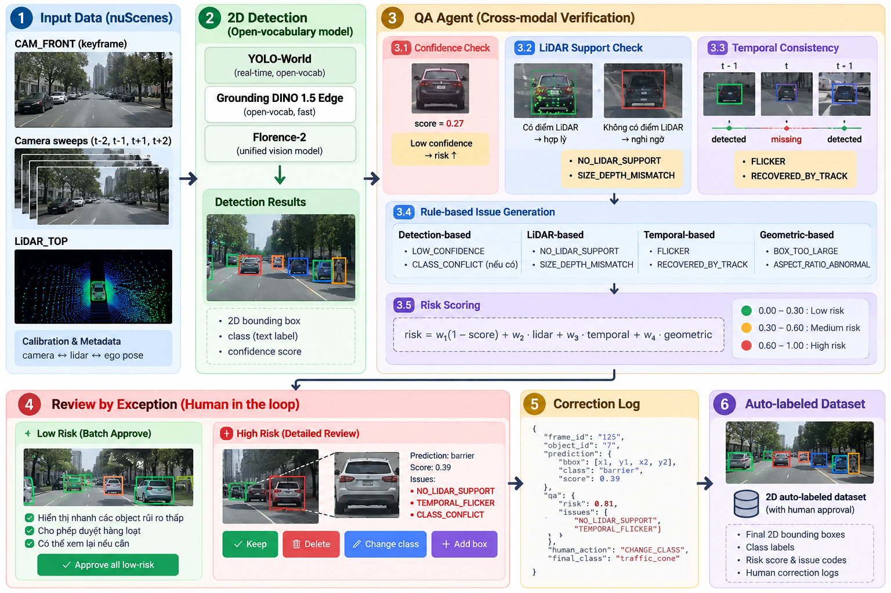

# AutoLabel 2D — Auto-label nuScenes + QA Agent đa tín hiệu + Review by exception

> Gán nhãn 2D cho xe tự lái tốn thời gian vì người phải soát từng box → model open-vocab tự sinh box,
> QA Agent kiểm chứng chéo bằng LiDAR và các frame camera lân cận để chấm rủi ro, người chỉ tập trung
> vào số ít box rủi ro cao và duyệt theo lô phần còn lại.



## Workflow

| Bước | Làm gì | Code |
|---|---|---|
| 1. Input | CAM_FRONT keyframe, sweep t-2..t+2 (12Hz), LIDAR_TOP, calibration + ego pose từ nuScenes v1.0-mini | `src/services/nuscenes_data.py` |
| 2. 2D Detection | YOLOE-26 (mặc định), YOLO-World, Grounding DINO, Florence-2 — open-vocab, không train; YOLO26 (tập lớp COCO) làm model phụ; nhiều model thì fuse ([so sánh](eval/compare_detectors.ipynb)) | `src/services/detectors/` |
| 3. QA Agent | LangGraph: 3.1 confidence · 3.2 LiDAR support · 3.3 temporal (song song) → 3.4 issue → 3.5 risk | `src/agents/` |
| 4. Review by exception | Low risk duyệt theo lô, high risk xem chi tiết: Keep / Delete / Change class / Sửa box / Add box | `src/web/`, `src/services/review.py` |
| 5. Correction log | Mỗi thao tác ghi 1 dòng JSONL: dự đoán, risk, issue, hành động, kết quả cuối | `data/workspace/corrections.jsonl` |
| 6. Dataset | Chỉ frame đã approve: COCO + JSONL + log + manifest | `src/services/exporter.py` |
| 7. Lan truyền video (chế độ 🎞 Video) | Approve một keyframe → nhãn của người được mang sang các keyframe sau (track qua mọi ảnh 12Hz / 10 fps), dừng trước frame người đã mở. Nguồn: scene nuScenes hoặc mp4 tải lên | `src/services/propagation.py`, `src/services/sequence.py`, `src/services/video.py` |

**Issue code:** `LOW_CONFIDENCE`, `CLASS_CONFLICT`, `NO_LIDAR_SUPPORT`, `SIZE_DEPTH_MISMATCH`, `FLICKER`,
`RECOVERED_BY_TRACK`, `BOX_TOO_LARGE`, `ASPECT_RATIO_ABNORMAL`; nhãn lan truyền thêm `PROP_LOW_CONF`,
`PROP_COASTING`, `PROP_CLASS_DIFFERS`.

**Risk:** `risk = w1(1 − score) + w2·lidar + w3·temporal + w4·geometric` → low < 0.30 ≤ medium < 0.60 ≤ high.
Object có issue luôn ≥ 0.30 nên không bao giờ bị duyệt theo lô. Mọi ngưỡng và trọng số nằm trong
[configs/autolabel.yaml](configs/autolabel.yaml). Chi tiết: [ARCHITECTURE.md](ARCHITECTURE.md).

## Demo nhanh (không cần GPU, không cần nuScenes)

```bash
pip install -r requirements.txt
python -m src.demo            # hoặc: make demo
# mở http://localhost:8000 → chọn 🎞 Video trên thanh trên cùng
```

Lệnh này sinh một video đường phố tổng hợp 16 giây (`data/demo/street_demo.mp4`), cho nó đi qua đúng đường xử lý
của video tải lên (cắt frame 10 fps, keyframe 2 fps, detect, QA Agent) bằng một detector demo tìm vật thể theo
màu, rồi mở UI trên workspace riêng `data/demo/workspace` (không đụng dữ liệu thật). Kịch bản trình diễn từng
bước: [docs/demo-script.md](docs/demo-script.md). `python -m src.demo --reset` để sinh lại từ đầu.

## Quick Start (nuScenes thật)

Yêu cầu: Python 3.11, GPU NVIDIA (chạy được trên RTX 3060 6GB; CPU cũng chạy nhưng chậm),
nuScenes v1.0-mini giải nén vào `./v1.0-mini-001` (hoặc đặt `NUSCENES_DATAROOT` trong `.env`).

```bash
python -m venv .venv && .venv\Scripts\activate          # Linux/macOS: source .venv/bin/activate
pip install torch torchvision --index-url https://download.pytorch.org/whl/cu126
pip install -r requirements-ml.txt
pip install git+https://github.com/ultralytics/CLIP.git  # tokenizer cho YOLOE / YOLO-World (lần đầu tự tải yoloe-26l-seg.pt + mobileclip2_b.ts)

# 1-3. Auto-label + QA Agent (tải weights lần đầu; detection được cache, chạy lại rất nhanh)
python -m src.cli run --limit 40                 # 40 keyframe đầu
python -m src.cli run                            # cả 404 keyframe
python -m src.cli run --detectors yoloe yolo26 --overwrite   # ensemble (YOLO-World: --detectors yolo_world)

# Đánh giá so với GT (mAP + flag recall/precision) -> eval/results/autolabel2d_eval.md
python -m src.cli evaluate

# 4-6. UI review
uvicorn src.main:app --port 8000
# mở http://localhost:8000

# 7. Lan truyền nhãn trên video (tuỳ chọn thêm detect-sweeps để tracker có detection ở mọi ảnh 12Hz)
python -m src.cli detect-sweeps --scenes scene-0061        # GPU; `run` đã cache sẵn sweep t-2..t+2
python -m src.cli propagate scene-0061_000                 # hoặc bấm "Lan truyền" / tự chạy khi approve trong UI
python -m src.cli eval-propagation                         # -> eval/results/propagation_eval.md
```

Chỉ chạy UI / test (không cần GPU): `pip install -r requirements.txt`, rồi `pytest` hoặc `uvicorn`.

Test nhanh trên vài scene ngẫu nhiên của bản trainval (chỉ chọn scene có ảnh trên máy), rồi auto-label đúng các scene đó:

```bash
python scripts/pack_nuscenes_subset.py --dataroot ../v1.0-trainval --version v1.0-trainval \
    --random 2 --seed 20260927 --window 20 --with-lidar --workspace none --out ../nusc_random.zip
```

Giải nén zip vào thư mục repo, trỏ `.env` vào `autolabel_subset/` (README.txt trong zip), chạy `run` như trên. Bản rút
gọn (~60 MB) cũng dùng để gửi cho thành viên chưa tải đủ 48 GB dataset.

## UI

Thanh trên cùng có hai chế độ:

- **🖼 Ảnh** — duyệt từng frame như MVP: hàng đợi sắp theo risk, review by exception. Không lan truyền.
- **🎞 Video** — danh sách video (mỗi scene nuScenes là một video; mp4 tải lên bằng nút *⬆ Tải lên mp4*),
  timeline riêng cho video đang mở, lan truyền nhãn giữa các frame.

Chế độ Ảnh:

- **Hàng đợi frame** sắp theo frame risk (khó nhất lên đầu), lọc theo trạng thái.
- **Canvas**: box tô màu theo risk (xanh/vàng/đỏ, luôn có nhãn chữ), box `RECOVERED_BY_TRACK` nét đứt,
  bật overlay điểm LiDAR (màu theo độ sâu) và GT để đối chiếu.
  Box GT (nét đứt trắng, chữ `GT <lớp>`) = box 3D của nuScenes chiếu xuống ảnh (hình chữ nhật bao 8 đỉnh) nên thường
  rộng hơn box detector; box GT mờ không chữ = vật hiển thị 0–40% hoặc không có điểm LiDAR/radar, bỏ qua khi đánh giá.
- **Zoom**: lăn chuột trên ảnh (phóng quanh con trỏ), `+`/`−`, `0` về vừa khung, hoặc nút `− 100% +`; khi phóng to
  kéo vùng trống để di chuyển ảnh. Vẽ/sửa box vẫn đúng toạ độ ở mọi mức zoom.
- **Temporal strip** t-2 … t+2: xem object đang chọn có/không ở từng sweep; click để xem sweep đó.
- **Panel risk**: High (card chi tiết + crop + issue + giải thích), Medium, Low (thu gọn + *Approve all low-risk*).
- **Correction log** và **Metrics & Export**: M4 (tỉ lệ nhãn phải sửa), M1 (thời gian/frame),
  flag precision/recall của agent tính từ thao tác thật của người, precision của từng issue code.

Chế độ Video:

- **Timeline**: mỗi keyframe một thẻ (ảnh thu nhỏ, thời điểm, số object chờ duyệt, vạch màu risk). ★ = người đã
  duyệt, ↦ = nhãn lan truyền chưa ai mở, ✎ = đang sửa. Bấm vào thẻ, hoặc **kéo thẻ thả lên khung ảnh**, để mở
  frame đó và chỉnh y như chế độ Ảnh (sửa box, đổi lớp, xoá, vẽ thêm). `◀ ▶|` từng frame, *▶ Phát* xem nhanh.
- **Lan truyền**: bật "Lan truyền khi approve" (mặc định bật) thì approve xong một frame, nhãn được mang sang
  các frame sau của video và UI mở luôn frame kế tiếp chưa duyệt. Nhãn lan truyền ghi `↦ c 0.82`
  (c_prop = độ tin cậy lan truyền); box nét chấm là box dự đoán khi detector không thấy. Box người đã xoá được tự
  xoá ở frame sau ("✗ Tự xoá theo frame #1", bấm Keep để khôi phục). Nút *↦ Lan truyền* (`T`) chạy lại bằng tay.
- **Tải lên mp4**: server cắt frame ngay, auto-label + QA chạy nền; danh sách hiện tiến độ và báo khi xong.
  Video không có LiDAR/calibration nên các check LiDAR tự bỏ qua, risk dựa trên score, temporal và hình học.

Phím tắt: `↑/↓` chọn object · `K` keep · `D` delete · `C` đổi lớp · `E` sửa box · `B` vẽ box mới ·
`A` approve low-risk · `Enter` approve frame · `N/P` frame kế/trước · `L` LiDAR · `G` GT; chế độ Video thêm
`T` lan truyền · `Space` phát/dừng.

## Kết quả đánh giá

Xem [eval/results/autolabel2d_eval.md](eval/results/autolabel2d_eval.md).

## API

| Method | Path | Mô tả |
|---|---|---|
| GET | `/api/v1/frames?sort=risk&status=` | Hàng đợi frame + số object theo mức risk |
| GET | `/api/v1/frames/{id}` | Frame + object + kết quả QA |
| GET | `/api/v1/frames/{id}/image?offset=` | Ảnh keyframe (0) hoặc sweep (±1, ±2) |
| GET | `/api/v1/frames/{id}/lidar`, `/gt` | Điểm LiDAR đã chiếu, GT 2D |
| POST | `/api/v1/frames/{id}/actions` | `KEEP` / `DELETE` / `CHANGE_CLASS` / `EDIT_BOX` / `ADD_BOX` |
| POST | `/api/v1/frames/{id}/approve-low-risk` | Duyệt theo lô nhóm low |
| POST | `/api/v1/frames/{id}/approve`, `/reopen` | Approve frame (chặn nếu còn object chờ) / mở lại |
| GET | `/api/v1/corrections?frame_id=` | Correction log |
| GET | `/api/v1/metrics` | M1, M4, flag precision/recall, theo nhóm và theo issue |
| POST | `/api/v1/frames/{id}/propagate` | Lan truyền từ frame đã approve sang các keyframe sau còn "auto" |
| GET | `/api/v1/videos` | Video: scene nuScenes + mp4 đã tải lên (tiến độ, số frame đã duyệt / lan truyền) |
| GET | `/api/v1/videos/{id}` | Timeline của một video: danh sách frame kèm thời điểm và trạng thái |
| POST | `/api/v1/videos/upload` | Tải lên mp4 (multipart `file`); cắt frame ngay, auto-label chạy nền |
| POST | `/api/v1/export` | Xuất dataset các frame đã approve |

## Cấu trúc

```
configs/autolabel.yaml     taxonomy, prompt, ngưỡng QA, trọng số risk
src/
  agents/                  QA Agent (LangGraph): state, graph, nodes/{confidence,lidar,temporal,issues,risk}
  services/
    nuscenes_data.py       loader nuScenes, chiếu LiDAR -> ảnh, GT 2D
    detectors/             YOLOE-26, YOLO26, YOLO-World, Grounding DINO, Florence-2, fusion, cache; demo.py (cho demo/test)
    pipeline.py            bước 1 -> 3 (label_keyframe dùng chung cho nuScenes và video tải lên)
    video.py               chế độ Video: cắt mp4, auto-label nền, danh sách/timeline video
    propagation.py         lan truyền: tracker 12Hz, c_prop, ghi vào keyframe đích
    sequence.py            lan truyền cả scene + thí nghiệm keyframe hoàn hảo
    review.py              thao tác review, M4, metrics
    store.py exporter.py evaluation.py
  api/routes.py            REST API
  web/                     UI review (HTML/JS/CSS)
  cli.py                   python -m src.cli run | evaluate | detect-sweeps | propagate | eval-propagation
  demo.py                  python -m src.demo: demo không cần GPU/nuScenes
scripts/pack_nuscenes_subset.py   chọn ngẫu nhiên / đóng gói vài scene nuScenes (+ workspace) thành zip nhỏ
scripts/bench_detectors.py        đo tốc độ detector
scripts/simulate_review.py        người duyệt mô phỏng theo GT (đo công duyệt có / không lan truyền)
eval/compare_detectors.ipynb      so sánh detector (matplotlib)
eval/precision_tuning.ipynb       tăng precision không cần train (ngưỡng min_score, ensemble)
eval/review_simulation.ipynb      công duyệt 40 keyframe: có / không lan truyền
tests/                     pytest, dữ liệu tổng hợp (không cần GPU/dataset)
```

## Giới hạn

- nuScenes mini chỉ 10 scene → số liệu mang tính minh hoạ quy trình.
- GT 2D là hộp bao của box 3D chiếu xuống, rộng hơn box sát vật thể → AP@0.7 thấp là bình thường.
- Chưa có: ẩn danh mặt/biển số (EgoBlur), mask SAM2, VLM verifier, đăng nhập/phân vai.
- Florence-2 không trả confidence nên box của nó nhận score cố định trong config.
- Lan truyền chỉ 2D trên một camera (CAM_FRONT hoặc video tải lên); `track_id` đã có sẵn để gắn box 3D vào sau.
- Vật bị che hoàn toàn quá `max_coast_images` ảnh thì track dừng; khi hiện lại nó là object mới cần duyệt. Chạy lại `run --overwrite`
  trên frame "auto" sẽ xoá nhãn lan truyền của frame đó (dựng lại từ cache detection).

Template gốc AI20K (hướng dẫn hook ghi log AI, Technical Guidebook) xem `README_boilerplate.md` và `docs/guide/`.

## License

MIT
