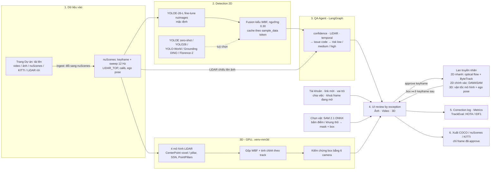
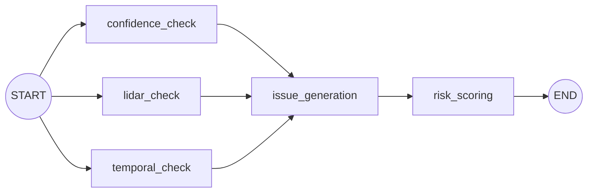
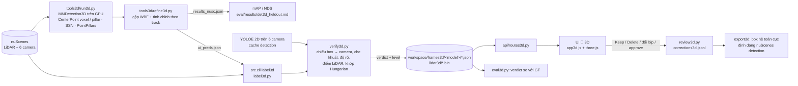

# Architecture Diagram — AutoLabel 3D (2D + 3D)

## Luồng tổng thể

Ảnh xuất sẵn: [architecture.png](architecture.png).

Số đo của từng khối (so với nhãn gốc, tập test):

- Detector 2D: mAP50 0.366.
- 3D ensemble: mAP 0.668 / NDS 0.713.
- Lan truyền 2D: 77% box ghi ra đúng vật; HOTA 0.563 (luồng Nhanh) / 0.573 (DAM4SAM) trên 20 scene held-out.
- Lan truyền 3D: 94% box đúng vật.

Chi tiết và so sánh từng phương pháp: [eval/results/bang-so-sanh.md](../eval/results/bang-so-sanh.md).

## QA Agent (src/agents/graph.py)

Ba check chạy song song, `issue_generation` chờ đủ cả ba (`add_edge([...], ...)`).
Agent deterministic, không gọi LLM.

## Thành phần

| Thành phần | File | Vai trò |
|---|---|---|
| Loader nuScenes | `src/services/nuscenes_data.py` | Keyframe, sweep 12Hz, chiếu LiDAR→ảnh có bù ego-motion, GT 2D chiếu từ 3D |
| Detector | `src/services/detectors/` | YOLOE-26-L fine-tune nuImages (mặc định) / YOLOE zero-shot / YOLO26 / YOLO-World / Grounding DINO / Florence-2, fuse kiểu WBF, cache theo `sample_data` token |
| QA Agent | `src/agents/` | 3.1–3.5, sinh issue code + risk |
| Pipeline | `src/services/pipeline.py`, `src/cli.py` | Chạy batch, ghi frame JSON vào workspace |
| Review | `src/services/review.py` | Keep / Delete / Change class / Edit box / Add box / Batch approve, M4, flag precision/recall |
| Store | `src/services/store.py` | JSON file + `corrections.jsonl` |
| Export | `src/services/exporter.py` | COCO + JSONL, chỉ frame đã approve |
| Đánh giá | `src/services/evaluation.py` | mAP@0.5/0.7, flag recall/precision so với GT |
| API | `src/api/routes.py` | REST cho UI |
| UI | `src/web/` | HTML/JS thuần, FastAPI phục vụ ở `/ui/` |
| Lan truyền 2D | `src/services/propagation.py`, `flow.py`, `sequence.py` | Track qua mọi ảnh 12 Hz giữa hai keyframe: dự đoán box bằng optical flow (OpenCV DIS), ghép detection hai lượt kiểu ByteTrack |
| Lan truyền 3D | `src/services/propagation3d.py` | Track box 3D đã duyệt theo vận tốc mô hình + ego pose, giữ track qua 4 keyframe bị che |
| Chọn vật | `src/services/segment.py` | Bấm điểm / kéo khung thô → mask + box: SAM 2.1 ONNX (CPU được), lùi về SAM PyTorch rồi GrabCut |
| Luồng lan truyền | `src/services/sequence.py`, `dam4sam.py`, `botsort.py` | Người dùng chọn "Nhanh" (flow + ByteTrack) hoặc "Chính xác" (DAM4SAM); BoT-SORT là tuỳ chọn ghép |
| TrackEval | `src/services/trackeval.py`, `tools2d/dam4sam.py` | HOTA / DetA / AssA / MOTA / IDF1 / IDSW; so sánh các cấu hình tracker |
| Nhiều người dùng | `src/services/users.py`, `src/api/auth_routes.py`, `auth_middleware.py` | Tài khoản, link mời, vai trò, chia việc, khoá frame (409 `FRAME_LOCKED`) |
| BEV (3D) | `src/services/bev.py` | Ảnh mặt đường nhìn từ trên: ghép 6 camera và ±4 keyframe theo ego pose, mặt đường theo LiDAR |
| Dự án end-user | `src/services/projects.py`, `ingest/`, `jobs.py` | Tải lên, đổi định dạng sang nuScenes, chạy 2D / 3D nền, xuất zip |
| Cài đặt trên UI | `src/services/ui_settings.py`, `relabel.py`, `temporal_eval.py` | Chỉnh tham số theo workspace, áp dụng lại, chạy đánh giá trước / sau |

## Phần 3D

| Thành phần | File | Vai trò |
|---|---|---|
| Runner mô hình 3D | `tools3d/run3d.py` | Tạo info MMDet3D cho các scene val có trên máy, suy luận, chấm nuScenes DetectionEval trên đúng các scene đó |
| Gộp và tinh chỉnh 3D | `tools3d/refine3d.py` | Gộp 4 mô hình LiDAR, chỉnh kích thước / vận tốc / hướng theo track, bù keyframe bị hụt. Camera (FCOS3D, PGD) đã thử, làm ensemble kém đi nên không dùng |
| Kiểm chứng 3D | `src/services/verify3d.py` | Kết luận từng box: DUNG / BOX LECH / SAI LOP / NGHI BAO NHAM / CAMERA KHONG XAC NHAN / CHUA DU THONG TIN |
| Tạo frame 3D | `src/services/label3d.py` | Đọc dự đoán, gộp LiDAR keyframe + sweep, chạy kiểm chứng, lưu frame + point cloud cho UI |
| Duyệt 3D | `src/services/review3d.py` | Keep / Delete / Change class / Batch approve, metrics, export |
| Đánh giá 3D | `src/services/eval3d.py` | Tỉ lệ tự duyệt, precision nhóm tự duyệt, recall lỗi, flag precision |
