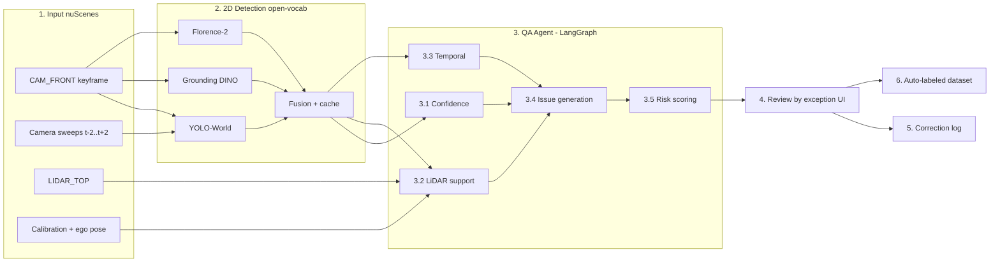
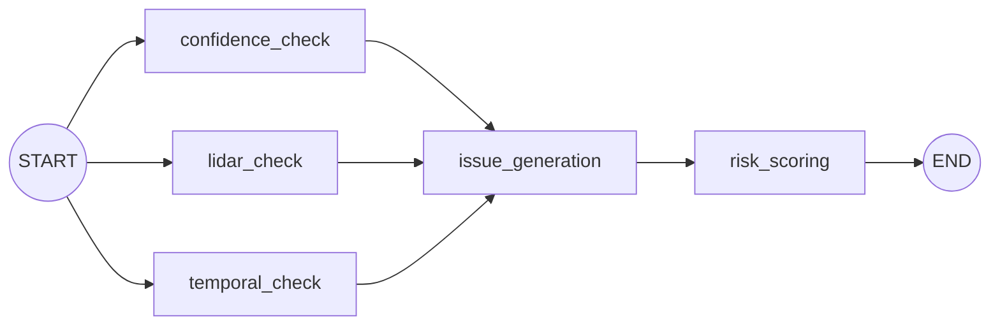

# Architecture Diagram — AutoLabel 2D

## Luồng tổng thể (6 bước)

## QA Agent (src/agents/graph.py)

Ba check chạy song song, `issue_generation` chờ đủ cả ba (`add_edge([...], ...)`).
Agent deterministic, không gọi LLM.

## Thành phần

| Thành phần | File | Vai trò |
|---|---|---|
| Loader nuScenes | `src/services/nuscenes_data.py` | Keyframe, sweep 12Hz, chiếu LiDAR→ảnh có bù ego-motion, GT 2D chiếu từ 3D |
| Detector | `src/services/detectors/` | YOLO-World / Grounding DINO / Florence-2, fuse kiểu WBF, cache theo `sample_data` token |
| QA Agent | `src/agents/` | 3.1–3.5, sinh issue code + risk |
| Pipeline | `src/services/pipeline.py`, `src/cli.py` | Chạy batch, ghi frame JSON vào workspace |
| Review | `src/services/review.py` | Keep / Delete / Change class / Edit box / Add box / Batch approve, M4, flag precision/recall |
| Store | `src/services/store.py` | JSON file + `corrections.jsonl` |
| Export | `src/services/exporter.py` | COCO + JSONL, chỉ frame đã approve |
| Đánh giá | `src/services/evaluation.py` | mAP@0.5/0.7, flag recall/precision so với GT |
| API | `src/api/routes.py` | REST cho UI |
| UI | `src/web/` | HTML/JS thuần, FastAPI phục vụ ở `/ui/` |
