# Report đánh giá mô hình — AutoLabel 3D

Cập nhật 2026-10-01 · nhóm P-130 · biểu đồ vẽ bằng matplotlib: `python eval/report/make_figures.py`

Report gom mọi mô hình đã thử nghiệm, các chỉ số đánh giá và các phương pháp tối ưu cho hai phần:

- **3D**: gán box 3D trên LiDAR.
- **2D**: gán box trên ảnh camera trước.

Mỗi phần có thêm lan truyền nhãn qua video, QA Agent và thời gian suy luận. Mọi số đo đều so với **nhãn gốc của
nuScenes** và đọc từ các file trong `eval/results/`; nguồn của từng bảng ghi ở cuối report.

## Tóm tắt

| Phần | Cấu hình đang dùng | Kết quả trên tập test | Thời gian |
|---|---|---|---|
| Detector 3D | Gộp 4 mô hình LiDAR + tinh chỉnh theo track | **mAP 0.668 · NDS 0.713** · P 0.777 · R 0.809 · F1 0.793 | 2.56 s / keyframe (GPU) |
| Detector 2D | YOLOE-26-L fine-tune trên nuImages | **mAP50 0.366** · P 0.484 · R 0.581 · F1 0.528 | 0.076 s / ảnh (GPU) |
| Lan truyền 2D | Optical flow + ghép kiểu ByteTrack | P 0.773 · R 0.711 · F1 0.741 · đổi ID 76 | 1.39 s / lần lan truyền |
| Lan truyền 3D | Vận tốc mô hình + giữ track 4 keyframe | P 0.940 · R 0.653 · F1 0.770 | ≈ 0, không chạy mô hình |
| QA Agent 3D | Kiểm chứng box bằng 6 camera | 51% box được tự duyệt, 93% trong số đó đúng; bắt 86% box sai | — |

So với điểm xuất phát:

- **3D:** mAP tăng từ 0.578 lên 0.668 (+0.090) so với CenterPoint voxel, mô hình đơn tốt nhất.
- **2D:** mAP50 tăng từ 0.312 lên 0.366 (+17%) so với YOLOE zero-shot.
- **Lan truyền 2D:** nhãn đúng tăng 12% và đổi ID giảm 60% so với khi không có optical flow.

## 1. Giao thức đánh giá và định nghĩa chỉ số

**Tách dữ liệu để tránh overfit.** Cách làm được chọn trên **dev**, gồm 3 scene demo của UI (scene-0035, 0097, 0101;
119 keyframe). Số liệu báo cáo lấy trên **test**, gồm các scene val khác của nuScenes trainval chưa dùng để chọn gì:

| Tập test | Số scene | Số keyframe |
|---|---|---|
| Detector 3D | 24 | 957 |
| Detector 2D | 24 | 957 (CAM_FRONT) |
| Lan truyền 2D, P/R/F1 của 3D | 20 | 795 |

Tham số lấy theo mặc định của bài báo gốc, không dò trên nhãn gốc.

| Chỉ số | Ý nghĩa |
|---|---|
| **mAP** (3D) | AP trung bình 10 lớp, chuẩn nuScenes: ghép box theo khoảng cách tâm trên mặt phẳng BEV, lấy trung bình ở 4 ngưỡng 0.5 / 1 / 2 / 4 m |
| **NDS** (3D) | nuScenes Detection Score = ½·mAP + ½·trung bình của (1 − sai số) qua 5 sai số TP: vị trí, kích thước, hướng, vận tốc, thuộc tính |
| **mATE / mASE / mAOE / mAVE** | Sai số trung bình của box đúng: vị trí (m), kích thước (1 − IoU sau khi căn tâm và hướng), hướng (rad), vận tốc (m/s). Thấp hơn là tốt |
| **mAP50 / mAP70** (2D) | AP trung bình các lớp, box tính là đúng khi IoU ≥ 0.5 (hoặc 0.7). Nhãn 2D là hình chiếu của box 3D gốc |
| **Precision (P)** | Box đúng / box ghi ra |
| **Recall (R)** | Box đúng / số vật trong nhãn gốc |
| **F1** | 2·P·R / (P + R) |
| P/R/F1 của 3D | Cùng lớp, tâm BEV ≤ 2 m, score ≥ 0.3; chỉ tính vật có ít nhất 1 điểm LiDAR/radar và nằm trong tầm theo lớp như nuScenes (xe 50 m, người / xe 2 bánh 40 m, cone / barrier 30 m) |
| P/R/F1 của 2D | IoU ≥ 0.5, ngưỡng giữ box của sản phẩm (0.30) |
| **Lan truyền nhãn** | Nhãn gốc ở keyframe 0, 5, 10… đóng vai nhãn người đã duyệt, lan truyền tiếp tối đa 10 keyframe |
| Đúng / sai / đổi ID / thiếu | Đúng: box ghi ra nằm trên đúng vật. Sai: box không trùng vật nào. Đổi ID: box nhảy sang vật khác. Thiếu: vật còn trong ảnh nhưng không có box |
| **Điểm lan truyền** | Đúng − sai − 2 × đổi ID. Đổi ID bị phạt gấp đôi vì box mang lớp và kích thước của vật cũ, người duyệt khó phát hiện |
| **Thời gian** | GPU = laptop RTX 4050; CPU = 2 luồng x86. Thời gian 3D tính cả nạp dữ liệu |

## 2. Detector 3D

Tất cả là trọng số MMDetection3D có sẵn, không train lại và không dùng TTA.

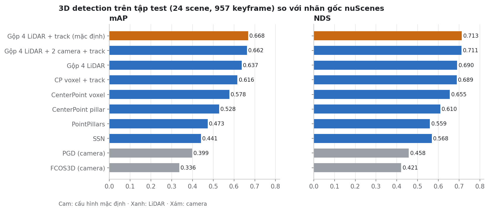

| Mô hình | Cảm biến | mAP | NDS | mATE (m) | mASE | mAOE (rad) | mAVE (m/s) | P | R | F1 | F1 tốt nhất (ngưỡng) | s / keyframe | VRAM |
|---|---|---|---|---|---|---|---|---|---|---|---|---|---|
| FCOS3D | camera | 0.336 | 0.421 | 0.682 | 0.231 | 0.451 | 1.725 | 0.823 | 0.440 | 0.573 | 0.573 (0.3) | 2.72 | 0.55 GB |
| PGD | camera | 0.399 | 0.458 | 0.599 | 0.247 | 0.375 | 1.288 | 0.995 | 0.012 | 0.024 | 0.660 (0.1) | 2.71 | 0.56 GB |
| SSN | LiDAR | 0.441 | 0.568 | 0.325 | 0.260 | 0.346 | 0.332 | 0.787 | 0.497 | 0.609 | 0.609 (0.3) | 0.59 | 0.57 GB |
| PointPillars | LiDAR | 0.473 | 0.559 | 0.389 | 0.265 | 0.559 | 0.299 | 0.752 | 0.623 | 0.681 | 0.681 (0.3) | 0.85 | 1.74 GB |
| CenterPoint pillar | LiDAR | 0.528 | 0.610 | 0.292 | 0.258 | 0.369 | 0.360 | 0.560 | 0.845 | 0.673 | 0.749 (0.5) | 0.41 | 0.48 GB |
| CenterPoint voxel | LiDAR | 0.578 | 0.655 | 0.257 | 0.237 | 0.286 | 0.368 | 0.625 | 0.866 | 0.726 | 0.777 (0.5) | 0.62 | 0.50 GB |
| CenterPoint voxel + track | LiDAR | 0.616 | 0.689 | 0.256 | 0.219 | 0.212 | 0.325 | 0.620 | 0.894 | 0.733 | 0.789 (0.5) | 0.63 | 0.50 GB |
| Gộp 4 LiDAR | LiDAR | 0.637 | 0.690 | 0.232 | 0.242 | 0.274 | 0.288 | 0.783 | 0.788 | 0.785 | 0.785 (0.3) | 2.55 | — |
| **Gộp 4 LiDAR + track (mặc định)** | LiDAR | **0.668** | **0.713** | 0.229 | 0.237 | 0.220 | **0.268** | 0.777 | 0.809 | **0.793** | 0.793 (0.3) | 2.56 | — |
| Gộp 4 LiDAR + 2 camera + track | cả hai | 0.662 | 0.711 | 0.236 | 0.234 | **0.207** | 0.277 | 0.876 | 0.671 | 0.760 | 0.760 (0.3) | 8.01 | — |

Cách đọc bảng:

- **mAP, NDS và sai số** đo trên 24 scene test.
- **P / R / F1** đo ở score ≥ 0.3 trên 20 scene test (17251 vật, 795 keyframe). Cột "F1 tốt nhất" là F1 cao nhất trong 4
  ngưỡng 0.05 / 0.1 / 0.3 / 0.5. Vì ngưỡng đó được chọn ngay trên tập test, cột này chỉ để tham khảo.
- **Thời gian** đo trên RTX 4050 với 1076 keyframe. Ensemble là tổng thời gian chạy 4 mô hình cộng bước gộp và track
  (khoảng 0.085 s trên CPU).

Nhận xét:

- **CenterPoint voxel là mô hình đơn tốt nhất** ở mọi chỉ số, trừ tốc độ.
- **Mô hình camera kém xa LiDAR:** mAP 0.34–0.40, sai số vận tốc 1.3–1.7 m/s so với khoảng 0.3 m/s.
- **PGD cho điểm rất thấp:** ở score ≥ 0.3 gần như không ra box (recall 0.012). Mô hình này chỉ dùng được với ngưỡng
  khoảng 0.1.
- **Gộp 4 mô hình LiDAR** làm precision tăng mạnh (0.625 → 0.783) vì box phải được nhiều mô hình đồng ý. Tinh chỉnh theo
  track bù lại recall (0.788 → 0.809) và giảm sai số hướng (0.274 → 0.220 rad).
- **Thêm 2 mô hình camera** tăng precision nhưng giảm mạnh recall, mAP giảm từ 0.668 xuống 0.662, và chậm gấp 3 lần.

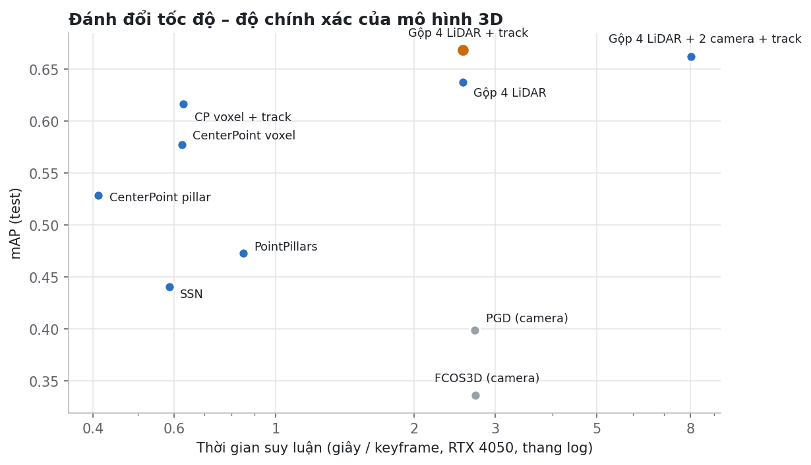

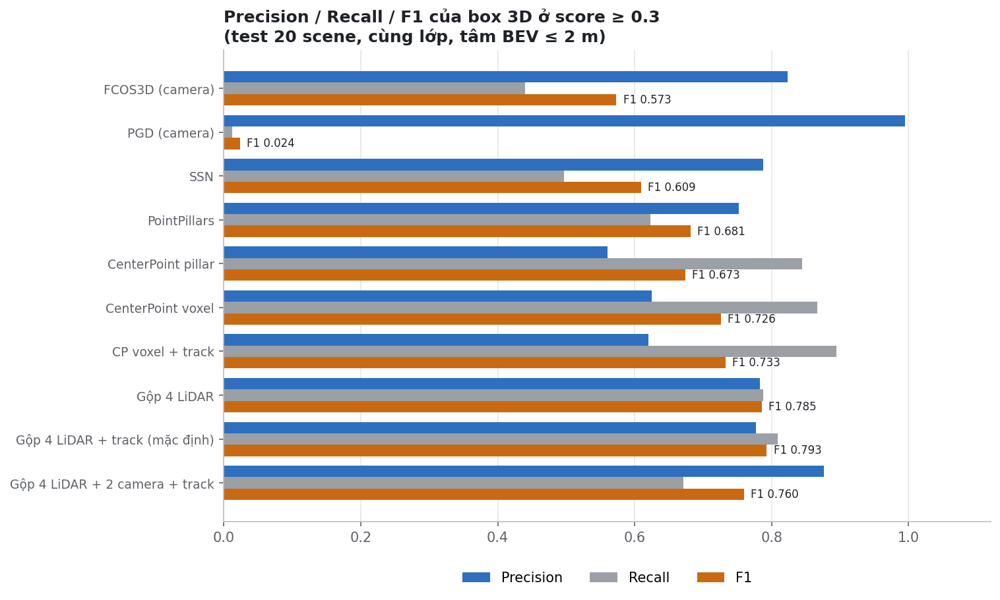

**AP từng lớp** (test 24 scene):

| Mô hình | car | truck | bus | trailer | constr. vehicle | pedestrian | motorcycle | bicycle | traffic cone | barrier |
|---|---|---|---|---|---|---|---|---|---|---|
| FCOS3D | 0.486 | 0.244 | 0.444 | 0.119 | 0.165 | 0.439 | 0.268 | 0.256 | 0.631 | 0.310 |
| PGD | 0.535 | 0.298 | 0.439 | 0.376 | 0.215 | 0.460 | 0.332 | 0.316 | 0.675 | 0.342 |
| SSN | 0.821 | 0.434 | 0.680 | 0.386 | 0.249 | 0.711 | 0.085 | 0.248 | 0.408 | 0.386 |
| PointPillars | 0.826 | 0.357 | 0.538 | 0.629 | 0.202 | 0.771 | 0.124 | 0.308 | 0.573 | 0.401 |
| CenterPoint pillar | 0.851 | 0.516 | 0.682 | 0.508 | 0.278 | 0.840 | 0.269 | 0.240 | 0.686 | 0.414 |
| CenterPoint voxel | 0.858 | 0.501 | 0.707 | 0.319 | 0.318 | 0.882 | 0.496 | 0.435 | 0.803 | 0.458 |
| CenterPoint voxel + track | 0.869 | 0.548 | 0.727 | 0.361 | 0.398 | 0.895 | 0.579 | 0.510 | 0.813 | 0.464 |
| Gộp 4 LiDAR | 0.878 | 0.547 | 0.780 | 0.554 | 0.439 | 0.891 | 0.479 | 0.502 | 0.803 | 0.498 |
| **Gộp 4 LiDAR + track (mặc định)** | **0.886** | **0.587** | 0.803 | **0.620** | **0.473** | 0.900 | 0.555 | 0.561 | 0.802 | 0.495 |
| Gộp 4 LiDAR + 2 camera + track | 0.886 | 0.572 | **0.812** | 0.470 | 0.468 | **0.903** | **0.593** | **0.582** | **0.834** | **0.503** |

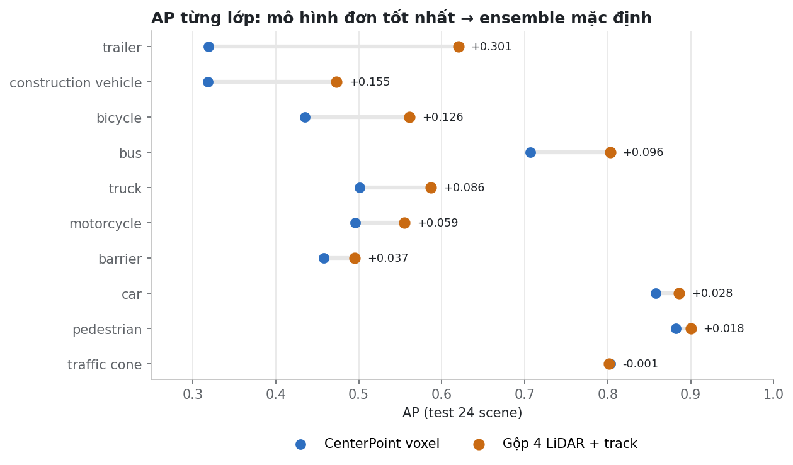

**Precision / recall từng lớp ở score ≥ 0.3** (test 20 scene):

| | car | truck | bus | trailer | constr. vehicle | pedestrian | motorcycle | bicycle | traffic cone | barrier |
|---|---|---|---|---|---|---|---|---|---|---|
| P · CenterPoint voxel | 0.82 | 0.55 | 0.77 | 0.13 | 0.34 | 0.67 | 0.12 | 0.29 | 0.65 | 0.45 |
| R · CenterPoint voxel | 0.89 | 0.72 | 0.86 | 1.00 | 0.60 | 0.92 | 0.66 | 0.58 | 0.89 | 0.84 |
| P · mặc định | 0.85 | 0.70 | 0.91 | 0.36 | 0.80 | 0.84 | 0.61 | 0.94 | 0.83 | 0.53 |
| R · mặc định | 0.90 | 0.75 | 0.94 | 1.00 | 0.49 | 0.85 | 0.41 | 0.41 | 0.70 | 0.78 |

Ensemble mạnh nhất ở xe lớn: trailer +0.30 AP, xe công trình +0.16, xe đạp +0.13. Với các lớp nhỏ như xe máy, xe đạp và
cone, ensemble đổi recall lấy precision ở cùng ngưỡng score.

## 3. Detector 2D

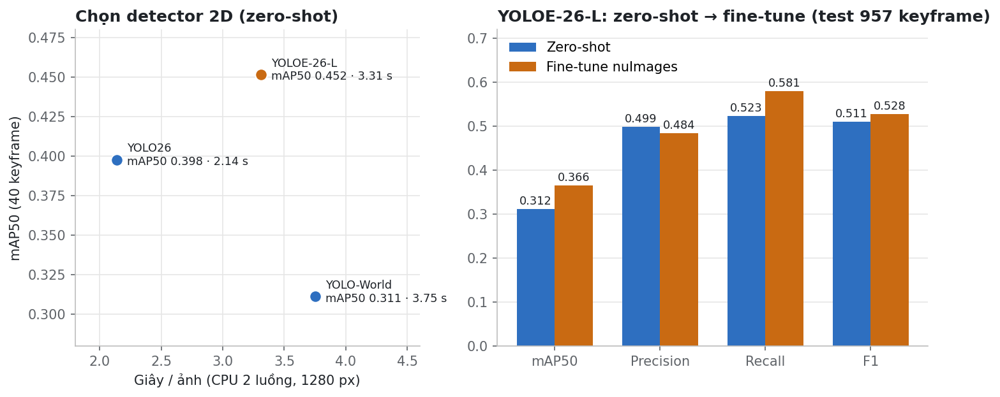

| Detector | Tập | mAP50 | mAP70 | P | R | F1 | Thời gian / ảnh (1280 px) |
|---|---|---|---|---|---|---|---|
| YOLO-World v2-L (từ vựng COCO, không có lớp barrier) | 40 keyframe | 0.311 | 0.208 | — | — | — | 3.75 s CPU |
| YOLO26-L (tập lớp COCO, không có lớp barrier) | 40 keyframe | 0.398 | 0.265 | — | — | — | 2.14 s CPU |
| YOLOE-26-L zero-shot | 40 keyframe | **0.452** | **0.278** | 0.506 | 0.616 | 0.556 | 3.31 s CPU |
| YOLOE-26-L zero-shot | dev 119 keyframe | 0.392 | — | 0.566 | 0.578 | 0.572 | |
| YOLOE-26-L fine-tune nuImages | dev 119 keyframe | **0.429** | — | 0.525 | **0.633** | **0.574** | |
| YOLOE-26-L zero-shot | test 957 keyframe | 0.312 | — | **0.499** | 0.523 | 0.511 | như dòng dưới |
| **YOLOE-26-L fine-tune nuImages (mặc định)** | **test 957 keyframe** | **0.366** | — | 0.484 | **0.581** | **0.528** | **0.076 s GPU** |

Ghi chú:

- **Bộ 40 keyframe** (scene-0031, 0065) chỉ có nhãn của 6 lớp, nên mAP ở đây cao hơn trên test 10 lớp.
- **Bản fine-tune** là linear probe 10 epoch ở 1280 px trên nuImages, chạy trên RTX 3090. Checkpoint chọn theo nuImages
  val (mAP50 0.509). Linear probe chỉ học lại đầu phân lớp, nên kiến trúc và tốc độ không đổi.
- **Thời gian zero-shot trên GPU:** lần chấm đó đọc từ cache detection nên không có số riêng.

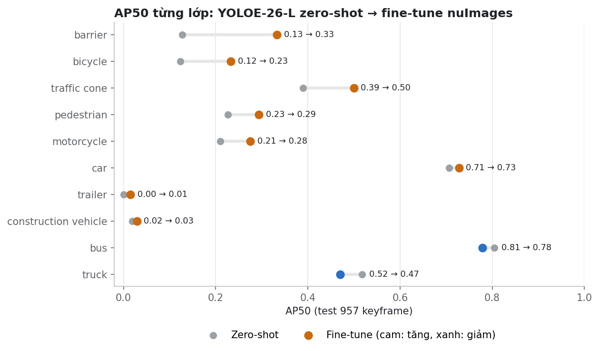

| Lớp | barrier | bicycle | bus | car | constr. | motorcycle | pedestrian | traffic cone | trailer | truck |
|---|---|---|---|---|---|---|---|---|---|---|
| AP50 zero-shot | 0.127 | 0.123 | 0.805 | 0.707 | 0.019 | 0.210 | 0.226 | 0.390 | 0.000 | 0.518 |
| AP50 fine-tune | **0.333** | **0.233** | 0.779 | **0.728** | **0.029** | **0.275** | **0.294** | **0.500** | **0.015** | 0.470 |
| Số vật trong nhãn gốc | 744 | 134 | 210 | 2375 | 112 | 81 | 1604 | 908 | 22 | 543 |

Fine-tune tăng ở 8/10 lớp, mạnh nhất ở các lớp nhỏ mà model zero-shot yếu: barrier ×2.6, xe đạp ×1.9, cone +0.11. Bus và
truck giảm nhẹ. Model fine-tune chỉ nhận tập lớp đóng gồm 10 lớp nuScenes; dự án dùng lớp khác phải quay về bản
zero-shot (open-vocab).

**Các biến thể TTA đã thử** (dev 119 keyframe, YOLOE zero-shot):

| Biến thể | mAP50 | P | R | F1 |
|---|---|---|---|---|
| **Gốc (prompt config, 1280 px)** | **0.395** | **0.568** | 0.580 | **0.574** |
| Prompt mở rộng theo định nghĩa lớp nuScenes | 0.392 | 0.549 | 0.579 | 0.564 |
| + prompt gây nhiễu | 0.392 | 0.549 | 0.579 | 0.564 |
| + lật ảnh ngang | 0.381 | 0.518 | **0.592** | 0.552 |
| Ảnh 1600 px | 0.365 | 0.520 | 0.555 | 0.537 |

Không biến thể nào tốt hơn cấu hình gốc, nên không dùng.

**Toàn bộ pipeline 2D của sản phẩm.** Gồm detector, fusion, ngưỡng 0.30 và QA, chạy với model zero-shot trên test 20
scene (795 keyframe):

| Chỉ số | Giá trị |
|---|---|
| mAP50 | 0.296 |
| mAP70 | 0.077 |
| Precision | 0.486 |
| Recall | 0.524 |
| F1 | 0.504 |

Pipeline với model fine-tune chưa được chạy lại (xem mục 9).

## 4. QA Agent

QA Agent chấm rủi ro cho từng box. Box rủi ro thấp được duyệt theo lô, còn người duyệt chỉ xem kỹ các box bị gắn cờ.

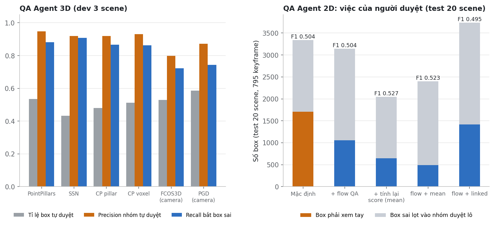

**QA 3D: kiểm chứng box bằng camera** (dev 3 scene, mỗi mô hình dùng ngưỡng điểm riêng):

| Mô hình | Số box | Tỉ lệ tự duyệt | Precision nhóm tự duyệt | Recall bắt box sai | Precision cờ | Tỉ lệ box sai | Vật bị sót |
|---|---|---|---|---|---|---|---|
| PointPillars | 2668 | 0.536 | **0.948** | 0.881 | 0.443 | 0.234 | 1514 / 3559 |
| SSN | 3468 | 0.432 | 0.920 | **0.909** | **0.607** | 0.379 | 1405 / 3559 |
| CenterPoint pillar | 3640 | 0.481 | 0.920 | 0.866 | 0.478 | 0.286 | 962 / 3559 |
| **CenterPoint voxel** | 3697 | 0.512 | 0.931 | 0.863 | 0.457 | 0.259 | **818 / 3559** |
| FCOS3D | 4111 | 0.529 | 0.798 | 0.722 | 0.590 | 0.385 | 1029 / 3559 |
| PGD | 3304 | 0.587 | 0.872 | 0.744 | 0.526 | 0.293 | 1222 / 3559 |

Với CenterPoint voxel:

- **Tự duyệt:** một nửa số box được tự duyệt, và 93% trong số đó đúng.
- **Bắt lỗi:** QA bắt được 86% box sai.
- **Vật bị sót:** mô hình này sót ít vật nhất.

**QA 2D: các cấu hình xử lý sau detector** (test 20 scene, cùng detection zero-shot):

| Cấu hình | mAP50 | P | R | F1 | Box xem tay | Box sai lọt duyệt lô | Recall cờ | Precision cờ | s / keyframe |
|---|---|---|---|---|---|---|---|---|---|
| **Mặc định** | 0.296 | 0.486 | 0.524 | 0.504 | 1707 | 1632 | **0.452** | 0.790 | **0.044** |
| + optical flow cho QA temporal | 0.296 | 0.486 | 0.524 | 0.504 | 1059 | 2082 | 0.301 | 0.848 | 0.143 |
| + tính lại score theo sweep (mean) | 0.283 | **0.582** | 0.482 | **0.527** | 648 | 1400 | 0.248 | 0.711 | 0.047 |
| flow + mean | 0.292 | 0.542 | 0.506 | 0.523 | 492 | 1906 | 0.171 | 0.801 | 0.139 |
| flow + linked | **0.304** | 0.453 | **0.546** | 0.495 | 1415 | 2319 | 0.346 | **0.866** | 0.144 |

Cấu hình mặc định giữ recall cờ cao nhất, tức là ít lỗi lọt qua nhóm duyệt lô nhất. "Tính lại score" giảm số box phải
xem tay từ 1707 xuống 648 nhưng làm sót thêm vật, nên chỉ để làm tuỳ chọn.

## 5. Lan truyền nhãn 2D: optical flow × ByteTrack × OC-SORT

Test 20 scene, 154 lần lan truyền, dùng chung detection zero-shot. Chỉ đếm những box sản phẩm thật sự ghi ra.

- P = đúng / box ghi ra.
- R = đúng / (đúng + thiếu).

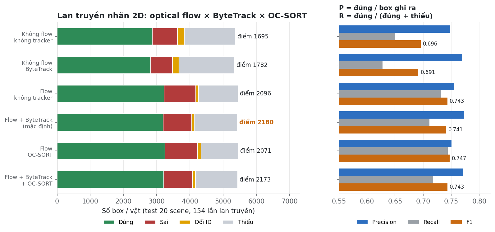

| Optical flow | Ghép detection | Đúng | Sai | Đổi ID | Thiếu | P | R | F1 | Điểm |
|---|---|---|---|---|---|---|---|---|---|
| không | không tracker (IoU 1 tầng) | 2866 | 761 | 205 | 1541 | 0.748 | 0.650 | 0.696 | 1695 |
| không | ByteTrack | 2822 | 652 | 194 | 1673 | 0.769 | 0.628 | 0.691 | 1782 |
| có | không tracker | 3220 | 960 | 82 | 1182 | 0.755 | 0.731 | 0.743 | 2096 |
| có | **ByteTrack (mặc định)** | 3192 | **860** | **76** | 1298 | **0.773** | 0.711 | 0.741 | **2180** |
| có | OC-SORT (OCR) | **3254** | 981 | 101 | **1122** | 0.750 | **0.744** | **0.747** | 2071 |
| có | ByteTrack + OC-SORT | 3215 | 868 | 87 | 1265 | 0.771 | 0.718 | 0.743 | 2173 |

Nhận xét:

- **Optical flow là bước quyết định:** F1 tăng từ 0.696 lên 0.743, đổi ID giảm từ 205 xuống 82.
- **Khi đã có flow, F1 của bốn cách ghép gần như bằng nhau** (0.741–0.747).
- **ByteTrack** cho precision cao nhất và ít đổi ID nhất, nên được chọn theo điểm có phạt đổi ID.
- **OC-SORT** phủ thêm vật (recall cao nhất) nhưng đổi ID tăng từ 82 lên 101. Trên dev, các thành phần ORU và OCM không đổi kết
  quả đo được.
- **Thời gian:** ByteTrack và OC-SORT khác nhau dưới 2%. Optical flow chiếm phần lớn thời gian: 0.33 → 1.39 s mỗi lần lan
  truyền trên GPU.

## 6. Lan truyền nhãn 3D

Tracker 3D ghép box theo khoảng cách tâm (kiểu CenterPoint) và dự đoán vị trí bằng vận tốc mô hình cộng ego pose. Bước
này chỉ dùng dự đoán có sẵn, không chạy lại mô hình.

- P = tỉ lệ box đúng vật.
- R = tỉ lệ vật còn trong tầm có nhãn lan truyền đúng.

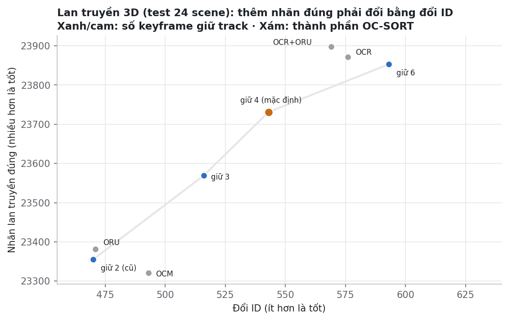

| Cấu hình (test 24 scene) | Box ghi ra | Đúng | Sai | Đổi ID | P | R | F1 | Sai số tâm | Điểm dev |
|---|---|---|---|---|---|---|---|---|---|
| Giữ track 2 keyframe (cũ) | 24771 | 23355 | 946 | **470** | **0.943** | 0.643 | 0.764 | **0.189 m** | 3731 |
| Giữ 3 keyframe | 25047 | 23569 | 962 | 516 | 0.941 | 0.648 | 0.768 | 0.190 m | 3741 |
| **Giữ 4 keyframe (mặc định)** | 25242 | 23731 | 968 | 543 | 0.940 | 0.653 | 0.770 | 0.190 m | **3762** |
| Giữ 6 keyframe | 25418 | 23853 | 972 | 593 | 0.938 | 0.656 | 0.772 | 0.191 m | 3765 |
| + OC-SORT OCR | 25428 | 23872 | 980 | 576 | 0.939 | 0.656 | 0.773 | 0.191 m | 3734 |
| + OCR + ORU | 25446 | **23898** | 979 | 569 | 0.939 | **0.657** | **0.773** | 0.191 m | 3733 |
| chỉ ORU | 24802 | 23382 | 949 | 471 | 0.943 | 0.643 | 0.765 | 0.190 m | 3731 |
| chỉ OCM | 24762 | 23321 | 948 | 493 | 0.942 | 0.642 | 0.763 | 0.189 m | 3731 |

Lan truyền theo vận tốc mô hình (held-out 4 scene):

| Cấu hình | Nhãn đúng | Đổi ID |
|---|---|---|
| Chỉ bù chuyển động xe ego | 3031 | 98 |
| + vận tốc mô hình | 3475 | 67 |
| Mặc định | 3339 | 36 |

Giữ 4 keyframe được chọn theo điểm dev. OCR cho F1 cao hơn một chút trên test, nhưng trên dev lại thấp hơn, nên để tắt;
có thể bật ở tab ⚙ Cài đặt.

## 7. Lịch sử tối ưu

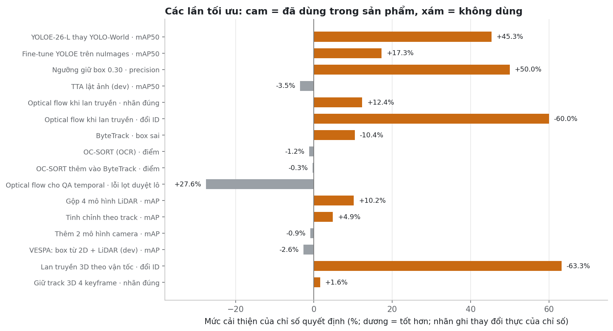

| # | Phương pháp | Phần | Chỉ số quyết định | Trước | Sau | Thời gian thêm | Dùng? |
|---|---|---|---|---|---|---|---|
| 1 | YOLOE-26-L thay YOLO-World | 2D | mAP50 (40 keyframe) | 0.311 | 0.452 | −12% (CPU) | ✅ |
| 2 | Fine-tune YOLOE-26-L trên nuImages | 2D | mAP50 test | 0.312 | 0.366 | 0 | ✅ |
| 3 | Ngưỡng giữ box 0.30 | 2D | precision (40 keyframe) | 0.34 | 0.51 | 0 | ✅ |
| 4 | TTA: prompt, lật ảnh, 1600 px | 2D | mAP50 dev | 0.395 | 0.365–0.392 | ×1.5–2 (ước tính) | ❌ |
| 5 | Optical flow khi lan truyền | 2D | nhãn đúng / đổi ID | 2866 / 205 | 3220 / 82 | ×4.2 | ✅ |
| 6 | ByteTrack | 2D | box sai | 960 | 860 | ≈ 0 | ✅ |
| 7 | OC-SORT (OCR) | 2D | điểm lan truyền | 2096 | 2071 | < 2% | ❌ |
| 8 | OC-SORT thêm vào ByteTrack | 2D | điểm lan truyền | 2180 | 2173 | < 2% | ❌ |
| 9 | Optical flow cho QA temporal | 2D | lỗi lọt duyệt lô | 1632 | 2082 | +0.10 s / keyframe | ❌ |
| 10 | Tính lại score theo sweep | 2D | box phải xem tay | 1707 | 648 | +0.003 s / keyframe | tuỳ chọn |
| 11 | Gộp 4 mô hình LiDAR | 3D | mAP | 0.578 | 0.637 | ×4.1 | ✅ |
| 12 | Tinh chỉnh theo track | 3D | mAP / NDS | 0.637 / 0.690 | 0.668 / 0.713 | +0.005 s | ✅ |
| 13 | Thêm 2 mô hình camera | 3D | mAP | 0.668 | 0.662 | ×3.1 | ❌ |
| 14 | Kiểm tra chéo 3D bằng 2D | 3D | box sửa đúng / làm hỏng (dev) | — | 14 / 39 | — | ❌ |
| 15 | VESPA: box 3D từ mask 2D + LiDAR | 3D | mAP dev | 0.644 | 0.627 | — | ❌ |
| 16 | VESPA: hướng theo chuyển động, cỡ theo lớp | 3D | NDS | 0.713 | 0.712–0.713 | ≈ 0 | ❌ |
| 17 | Lan truyền 3D theo vận tốc mô hình | 3D | đổi ID (held-out 4) | 98 | 36 | ≈ 0 | ✅ |
| 18 | Giữ track 3D 4 keyframe (ý OC-SORT) | 3D | điểm dev / nhãn đúng test | 3731 / 23355 | 3762 / 23731 | ≈ 0 | ✅ |
| 19 | OC-SORT OCR / ORU / OCM cho 3D | 3D | điểm dev | 3762 | 3731–3734 | ≈ 0 | ❌ |

## 8. Thời gian suy luận

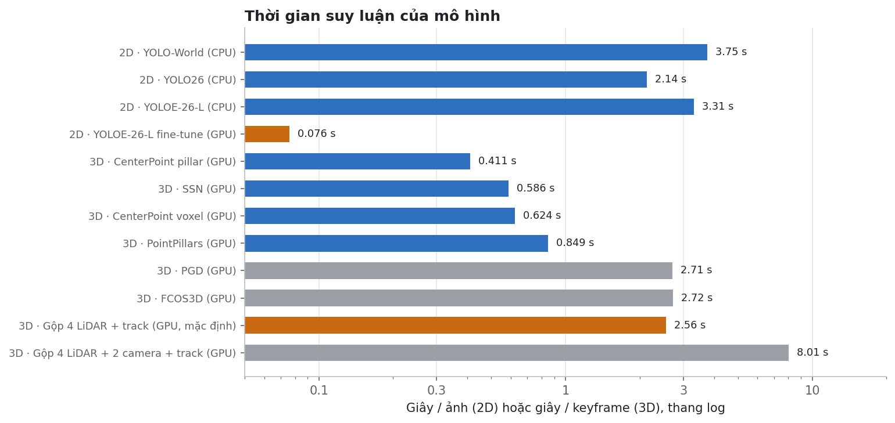

| Bước | GPU laptop (RTX 4050) | CPU |
|---|---|---|
| Detector 2D YOLOE-26-L, mỗi ảnh | 0.076 s | 3.31 s |
| Toàn pipeline 2D, mỗi keyframe (detect keyframe + 4 sweep, chiếu LiDAR, QA) | ~1 s | detect 17.7 s |
| Xử lý sau detector khi đã có cache, mỗi keyframe | 0.044 s | — |
| Detector 3D mặc định (4 mô hình LiDAR + gộp + track), mỗi keyframe | 2.56 s | không chạy được (cần op CUDA) |
| Toàn pipeline 3D, mỗi keyframe (4 mô hình + kiểm chứng 6 camera) | ~4 s | — |
| Lan truyền 2D, mỗi lần (≤ 10 keyframe, khoảng 60 ảnh 12 Hz) | 1.39 s (0.33 s khi không flow) | — |
| Lan truyền 3D | không đáng kể | không đáng kể |

### Thời gian trước / sau mỗi lần đổi model và tối ưu

| # | Thay đổi | Đơn vị (máy) | Trước | Sau | Thời gian | Chất lượng | Dùng? |
|---|---|---|---|---|---|---|---|
| 1 | Detector 2D: YOLO-World → YOLOE-26-L | s / ảnh (CPU) | 3.75 | 3.31 | −12% | mAP50 0.311 → 0.452 | ✅ |
| 2 | Detector 2D: YOLO26 → YOLOE-26-L | s / ảnh (CPU) | 2.14 | 3.31 | +55% | mAP50 0.398 → 0.452, có lớp barrier | ✅ |
| 3 | YOLOE-26-L zero-shot → fine-tune nuImages | s / ảnh (GPU) | 0.076¹ | 0.076 | không đổi | mAP50 0.312 → 0.366 | ✅ |
| 4 | Detector 3D: PointPillars → CenterPoint voxel | s / keyframe (GPU) | 0.85 | 0.62 | −27% | mAP 0.473 → 0.578 | ✅ |
| 5 | CenterPoint voxel → + tinh chỉnh theo track | s / keyframe (GPU) | 0.62 | 0.63 | +1% | mAP 0.578 → 0.616 | — |
| 6 | CenterPoint voxel → gộp 4 LiDAR | s / keyframe (GPU) | 0.62 | 2.55 | ×4.1 | mAP 0.578 → 0.637 | ✅ |
| 7 | Gộp 4 LiDAR → + tinh chỉnh theo track (mặc định) | s / keyframe (GPU) | 2.55 | 2.56 | +0.4% | mAP 0.637 → 0.668 | ✅ |
| 8 | Mặc định → + 2 mô hình camera | s / keyframe (GPU) | 2.56 | 8.01 | ×3.1 | mAP 0.668 → 0.662 | ❌ |
| 9 | Ngưỡng giữ box 2D 0.30 | — | — | — | không đổi | precision 0.34 → 0.51 | ✅ |
| 10 | Optical flow cho QA temporal | s / keyframe (GPU) | 0.044 | 0.143 | ×3.3 | lỗi lọt duyệt lô 1632 → 2082 | ❌ |
| 11 | Tính lại score theo sweep (mean) | s / keyframe (GPU) | 0.044 | 0.047 | +7% | box xem tay 1707 → 648 | tuỳ chọn |
| 12 | Optical flow khi lan truyền 2D | s / lần lan truyền (GPU) | 0.33 | 1.39 | ×4.2 | nhãn đúng 2866 → 3220, đổi ID 205 → 82 | ✅ |
| 13 | ByteTrack (có flow) | s, dev (cùng máy) | 67.6 | 67.4 | ≈ 0 | box sai 960 → 860 | ✅ |
| 14 | OC-SORT OCR, không ByteTrack | s, scene-0093 (VM)² | 16.2 | 16.5 | +2% | điểm 2096 → 2071 | ❌ |
| 15 | OC-SORT OCR thêm vào ByteTrack | s, scene-0093 (VM)² | 16.4 | 16.2 | ≈ 0 | điểm 2180 → 2173 | ❌ |
| 16 | TTA lật ảnh / ảnh 1600 px | s / ảnh | — | — | chưa đo (ước tính ×2 / ×1.6) | mAP50 dev 0.395 → 0.381 / 0.365 | ❌ |
| 17 | Lan truyền 3D: vận tốc, giữ 4 keyframe, OC-SORT 3D | — | — | — | ≈ 0, không chạy mô hình | đổi ID 98 → 36; nhãn đúng +1.6% | ✅ / ❌ |

Ghi chú:

1. Lần chấm zero-shot trên GPU đọc lại từ cache, nên không có số riêng. Hai bản cùng kiến trúc YOLOE-26-L và cùng 1280
   px; linear probe chỉ học lại đầu phân lớp.
2. Đo trên máy ảo CPU với optical flow đã tính sẵn, để so riêng phần ghép của tracker.

GPU mạnh hơn không làm accuracy cao hơn khi dùng cùng một mô hình, vì cấu hình CPU và GPU giống hệt nhau, chỉ khác FP16.
GPU cho phép chạy được những phần tăng accuracy: 4 mô hình LiDAR, fine-tune, ảnh 1280 px.

## 9. Hạn chế và việc tiếp theo

- **Pipeline 2D và lan truyền 2D** trong report vẫn dùng detection zero-shot. Cần chạy lại với model fine-tune bằng
  `scripts\tasks.ps1 evaltemporal`.
- **P/R/F1 của 3D** đo trên 20/24 scene test. Đây là phần có sẵn bảng nhãn đã lọc trên máy; mAP và NDS vẫn dùng đủ 24
  scene.
- **Ngưỡng score 0.3** dùng chung cho mọi mô hình 3D nên không công bằng với PGD, vốn cho điểm thấp.
- **Kiểm tra temporal của QA** so box bằng IoU mà không bù chuyển động, nên báo sai với vật ở gần đang chạy nhanh qua ảnh
  (`docs/eval-evidence.md`, TC-11).
- **Chưa làm:** BEVFusion (công bố 68.6 mAP, cần biên dịch op CUDA), fine-tune toàn phần YOLOE, TTA lật
  trục cho mô hình LiDAR, ByteTrack cho 3D.

## Nguồn số liệu

| Phần | File |
|---|---|
| 3D mAP / NDS / sai số / AP từng lớp | `eval/results/det3d/heldout24.json`, `det3d_heldout.md` |
| 3D P / R / F1 | `eval/results/det3d/pr_test20.json` |
| 3D thời gian, VRAM | `eval/results/det3d/*/run.json` |
| QA 3D | `eval/results/det3d/*/verify_eval.json` |
| Detector 2D | `eval/results/det2d_finetune.json`, `det2d_variants.json`, `compare/*/autolabel2d_eval.json`, `compare/speed.json` |
| Pipeline và QA 2D | `eval/results/temporal/gpu_heldout20.json` |
| Lan truyền 2D | `eval/results/tracker_test20.json`, `ocsort.json`, `temporal/bytetrack.json` |
| Lan truyền 3D | `eval/results/ocsort.json`, `propagation3d.md` |
| Bảng các phương pháp | `eval/results/bang-so-sanh.md` |
| Test case thủ công | `docs/eval-evidence.md` |
