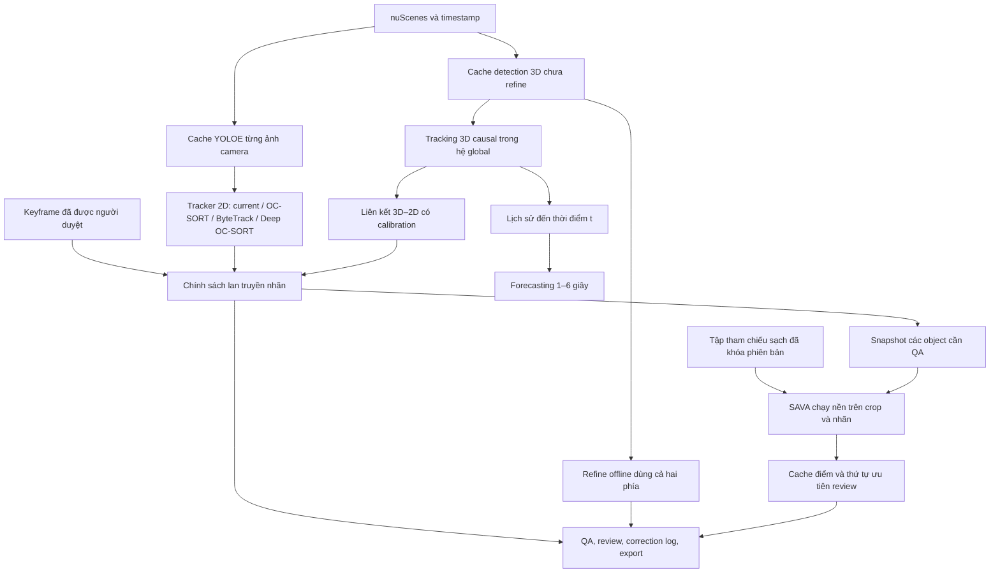

# Kế hoạch lan truyền nhãn, QA bằng SAVA và dự đoán chuyển động trên nuScenes

Ngày đánh giá: 01/10/2026. Phạm vi: mã nguồn và kết quả đã lưu trong repo P-130; đối chiếu tài liệu chính thức của các thuật toán. Ưu tiên đã xác nhận: **làm cả lan truyền nhãn và dự đoán quỹ đạo, triển khai lan truyền nhãn trước**.

Cập nhật theo hướng QA dùng [SAVA — Scalable Learning-Agnostic Data Valuation](https://github.com/skezle/sava): bổ sung thiết kế tại mục 5.4, thí nghiệm tại mục 6.5 và điều chỉnh lịch tại mục 8. SAVA được dùng để ưu tiên kiểm tra nhãn; phần áp dụng vào box/track nuScenes là đề xuất cần kiểm chứng, chưa có benchmark trong dự án.

Phạm vi lan truyền trong kế hoạch tập trung vào bounding box, lớp và ID đối tượng qua các frame bằng detector và tracker. Lan truyền segmentation mask nằm ngoài phạm vi triển khai.

## 1. Quyết định đề xuất

**Dùng OC-SORT làm ứng viên nâng cấp đầu tiên cho lan truyền box 2D. Thử Deep OC-SORT sau khi xác định lỗi đổi ID/che khuất còn đáng kể. Với chuyển động trong không gian thực, xây nhánh tracking 3D từ CenterPoint + SimpleTrack, rồi bổ sung forecasting riêng.**

**QA đề xuất: SAVA kết hợp các kiểm tra hiện có.** Chấm từng cặp crop–nhãn so với tập tham chiếu sạch, đưa mẫu đáng nghi lên trước cho người duyệt. Giữ LiDAR, hình học và temporal để kiểm tra những lỗi SAVA chưa được chứng minh xử lý, nhất là lệch box, thiếu object và đổi ID. Triển khai chạy nền trước, sau đó mới cho điểm SAVA ảnh hưởng cờ review nếu vượt baseline.

Đây là đề xuất về mức phù hợp với kiến trúc hiện tại, chưa phải kết luận thuật toán nào đạt chất lượng cao nhất trên dữ liệu của dự án. Chốt backend bằng thí nghiệm dùng cùng detection, cùng scene và cùng quy tắc duyệt.

| Mục tiêu | Phương án ưu tiên | Điều kiện nâng cấp |
|---|---|---|
| Lan truyền box/lớp/ID sau khi người duyệt keyframe | YOLOE hiện có + OC-SORT + logic review hiện có | So với tracker hiện tại và ByteTrack |
| Giữ ID qua che khuất, vật thể giao cắt | Thử Deep OC-SORT có Re-ID phù hợp lớp đối tượng | Chỉ giữ nếu giảm lỗi và công sửa đủ bù chi phí |
| QA nhãn detector và nhãn lan truyền | SAVA trên object crop + tập tham chiếu sạch + QA hình học/thời gian | Đánh giá khả năng tìm lỗi và thời gian sửa, chưa tự xóa/đổi nhãn theo điểm |
| Theo dõi vị trí, vận tốc theo mét | Detections CenterPoint + SimpleTrack trong hệ global | So với `build_tracks()` hiện có, tắt mọi xử lý dùng tương lai |
| Dự đoán quỹ đạo 1–6 giây | Constant velocity trước; thử constant turn rate khi đủ lịch sử | MTP/CoverNet là giai đoạn mở rộng nếu baseline chưa đáp ứng |

OC-SORT là tracker 2D dựa vào chuyển động và quan sát. Deep OC-SORT bổ sung appearance thích nghi; kết quả công bố tập trung vào MOT17, MOT20 và DanceTrack. Vì vậy không thể lấy kết quả đó làm bằng chứng trực tiếp cho xe nhiều lớp trên nuScenes. Nguồn: [OC-SORT](https://github.com/noahcao/OC_SORT), [Deep OC-SORT](https://github.com/GerardMaggiolino/Deep-OC-SORT).

## 2. Đánh giá dự án hiện tại

### 2.1. Những phần nên tận dụng

| Thành phần đã có | Bằng chứng trong repo | Ý nghĩa với kế hoạch |
|---|---|---|
| Detector 2D, cache, taxonomy và ngưỡng cấu hình | [detectors](src/services/detectors/), [autolabel.yaml](configs/autolabel.yaml) | Có thể so tracker mà không chạy lại detector mỗi lần |
| Tracking qua camera sweep, ghi nhãn ở keyframe | [propagation.py](src/services/propagation.py), [sequence.py](src/services/sequence.py) | Thay backend tracking, giữ luồng người duyệt |
| Giữ/sửa/xóa/vẽ thêm; khóa lớp người đã chốt | `init_tracks()`, `apply_propagation()` trong `propagation.py` | Đây là logic nghiệp vụ cần bảo toàn khi dùng tracker ngoài |
| QA theo confidence, LiDAR, thời gian, hình học | [QA nodes](src/agents/nodes/), [temporal.py](src/agents/nodes/temporal.py) | Có nền tảng xếp ưu tiên review và cảnh báo lan truyền sai |
| Calibration, ego pose, timeline camera | [nuscenes_data.py](src/services/nuscenes_data.py), [geometry.py](src/services/geometry.py) | Có dữ liệu cần cho liên kết 2D–3D |
| Detections 3D và tinh chỉnh theo track | [run3d.py](tools3d/run3d.py), [refine3d.py](tools3d/refine3d.py) | Không cần xây lại toàn bộ nhánh 3D |
| Schema và export giữ `track_id`, velocity, phép biến đổi | [schemas3d.py](src/models/schemas3d.py), [export_nusc.py](src/services/export_nusc.py) | Có thể mở rộng từ track thành chuỗi quỹ đạo |
| Tests dịch vụ/API, correction log, đo năng suất | [tests](tests/), [productivity.py](src/services/productivity.py) | Có chỗ kiểm tra hồi quy và đo lợi ích thực tế |

**Nhận định:** nền tảng hiện tại phù hợp để nâng cấp theo từng module. Nút thắt là association, độ tin cậy khi mất quan sát và cách đánh giá; đổi tên tracker chưa đủ để giải quyết cả ba.

### 2.2. Khoảng trống cần xử lý

1. **Tracker 2D còn đơn giản.** `Tracker.step()` dùng vận tốc bốn cạnh box theo px/s và thời gian thực; `_greedy_match()` ghép IoU tham lam. Chưa có Kalman covariance, appearance hay camera-motion compensation trong bước association. Dễ hụt khi xe quay, box đổi kích thước hoặc vật thể giao cắt.
2. **Đánh giá propagation chưa khớp đường chạy sản phẩm.** `evaluate_propagation()` gọi tracker trực tiếp, không đi qua đầy đủ `apply_propagation()`: thiếu tác động của `emit_coasting`, `stop_below`, claim pre-label, suppress và trạng thái review. `coverage` hiện đếm track còn sống của instance đã khởi tạo, chưa yêu cầu box đúng. Vòng lặp còn dừng khi mọi track chết, nên không ghi đủ số mất dấu ở các horizon sau. Cần giữ báo cáo cũ như chẩn đoán, thêm evaluator đầu-cuối chạy đến horizon cố định trước khi chọn model.
3. **Chất lượng khởi tạo đang được giả định tốt.** Evaluator dùng GT keyframe đầu làm nhãn người; chưa đại diện cho mọi lỗi seed, vật thể mới xuất hiện hoặc công sửa của người thật.
4. **Offline refinement 3D dùng tương lai.** `refine_tracks()` lấy trung vị kích thước, sai phân vận tốc có điểm phía sau, chấm lại điểm toàn track và nội suy gap. Hợp lệ cho gán nhãn dữ liệu đã ghi, nhưng sẽ gây rò rỉ nếu dùng làm lịch sử đầu vào forecasting tại thời điểm t.
5. **Chưa có contract forecasting riêng.** Vận tốc/box của tracker chưa tương đương đầu ra quỹ đạo nhiều mốc thời gian, xác suất và bất định.
6. **Luồng 2D đang phục vụ một camera.** `CameraFrame.frame_id` chỉ gồm scene và index; `sequence.py` ánh xạ theo sample trong scene. Khi mở nhiều camera sẽ có nguy cơ trùng ID/lẫn frame. Giữ CAM_FRONT ở giai đoạn đầu; thêm camera cần migration ID và cache trước.
7. **Temporal QA và propagation đang dùng hai cơ chế ghép riêng.** Chưa thay cả hai cùng lúc; trước hết đo OC-SORT ở propagation để biết cải thiện đến từ đâu, sau đó mới dùng track history cho QA.
8. **Track 3D do người thêm chưa được nối xuyên frame.** `review3d.py` chưa gán track cho `ADD_BOX`; `export_nusc.py` hiện chỉ gom theo track khi `source == "model"`. Muốn lan truyền correction 3D phải bổ sung nối/tách track và export instance cho cả nhãn người thêm.

### 2.3. Số liệu sẵn có và giới hạn bằng chứng

| Kết quả lưu trong repo | Diễn giải được | Chưa chứng minh được |
|---|---|---|
| [YOLOE propagation](eval/results/compare/yoloe/propagation_eval.json): 2 scene, 10 track khởi tạo, 50 lượt đúng/52 lượt xuất | Có tín hiệu tốt trên mẫu nhỏ; nhiều lượt là cùng track qua thời gian | Chưa chứng minh chất lượng toàn nuScenes hoặc luồng ghi nhãn thực tế |
| [Không propagation](eval/results/review_sim/none@0.3.json), [propagation](eval/results/review_sim/prop@0.3.json), [có coasting](eval/results/review_sim/prop_coasting@0.3.json) | Tổng `DELETE + CHANGE_CLASS + ADD_BOX` lần lượt 142, 128, 192 trên hai scene; coasting có thể làm tăng công sửa | Là mô phỏng dùng GT; không phải thời gian người dùng. Chỉ số này không bao gồm mọi thao tác review |
| [3D summary](eval/results/det3d/summary.json): 27 scene, 1.076 sample; CenterPoint voxel mAP khoảng 0,573, NDS khoảng 0,646 | Có detector 3D làm nền cho baseline tracking | Là detection trên subset, chưa phải AMOTA tracking hay kết quả full validation |
| [Evaluation report](eval/results/report.md) còn nhiều chỗ trống | Cần báo cáo benchmark mới có manifest và đầu ra rõ ràng | Không dùng template này để xác nhận dự án đã đạt KPI |

Các JSON review simulation còn có `frames_propagated = 0` dù thông tin từng frame ghi đích lan truyền; cần đối chiếu script trước khi dùng field này. Không quy lỗi đó thành bằng chứng propagation không chạy.

**Kiểm tra môi trường trong lần đánh giá:** đã thử chạy nhóm tests propagation, sequence, geometry, review/export và evaluation bằng `.venv/Scripts/python.exe`. Chưa khởi chạy được pytest vì virtualenv trỏ tới Python 3.11 không còn tồn tại. Các nhận định trên dựa vào đọc code và artifact; chưa chạy lại benchmark GPU hoặc xác nhận tests pass.

## 3. Tách đúng các bài toán

| Bài toán | Đầu vào → đầu ra | Dữ liệu tương lai |
|---|---|---|
| Tracking/ước lượng chuyển động | Detection hiện tại + lịch sử → box/state + ID hiện tại | Nhánh online chỉ dùng dữ liệu đến t |
| Lan truyền nhãn | Quyết định đã duyệt + track → đề xuất nhãn cho frame khác | Cho phép dùng hai phía nếu khai báo là offline |
| Forecasting | Lịch sử chuyển động đến t → các vị trí ở t+1, t+2, … | Tuyệt đối không dùng quan sát sau t làm feature |

Hàm `predict()` của Kalman chỉ là một bước trong tracking, không phải mô hình hiểu rẽ, phanh hay tương tác giao thông trong 6 giây. Vận tốc pixel cũng không phải vận tốc m/s.

nuScenes có keyframe gán nhãn 2 Hz; camera khoảng 12 Hz và LiDAR 20 Hz. Đi qua các ảnh camera trung gian giúp association 2D, nhưng phải dùng timestamp thực và chỉ đánh giá nhãn tại các thời điểm có GT. Nguồn: [nuScenes sensor setup](https://www.nuscenes.org/nuscenes?tutorial=lidarseg_panoptic).

## 4. So sánh các lựa chọn

| Phương án | Ưu điểm cho dự án | Chi phí/giới hạn | Vai trò |
|---|---|---|---|
| Tracker hiện tại | Ít phụ thuộc, đã gắn chặt với human review | IoU tham lam; thiếu xử lý association phức tạp | Baseline và phương án quay lại |
| OC-SORT | Ước lượng chuyển động và association dựa vào quan sát; không cần mạng Re-ID | Vẫn phụ thuộc detection; chuyển động trong ảnh có ego-motion | Ứng viên 2D số 1 |
| Deep OC-SORT | Appearance giúp phân biệt các track giống chuyển động | Thêm inference, cache và lựa chọn weights; Re-ID người chưa đủ cho xe | Thử có điều kiện, đánh giá theo lớp |
| ByteTrack | Tận dụng detection điểm thấp để nối track; hợp với cache ngưỡng thấp hiện có | Không giải quyết toàn bộ lỗi appearance/ego-motion | Đối chứng 2D nhẹ |
| CenterPoint + SimpleTrack | Làm trực tiếp với box 3D, thuận lợi cho global velocity và forecasting | Cần chuẩn hóa data và chạy detector 3D | Hướng chính cho quỹ đạo không gian thực |

ByteTrack sử dụng association với cả detection điểm thấp; giữ detection thô trong cache sẽ giúp thử cách này mà không thay detector. [ByteTrack](https://github.com/FoundationVision/ByteTrack).

SimpleTrack có luồng inference nuScenes 2 Hz và 10 Hz. Bắt đầu 2 Hz với cache 3D hiện có; dữ liệu LiDAR 20 Hz không đồng nghĩa đã có detections 3D ở 20 Hz. [SimpleTrack nuScenes](https://github.com/tusen-ai/SimpleTrack/blob/main/docs/nuScenes.md). CenterPoint cung cấp nền tảng detection/tracking theo tâm và vận tốc. [CenterPoint](https://github.com/tianweiy/CenterPoint).

Nếu chỉ có camera/video, hoàn thành nhánh 2D trước. Nếu có LiDAR, calib và ego pose như nuScenes, ưu tiên 3D cho vận tốc vật lý. Đây là lựa chọn theo loại đầu ra, không phải xếp hạng chung giữa thuật toán 2D và 3D.

## 5. Kiến trúc tích hợp



### 5.1. Adapter tracker 2D

Tạo interface nội bộ ở `src/services/tracking/base.py`; các đường dẫn chưa tồn tại trong mục kế hoạch là file **dự kiến bổ sung**.

```python
initialize(seeds, image, context) -> None
step(image, detections, frame_pixels=None) -> list[TrackUpdate]
reset() -> None
```

`TrackUpdate` tối thiểu có `track_id`, `bbox`, detection đã match, predicted/observed, thời điểm quan sát cuối, trạng thái sống/mất, lý do dừng và tín hiệu association. Giữ confidence detector tách khỏi confidence propagation; score association không tự trở thành xác suất đúng.

Các yêu cầu khi bọc OC-SORT/Deep OC-SORT:

- Dùng box người đã sửa để seed. Track đã được người xác nhận không phải chờ `min_hits` như một track tự sinh mới; xuất ID nội bộ ổn định, không lộ việc backend đánh số lại.
- Tách lớp người chốt khỏi lớp detector. Có class compatibility/gating, nhưng vẫn cho phép seed đã sửa từ car thành truck nối với detection mà detector tiếp tục gọi car.
- Track `keep` được ưu tiên; `suppress` chỉ xử lý phần còn lại và yêu cầu khớp chặt, cùng lớp theo chính sách hiện tại. Không cho tracker tự biến vật mới thành nhãn đã duyệt.
- MVP giữ hành vi hiện tại: seed chỉ gồm các object bị xóa, không có `keep`, thì không lan truyền. Nếu muốn hỗ trợ trường hợp này, triển khai như thay đổi nghiệp vụ riêng và có test tương ứng.
- Không thay đổi frame khác `auto`; dừng ở ranh giới người đã làm. Giữ dựng lại từ `prelabel`, trạng thái pending, log và undo/redo. Bổ sung kiểm tra version frame trước khi ghi nếu chạy job nền.
- Phân biệt `detections=None` (chưa infer/chưa có cache) với `[]` (đã infer, không thấy vật). Báo thiếu cache; không coi thiếu dữ liệu là bằng chứng vật biến mất, cũng không cho prediction chạy vô hạn.
- Giữ `emit_coasting: false` mặc định; predicted box có thể hiện dưới dạng gợi ý nhưng không được xuất như nhãn đã xác nhận.
- Với backend tự tạo track mới, chỉ các ID có liên kết tới seed mới được mang quyết định của người. Track mới có thể là đề xuất riêng chờ duyệt.

OC-SORT gốc cập nhật theo bước frame; `delta_t` trong code là số bước quan sát, không phải giây. Adapter phải xử lý khoảng thời gian không đều, `max_age` và gap theo giây; chỉ đổi tên tham số là chưa đủ. Kiểm thử cả ma trận động học/noise và logic observation history khi điều chỉnh. [Mã OC-SORT](https://github.com/noahcao/OC_SORT/blob/master/trackers/ocsort_tracker/ocsort.py).

Để so sánh công bằng, chạy reference OC-SORT trên chuỗi đủ ảnh; biến thể hỗ trợ thời gian không đều phải có tên/config riêng. Phát hiện gap dài thì ngừng lan truyền và yêu cầu anchor mới, thay vì giả lập hàng loạt quan sát.

### 5.2. Appearance và chuyển động camera

Chỉ triển khai sau khi OC-SORT đã có báo cáo lỗi:

1. Bổ sung khả năng lấy ảnh/crop vào `SequenceSource`, hiện mới cung cấp timeline và detections.
2. Thử OC-SORT, biến thể có bù camera-motion, Deep OC-SORT bật/tắt appearance trên cùng detection; ghi rõ các thành phần bật/tắt.
3. Chọn embedding theo lớp; không mặc định dùng person Re-ID cho car/truck/bus. Đánh giá riêng vật nhỏ, ban đêm, che khuất và góc nhìn đổi mạnh.
4. Cache embedding bằng dataset/version, scene/camera, image token, box, weights hash và preprocessing version. Batch crop để đo chi phí GPU thực tế.
5. Nếu bù camera bằng affine/homography, đo lỗi do parallax. Ego pose đơn thuần không cho phép warp chính xác mọi box 2D nếu thiếu depth; các điểm/vật ở độ sâu khác nhau dịch khác nhau.

### 5.3. Tracking 3D và liên kết với camera

Chuẩn hóa box từ sensor → ego → global theo đúng timestamp, `calibrated_sensor` và `ego_pose`; thống nhất mét, giây, size `[w,l,h]`, quaternion và hệ tọa độ velocity. Tái sử dụng hàm chuyển đổi hiện có, thêm kiểm tra round-trip. [Schema nuScenes](https://github.com/nutonomy/nuscenes-devkit/blob/master/docs/schema_nuscenes.md).

Baseline 3D gồm `build_tracks()` trên detections thô và SimpleTrack dùng cùng detections. Không cấp đầu ra `refine_tracks()` cho baseline causal. Khóa cache detector trước; so ensemble/TTA là thí nghiệm khác.

Khi đưa thông tin 3D sang propagation 2D, chiếu box global tới camera đích, kiểm tra depth/visibility và timestamp rồi ghép với detection 2D bằng geometry + class compatibility. Giữ ID toàn cục của object và ID track từng camera riêng. Box 3D chiếu xuống ảnh không nhất thiết là tight 2D box; dùng làm hỗ trợ association/QA, đối chiếu quy ước nhãn trước khi dùng làm đầu ra.

Bù ego-motion khi gộp LiDAR sweeps chưa bù chuyển động riêng của object. Với xe/người đang di chuyển, kiểm tra độ lệch thời gian trước khi dùng point support làm bằng chứng đúng ID. Correction 3D phải có preview phạm vi track, hỗ trợ tách track khi nối nhầm và gán ID cho box người thêm; chỉ những frame được phép sửa mới nhận đề xuất.

MVP chỉ CAM_FRONT. Mở 6 camera sau khi khóa key theo `(project, scene, camera, sample_data_token)` và có migration cho workspace cũ; không ghép các camera thành một chuỗi thời gian 2D.

### 5.4. QA bằng SAVA

#### 5.4.1. Vai trò và giới hạn

SAVA định giá các mẫu có nhãn bằng cách so với dữ liệu tham chiếu sạch qua optimal transport ở mức mẫu và mức batch. Paper đánh giá phát hiện dữ liệu nhiễu và chọn dữ liệu cho phân loại. Đây là cơ sở để thử xếp hạng crop–nhãn đáng nghi, chưa phải bằng chứng kiểm chứng box/track nuScenes. [Paper SAVA](https://arxiv.org/html/2406.01130v2).

| Loại lỗi QA | SAVA trong kế hoạch | Nguồn kiểm tra đi kèm |
|---|---|---|
| Crop có nhãn sai lớp | Mục tiêu thí nghiệm chính | Người duyệt và đối chứng confidence/kNN |
| Crop nền, mờ, cắt hụt, khác miền tham chiếu | Có thể xếp hạng bất thường; đo riêng từng loại | Geometry, chất lượng ảnh, kiểm tra người |
| Box lệch nhưng vẫn chứa vật đúng lớp | Chưa đủ để kết luận box sai | IoU trên tập kiểm tra, LiDAR/projection, người duyệt |
| Hai xe cùng lớp bị đổi ID | Crop riêng lẻ có thể vẫn hoàn toàn hợp lệ | Association, temporal, track continuity |
| Detector bỏ sót object | Không có candidate thì không có mẫu SAVA để chấm | Temporal recovery, cross-modal và review toàn frame |
| Vật hiếm nhưng nhãn đúng | Có thể khác reference nên bị xếp nghi vấn | Bao phủ reference, báo cáo theo lớp/điều kiện |

MVP áp dụng trên **object 2D**, gồm nguồn `model`, `track` và `propagated`. Object người đã duyệt có thể được chấm để kiểm toán nhưng không tự đổi trạng thái. Không thay `verify3d.py` bằng điểm từ crop: crop tốt không chứng minh tâm, kích thước, yaw hay velocity 3D đúng.

#### 5.4.2. Đơn vị dữ liệu và tập tham chiếu

Một mẫu ứng viên là `(object_key, image_crop, proposed_class, annotation_revision)`. `object_key` phải bao gồm project, scene, camera, image token và object ID; thêm track ID làm metadata. Dùng box/lớp của phiên bản nhãn đang được QA. Không coi toàn frame có nhiều object là một mẫu phân loại một nhãn.

Tách ba tập, khóa bằng manifest và tách theo scene/log:

| Tập | Nội dung | Được dùng vào việc gì? |
|---|---|---|
| `R_ref` | Crop và nhãn sạch đã kiểm tra, phủ taxonomy/điều kiện mục tiêu | Đầu vào tham chiếu của SAVA và kNN |
| `C_dev` | Nhãn detector/propagation; có bản đáp án kiểm tra riêng | Chọn encoder, batch, ranking policy và ngưỡng; đáp án chỉ để chấm/calibrate |
| `C_holdout` | Scene chưa dùng khi thiết kế; giữ đáp án riêng | Đánh giá cuối, không nhập nhãn đúng vào SAVA hoặc `R_ref` |

Thuật ngữ “validation set” trong repo SAVA tương ứng với `R_ref` khi tích hợp; nó không phải tập holdout dùng báo cáo kết quả của dự án. Với candidate, nhãn đưa vào SAVA vẫn là nhãn được đề xuất, không thay bằng GT của candidate.

Đề xuất pilot: khoảng 1.000–2.000 crop sạch cho reference và 3.000–5.000 candidate, điều chỉnh theo số object thực và công duyệt. Trước đó dùng bộ nhỏ 200–500 crop để kiểm tra dữ liệu. Đặt mục tiêu ít nhất 50 mẫu từ nhiều track độc lập cho mỗi lớp bật SAVA; đây là ngân sách khởi đầu cần đo lại. Lớp không đủ mẫu trả `insufficient_reference`, giữ QA hiện có. Không nhân nhiều frame cùng một xe để tạo cảm giác reference lớn.

Reference khởi đầu có thể lấy từ các scene train được phép dùng GT, sau đó người kiểm tra crop và quy ước box. Box nuScenes chiếu từ 3D và tight box detector có khác biệt; phải thống nhất quy ước crop để SAVA không chỉ phát hiện khác biệt đó. Giữ các nhóm xa/gần, ngày/đêm, che khuất và lớp hiếm nếu dữ liệu có; công bố nhóm chưa được phủ.

Reference từ người dùng phải lấy lớp/box cuối sau review và có bước chọn mẫu sạch. Không tự đưa mọi nhãn batch-approved hoặc propagated vào reference. Loại cùng ảnh/object/track với candidate khỏi reference; các phiên bản reference mới chỉ ảnh hưởng run mới. Chi phí xây và bảo trì reference được tính vào tổng công QA.

#### 5.4.3. Đặc trưng và thuật toán

Baseline embedding đề xuất: ResNet18 với weights ImageNet, frozen, lấy vector trước classifier; dùng đúng preprocessing của weights. Đây là lựa chọn thử nghiệm nhẹ, chưa được chứng minh tối ưu cho vật nhỏ/xe nuScenes. [Torchvision ResNet18](https://docs.pytorch.org/vision/stable/models/generated/torchvision.models.resnet18.html).

Crop giữ tỉ lệ, padding cố định và nhất quán giữa reference/candidate. Thử mức context padding 0% và 10% trên dev, không đổi theo nhãn đúng. Không resize tùy tiện về quy trình CIFAR10; không dùng checkpoint CIFAR10 đi kèm repo như encoder đã phù hợp nuScenes. Cache embedding một lần; encoder ở chế độ eval, pin weights và normalization. Giữ encoder độc lập detector ở baseline để giảm việc lặp lại cùng sai lệch.

Adapter phải giữ các bước định giá SAVA: cost feature–label, OT giữa các cặp batch, OT giữa các batch và tổng hợp calibrated gradients. `api.hierarchical_ot_experiment()` là điểm tham khảo; API hiện trả thứ tự chỉ số, nên cần xuất thêm raw score với object key ổn định. Chạy kNN/cosine distance riêng như đối chứng, không gọi khoảng cách gần nhất là SAVA. [SAVA API](https://github.com/skezle/sava/blob/main/api.py).

Theo cách dùng trong paper, gradient OT cao được xếp trước để tìm mẫu nhiễu; không hiểu “data value cao” là nhãn tốt. Kiểm tra chiều ranking bằng tập đảo nhãn có chủ đích trước khi tích hợp. Raw score không phải xác suất sai, không dùng trực tiếp `1 - score` làm confidence. [SAVA, Appendix F](https://arxiv.org/html/2406.01130v2).

Không chia mọi phép OT thành các bài toán một lớp ngay từ đầu: làm vậy có thể mất tín hiệu giữa nhãn và đặc trưng khi nhãn bị gán sai. Thử batch có nhiều lớp, kiểm tra thiếu lớp và label-distance cache. So random batching với stratified batching, lưu seed và thứ tự mẫu. Khi thay ground cost bằng hình học/temporal hoặc embedding track, ghi tên biến thể mới và có ablation riêng.

Các kiểm tra adapter trước khi benchmark:

- Chỉ số đầu ra ánh xạ một–một đúng object, kể cả score bằng nhau và batch cuối ngắn; không trả trùng ID khi sort.
- Batch một mẫu, tập rỗng, lớp thiếu, chi phí toàn 0, NaN/Inf và Sinkhorn không hội tụ được xử lý rõ; lỗi không trở thành điểm “an toàn”.
- Marginals của OT mức batch phải có tổng khối lượng tương thích khi số batch candidate và reference khác nhau; đối chiếu thuật toán, không giữ giả định ngầm của script demo.
- Tính trên embedding cache phải tương đương đường encoder trực tiếp trong sai số đặt trước. Adapter có thay đổi thuật toán phải được ghi lại và so với upstream trên fixture nhỏ.

#### 5.4.4. Chạy nền và cache theo phiên bản

Luồng dự kiến: snapshot nhãn → crop/embedding → job SAVA theo tập candidate → lưu kết quả → cập nhật thứ tự review. Không giải OT trong HTTP request khi người bấm Keep/Approve hoặc trong mỗi lần tracker cập nhật ảnh.

SAVA là phép tính trên một tập mẫu: đổi thành phần candidate, reference hoặc batching có thể đổi score của nhiều object. Cache embedding có thể cập nhật từng object; cache valuation phải gắn với cả manifest của run. Không dùng lại raw score giữa hai run như cùng một thang đo tuyệt đối.

Thử batch 128/256/512, chỉ tăng sau đo RAM/VRAM và độ ổn định ranking. Đo cả số cặp batch, cost/plan và vùng lưu dual, không chỉ kích thước embedding; batch nhỏ hơn chưa chắc nhanh hơn. Giới hạn một số quan sát đại diện mỗi track để khảo sát chi phí là biến thể sampling, cần báo coverage của những object thực sự được chấm.

Ví dụ cấu hình **dự kiến bổ sung, chưa có trong schema hiện tại**:

```yaml
qa:
  sava:
    enabled: true
    mode: shadow                 # sau kiểm chứng: review_priority
    unit: object_crop
    reference_version: nusc_ref_v1
    encoder: resnet18_imagenet1k_v1
    batch_size: 256              # giá trị pilot, chốt bằng profiling
    min_reference_per_class: 50
    allow_auto_delete: false
```

Record cache đề xuất: `object_key`, `annotation_hash`, `candidate_manifest_hash`, `reference_version`, `encoder_hash`, `preprocess_hash`, `algorithm_commit`, `run_id`, `raw_score`, `rank_percentile`, `status`, `computed_at`. Trạng thái gồm `ready`, `pending`, `stale`, `insufficient_reference`, `error`. Không gán `0` cho điểm chưa tính. Percentile chỉ để xếp hạng trong run đã định nghĩa, không phải xác suất lỗi.

Sửa bbox/class, thay ảnh, propagation lại hoặc undo/redo phải kiểm tra hash để bỏ kết quả cũ. Kết quả job chỉ gắn vào đúng phiên bản nhãn; không ghi đè nhãn người đang sửa. Lưu sidecar tại `workspace/qa/sava/<run_id>/` giúp giữ lịch sử và đọc dữ liệu cũ. UI công bố run/reference hiện dùng; không đổi thứ tự bất ngờ giữa phiên review đang mở.

#### 5.4.5. Tích hợp vào QA và hàng đợi duyệt

Trong repo có hai đường QA: `pipeline.label_keyframe()` gọi LangGraph; `_propagated_qa()` trong `propagation.py` tự dựng `QAResult` rồi gọi `score_risk()`. Chỉ thêm node SAVA vào graph sẽ bỏ sót nhãn lan truyền. Hơn nữa, propagated box có thể đổi lớp/box nên không được kế thừa điểm SAVA của pre-label cũ.

Thiết kế một hàm dùng chung `enrich_qa_from_sava_cache()` để đọc/kiểm tra cache và tạo metadata. Gọi từ node graph và từ đường QA propagation sau khi đã biết box/lớp cuối được đề xuất. Object `RECOVERED_BY_TRACK` được sinh sau các check song song cũng cần được đưa vào job/tra cứu cache; không chỉ chấm danh sách detector ban đầu. Hàm này không chạy encoder hoặc OT.

Vị trí node đề xuất: `issue_generation → sava_cached → risk_scoring`. Bổ sung project/frame/image context vào `QAState` và lời gọi trong `pipeline.py` để lookup đúng phiên bản. Khi đọc nhãn đã sửa, dùng `review.final_bbox/final_label` nếu có vì thao tác review hiện không thay trực tiếp bbox/label gốc; giữ snapshot QA trước sửa để chấm hiệu quả triage mà không dùng đáp án sau sửa làm đầu vào.

Triển khai theo hai mức:

1. **Shadow:** lưu SAVA score và báo cáo bên cạnh QA hiện tại; không đổi `risk`, `level`, batch approve, suppression hoặc stopping của tracker. Đo xem score bắt được lỗi bổ sung nào.
2. **Review priority:** khi đạt cổng nghiệm thu, dùng SAVA để ưu tiên review; raw score vẫn là metadata riêng. Có thể tạo issue `SAVA_REVIEW_HINT` thuộc group mới `dataset` khi vượt ngưỡng đã chọn trên dev, áp `issue_floor` hiện tại để không rơi vào duyệt lô. Điểm SAVA tốt không hạ risk của issue LiDAR/geometry/temporal. Chưa cộng một trọng số SAVA vào mẫu số `score_risk()`, vì điều đó có thể làm loãng rủi ro hiện tại.

Giữ `risk` về yêu cầu kiểm tra và `review_priority` về thứ tự xử lý thành hai trường riêng. API queue thêm chế độ sort theo priority, vẫn giữ frame rejected lên trước và không đưa frame approved trở lại hàng đợi thường. Gộp object score thành frame/track priority bằng quy tắc cố định, so max với trung bình top-3 trên dev; tránh một track dài chiếm hết ngân sách review. Giữ một phần mẫu review ngẫu nhiên, đề xuất 10%, để phát hiện lỗi ngoài top-ranked.

UI hiển thị “Cần xem lại so với tập tham chiếu”, lớp đề xuất, crop, percentile, tình trạng cache và phiên bản reference. Có thể hiển thị vài crop tham chiếu gần nhất như ví dụ hỗ trợ; không mô tả đó là lời giải thích nhân quả từ SAVA. Mẫu khác reference có thể là nhãn hiếm đúng, không tự đổi lớp hay xóa.

Khi SAVA chưa sẵn sàng hoặc lỗi, tiếp tục QA hiện có và hiển thị trạng thái chưa chấm; không ghi là SAVA đã xác nhận. Chỉ người dùng chốt Keep/Edit/Delete. Điểm SAVA không trực tiếp sửa `c_prop`, dừng OC-SORT, suppress object hay tự approve frame trong MVP.

#### 5.4.6. Môi trường và phạm vi 3D

Repo SAVA có yêu cầu torch/torchvision và Triton được pin. Tách worker SAVA khỏi môi trường FastAPI/YOLOE/MMDetection3D, thử Linux/WSL2 hoặc container phù hợp và pin commit sau khi tái lập fixture; chưa giả định cài nguyên requirements sẽ chạy trên Windows hiện tại. [Requirements SAVA](https://github.com/skezle/sava/blob/main/requirements.txt).

Giai đoạn đầu chỉ định giá và review, không cần train lại detector. Tắt logging ngoài trong job tích hợp, ghi metric/artifact cục bộ. Nếu sau này dùng nhãn đã sửa để fine-tune, làm thí nghiệm downstream riêng; không đồng nhất bắt lỗi QA tốt với mAP detector chắc chắn tăng.

Với box 3D, bước mở rộng đầu tiên là lấy crop camera khả kiến để hỗ trợ kiểm tra lớp, giữ `verify3d` cho hình học. Việc chấm point-cloud embedding hoặc tracklet là nghiên cứu tiếp theo, cần reference/ground cost riêng. Forecasting vẫn giữ đường causal: điểm QA/track tổng hợp bằng dữ liệu sau t chỉ dùng offline, không được đưa ngược thành feature dự đoán tại t.

## 6. Kế hoạch dữ liệu và thực nghiệm

### 6.1. Dữ liệu và chống rò rỉ

- Dùng mini để kiểm tra pipeline. Dùng trainval subset có manifest để ra quyết định: mục tiêu ban đầu 10 scene phát triển và ít nhất 20 scene đánh giá chưa dùng để chỉnh ngưỡng, tùy dữ liệu thực có.
- Tách theo scene; khi chọn subset riêng, ưu tiên tách cả log để giảm trùng cảnh gần nhau. Khi báo benchmark chính thức, dùng đúng split chính thức.
- Chọn cảnh thẳng/rẽ, giao cắt, che khuất, vật nhỏ, đứng yên và các điều kiện sáng khác nhau nếu subset có. Báo số scene/object/track mỗi nhóm; không kết luận cho lớp không đủ mẫu.
- Khóa detector weights, prompts, confidence/NMS/fusion, camera, timestamp, danh sách token và GT visibility policy. Giữ cả detection điểm thấp; tách ngưỡng tracking khỏi ngưỡng pre-label.
- Chỉ dùng GT để tạo seed trong thí nghiệm oracle và chấm điểm. GT instance không được làm feature association, embedding hay production track ID.
- Riêng forecasting: lưu `available_until=t`, chỉ dùng frame/feature có timestamp ≤ t. Các bước QA dùng sweep tương lai, velocity sai phân hai phía, track refinement offline đều phải được chặn khỏi đường input này.

### 6.2. Ma trận thí nghiệm

| Mã | Thí nghiệm | Câu hỏi cần trả lời |
|---|---|---|
| E0 | Pre-label + review, không propagation | Công sửa cơ sở là bao nhiêu? |
| E1 | Tracker hiện tại + propagation policy hiện tại | Baseline đầu-cuối hiện tại |
| E2 | OC-SORT + cùng propagation policy | Motion/association mới cải thiện gì? |
| E3 | ByteTrack + cùng policy | Tận dụng detection điểm thấp có đủ hiệu quả? |
| E4 | Deep OC-SORT, ablation appearance/CMC | Re-ID hay bù camera tạo lợi ích, trên lớp nào? |
| E5 | E2 tại keyframes-only và đủ camera sweeps | Giá trị của dữ liệu dày so với chi phí infer/cache |
| E6 | `build_tracks()` causal và SimpleTrack + cùng cache CenterPoint | Backend 3D nào giữ ID tốt hơn? |
| E7 | CV và CTRV từ lịch sử 3D causal | Mức dự đoán tương lai đạt được không cần train |

E4 chỉ chạy sau khi phân loại lỗi E2; E6–E7 theo sau mốc hoàn thành propagation. Không tăng đồng thời độ mạnh detector, tracker và hậu xử lý rồi quy toàn bộ cải thiện cho tracker.

### 6.3. Chỉ số phải báo cáo

**Lan truyền có seed:** chấm trên output thực sự được ghi sau policy. `precision = số box đúng instance, đúng lớp và IoU ≥ 0,5 / tổng box được đề xuất`; báo thêm IoU 0,7. `correct_coverage = số instance đã seed còn hiện diện được lan truyền đúng / số instance đã seed còn hiện diện`. Báo theo hop/thời gian, lỗi chuyển sang instance khác, tỷ lệ tự suppress nhầm và số anchor người phải bổ sung. Vật mới xuất hiện nằm trong recall toàn frame và `ADD_BOX`, không bị biến mất khỏi báo cáo vì không thuộc seed.

Chốt GT ignore policy độc lập backend: instance bị ignore vì visibility/điểm cảm biến không được tự coi là đã biến mất. Ghép một–một với GT được chấm trước, rồi xử lý output thuộc vùng/instance ignore theo quy tắc cố định và báo số bị loại khỏi mẫu số. Không để box trùng cùng được tính đúng hoặc bỏ GT ignore rồi mặc nhiên tính mọi output tương ứng là sai.

**Tracking tổng quát:** thêm chế độ không seed GT, cho phép sinh track mới và xuất đủ chuỗi để tính HOTA/IDF1/IDS/fragmentation bằng evaluator phù hợp. Giữ phép đo “nhảy khỏi instance seed” riêng; không gọi nó là IDS chuẩn MOT. Với 2D, GT nuScenes trong repo là box chiếu từ 3D, cần ghi rõ và kiểm tra một mẫu tight box thủ công.

**Tracking 3D:** dùng nuScenes tracking evaluator cho AMOTA, AMOTP, IDS, fragmentation, TID/LGD; chấm keyframe 2 Hz. Benchmark tracking dùng 7 lớp: car, truck, bus, trailer, pedestrian, motorcycle, bicycle. Barrier/cone/construction vehicle vẫn có thể nằm trong sản phẩm gán nhãn nhưng không gộp vào con số benchmark này. Kết quả có nội suy tương lai tách riêng là offline annotation. [nuScenes tracking protocol](https://github.com/nutonomy/nuscenes-devkit/blob/master/python-sdk/nuscenes/eval/tracking/README.md).

**Lợi ích sản phẩm:** thời gian thao tác/frame, số sửa/xóa/thêm, chất lượng nhãn sau duyệt, lỗi lọt vào nhóm risk thấp. Mô phỏng GT chỉ sàng lọc phương án; quyết định cuối cần người thật review. Chia các đoạn scene tương đương, đổi thứ tự phương án giữa annotator để giảm hiệu ứng đã nhớ nhãn.

**Tài nguyên:** tách detector, tracker, Re-ID, I/O và tổng thời gian; ghi FPS/latency p50–p95, peak VRAM và cache nóng/lạnh trên cùng máy. Không dùng FPS công bố trong paper làm latency của ứng dụng.

Tổng hợp cả trung bình theo scene và theo object; dùng bootstrap theo scene khi đủ scene để thể hiện độ bất định, vì các frame cùng track không độc lập.

Sau vòng so sánh giữ nguyên policy, hiệu chỉnh `c_prop`, `flag_below`, `stop_below` trên tập phát triển với cùng ngân sách tuning cho mỗi backend, rồi khóa trước holdout. Match đúng nhờ appearance vẫn có thể có IoU prediction thấp; điểm heuristic cũ có thể dừng nhầm track mới. Báo riêng trước/sau calibration và tỷ lệ lỗi lọt nhóm risk thấp; chưa gọi `c_prop` là xác suất nếu chưa kiểm chứng calibration.

### 6.4. Điều kiện chọn phương án

Các ngưỡng sau là **mục tiêu đề xuất để chốt sau baseline**, không phải kết quả đã đạt:

| Cổng quyết định | Điều kiện |
|---|---|
| Backend 2D đủ điều kiện tích hợp | Tests bảo vệ human review pass; không giảm propagation precision quá 1 điểm phần trăm; coverage đúng không giảm; mục tiêu giảm ≥15% thao tác sửa so E1 |
| Bật Deep OC-SORT mặc định | So với OC-SORT: mục tiêu giảm ≥20% lỗi đổi ID trên tập có đủ lỗi, đồng thời giảm ≥10% thời gian sửa; latency/VRAM nằm trong ngân sách máy thực tế |
| Cho phép xuất thêm box coasting | Có bằng chứng precision trên tập che khuất và lợi ích review; trước đó giữ tắt |
| Cho SAVA ảnh hưởng review priority | Vượt baseline QA trên lỗi thật, không tăng lỗi lọt và không đẩy nhãn hiếm đúng thành nhóm lỗi hàng loạt; chi phí reference + worker được đo |
| Đưa forecasting lên UI | Input causal được kiểm thử; báo ADE/FDE theo horizon và tỷ lệ track đủ lịch sử; hiển thị là dự đoán, không thành nhãn đã duyệt |

Nếu số lỗi quá ít hoặc khoảng bất định quá rộng, ghi “chưa đủ bằng chứng” và giữ backend đơn giản hơn. Không chọn bằng precision đơn lẻ vì một tracker dừng sớm có thể precision cao nhưng gần như không lan truyền được gì.

### 6.5. Thực nghiệm QA riêng cho SAVA

Giữ detector, tracker, candidate snapshot và reference cố định khi so QA; dùng một backend tracking đã khóa hoặc factorial nhỏ `current/OC-SORT × QA hiện tại/hybrid`. Không thay OC-SORT và SAVA đồng thời rồi quy toàn bộ lợi ích cho SAVA.

| Mã | Cách xếp review | Mục đích |
|---|---|---|
| Q0 | Ngẫu nhiên, cùng ngân sách | Mốc tối thiểu |
| Q1 | Confidence thấp trước | Đối chứng rẻ |
| Q2 | QA hiện tại: confidence + LiDAR + temporal + geometry | Baseline sản phẩm |
| Q3 | kNN class disagreement/feature distance tới `R_ref`, cùng encoder | Kiểm tra SAVA có hơn một phương án gần nhất đơn giản |
| Q4 | SAVA ranking đơn độc, chỉ trong evaluator | Cô lập tín hiệu SAVA; không bật tự xử lý trong ứng dụng |
| Q5 | QA hiện tại + SAVA ưu tiên review | Phương án tích hợp đề xuất |

Hai bộ đánh giá bổ sung cho nhau:

1. **Lỗi có kiểm soát trên dev:** đảo nhãn, shift/scale bbox, crop nền, blur và trộn điều kiện tham chiếu. Giữ một nhóm nhãn hiếm đúng làm đối chứng. Có ca đổi ID giữa hai xe cùng lớp để xác định giới hạn SAVA crop; không yêu cầu SAVA phải phát hiện được lỗi này. Mức lỗi và phép tạo lỗi phải được lưu lại.
2. **Lỗi thật trên scene giữ riêng:** đánh giá pre-label và propagated labels trước sửa bằng GT theo quy ước đã chốt, cộng mẫu kiểm tra người cho tight box/visibility. Reviewer không thấy ranking method khi xác lập đáp án. Kết luận tích hợp dựa vào lỗi thật, không chỉ tập đảo nhãn dễ.

Mở rộng `evaluate_qa()` hiện chỉ tập trung object `source == "model"` để có báo cáo riêng `model`, `track`, `propagated`. Định nghĩa `needs_fix` tách sai lớp, box lệch, false positive, duplicate, sai ID; thiếu object là chỉ số toàn frame riêng vì không có crop candidate để xếp hạng. Không đếm object ignore là sai một cách mặc định.

Chỉ số chính tại ngân sách B = 5%, 10%, 20% số object:

- `ErrorRecall@B = lỗi bắt được trong B / tổng lỗi candidate đủ điều kiện chấm`.
- `ErrorPrecision@B = lỗi bắt được trong B / số candidate đã review trong B` và AUPRC với nhãn dương là `needs_fix`.
- Lỗi chưa được kiểm tra sau B; lỗi lọt nhóm risk thấp; tỷ lệ nhãn sạch bị gắn nghi vấn, tách lớp hiếm, khoảng cách, ánh sáng và visibility.
- Thời gian review thực, số sửa/xóa/thêm và chất lượng nhãn cuối. Báo chi phí xây reference một lần, cập nhật định kỳ và inference riêng để tính lợi ích ròng.
- Độ ổn định top-B khi đổi seed/batch/candidate window: overlap top-B hoặc tương quan ranking qua ít nhất 3 seed; thời gian job, peak RAM/VRAM và tỷ lệ `ready/stale/error`.

Báo object-budget cùng frame-budget hoặc phút review vì một frame có thể chứa nhiều object. Khi review theo track, giới hạn số mẫu lặp của cùng track và giữ denominator gốc; bootstrap theo scene để tránh xem hàng trăm crop gần nhau là hàng trăm mẫu độc lập.

**Mục tiêu pilot đề xuất, khóa sau baseline:** Q5 tăng ErrorRecall@20% ít nhất 10 điểm phần trăm so Q2, hoặc giảm ít nhất 15% thời gian review ở cùng chất lượng cuối; đồng thời không làm tăng lỗi lọt nhóm low. Kiểm tra riêng lớp hiếm và xác nhận lợi ích so Q3 có đủ bù chi phí. Nếu chưa đạt, giữ SAVA ở shadow, cải thiện reference/encoder bằng dev; không xóa các check hiện có để tạo ra mức cải thiện giả.

Trong lần đánh giá này mới đọc paper/code và thiết kế integration; chưa cài/chạy SAVA trên dữ liệu dự án. Kết quả CIFAR10/Clothing1M của tác giả không được ghi thành kết quả nuScenes.

## 7. Nhánh dự đoán quỹ đạo sau khi propagation ổn định

### 7.1. MVP không cần huấn luyện

Lưu lịch sử global XY, velocity, heading, timestamp và trạng thái observed/predicted từ tracker 3D causal. Với track thiếu lịch sử hoặc bị đổi ID, giảm độ tin cậy, reset lịch sử hoặc bỏ dự đoán và ghi lý do.

Baseline CV: `p(t+h) = p(t) + v(t) * h`. Thử thêm constant turn rate and velocity (CTRV) khi ước lượng yaw-rate từ quá khứ đủ ổn định; không lấy yaw box của người đi bộ làm hướng di chuyển một cách mặc định. Đo trước tại 1 s, 2 s, 3 s; sau đó 6 s để thấy rõ suy giảm khi rẽ/phanh.

Schema dự kiến gồm `track_id`, `anchor_timestamp`, `coordinate_frame`, `history_source`, `horizons_s`, `trajectories_xy`, `probabilities`, `uncertainty`, `model_version`. Nhánh CV có một mode; không tự sinh nhiều đường giống nhau để cải thiện hình thức báo cáo.

UI hiển thị lịch sử và đường tương lai bằng hai kiểu nét, đơn vị mét/giây, thời điểm neo và mức bất định. Khi sửa seed/ID, hủy cache dự đoán phụ thuộc và tính lại. Forecast chỉ hỗ trợ xem/review, không tự ghi thành ground-truth tương lai.

### 7.2. Đánh giá đúng giao thức

nuScenes prediction yêu cầu tương lai 6 giây, 12 bước tại 2 Hz, lịch sử tối đa 2 giây; đầu ra là global XY, có thể có tối đa 25 modes kèm xác suất. Dùng danh sách instance/sample của prediction split. Báo ADE/FDE cho một mode; khi có nhiều mode dùng minADE_k, minFDE_k và MissRate theo cùng k bằng devkit. [nuScenes prediction protocol](https://github.com/nutonomy/nuscenes-devkit/blob/master/python-sdk/nuscenes/eval/prediction/README.md).

Chạy hai báo cáo riêng: (A) lịch sử GT theo prediction protocol để cô lập predictor; (B) lịch sử từ detector/tracker để đo pipeline thực tế. Với B, ghép track vào GT tại anchor t bằng phép ghép độc lập tương lai, tính cả tỷ lệ thiếu track/thiếu forecast; không chỉ báo ADE của các ca dễ còn sống. Future GT chỉ nằm trong evaluator. Ước lượng velocity/acceleration làm feature phải dùng quá khứ, kể cả ở baseline GT-history.

Nếu CV/CTRV chưa đáp ứng và có ngân sách, thử MTP hoặc CoverNet có map/lịch sử chuyển động. Devkit có implementation mẫu, nhưng vẫn cần chuẩn bị dữ liệu, weights hoặc huấn luyện và kiểm tra domain; đây là hạng mục mở rộng. [Prediction tutorial](https://www.nuscenes.org/tutorials/prediction_tutorial.html).

## 8. Lộ trình điều chỉnh khi bổ sung SAVA

Đề xuất **8 tuần cho phạm vi đầy đủ**, thay lịch 6 tuần trước vì có thêm xây reference và kiểm chứng SAVA trên bài toán mới. Ước lượng cho 4 vai trò như PRD: ML 2D, ML 3D, Backend, Frontend/QA; nhóm cùng tham gia kiểm tra reference. Ưu tiên lan truyền nhãn + QA trước, forecasting sau. Tài nguyên thật cần đo lại: PRD đề cập RTX 3090, README có cấu hình 6 GB; không coi máy hiện tại đã có GPU nào.

| Mốc | Công việc | Người phụ trách chính | Đầu ra/điều kiện hoàn thành |
|---|---|---|---|
| Tuần 1 | Khôi phục môi trường; khóa split/cache; sửa evaluator; đo E0/E1 và Q0–Q2; kiểm tra upstream SAVA trên fixture nhỏ; xây reference | Backend + ML 2D + QA | Manifest riêng `R_ref/C_dev/C_holdout`, quy ước crop, baseline và kiểm tra chiều score |
| Tuần 2 | Adapter OC-SORT; crop/embedding cache; SAVA worker độc lập, export score/ID | ML 2D + Backend, ML 3D hỗ trợ adapter | E2 hoạt động; chạy hết pilot SAVA, cache có version và thống kê tài nguyên |
| Tuần 3 | Q3/Q4 shadow, lỗi giả lập + lỗi thật dev; thử batching/reference coverage; E3/E5 | ML 2D + QA | Báo cáo lỗi nào SAVA bắt được; khắc phục mapping/score/fallback trước UI |
| Tuần 4 | Shared cached QA cho model/recovered/propagated; Q5 priority; invalidation; UI và calibration dev | Backend + Frontend/QA | Cờ và queue hoạt động, giữ issue floor và human review; ngưỡng được khóa |
| Tuần 5 | Đối chứng người review, đánh giá giữ riêng mốc 2D/QA; E4 nếu lỗi ID còn là nút thắt | ML 2D + Frontend/QA | Quyết định OC-SORT/Deep; SAVA bật priority hay giữ shadow; đo lợi ích ròng |
| Tuần 6 | Chuẩn hóa state global; CenterPoint raw + E6; thử QA crop cho lớp 3D nếu 2D đạt | ML 3D + Backend | Tracking 3D causal, AMOTA/IDS và transform tests; verify3d vẫn kiểm tra geometry |
| Tuần 7 | CV/CTRV, evaluator GT-history/tracked-history, overlay trajectory | ML 3D + Frontend | E7 tại 1/2/3/6 s, kiểm tra không dùng feature SAVA/track từ tương lai |
| Tuần 8 | Kiểm tra hệ thống trên tập cuối chưa dùng chỉnh ngưỡng; profiling, báo cáo, demo | Cả nhóm | Đóng gói cấu hình, reference/weights manifest, rollback và giới hạn đã đo |

ML 3D có thể chuẩn bị cache/transform song song sau khi worker SAVA chạy được. Phân chia các phần holdout theo mốc và không dùng kết quả mốc trước để tinh chỉnh trên cùng tập rồi gọi lần chấm sau là kiểm thử độc lập.

Nếu giữ ngân sách **6 tuần**, chốt MVP là CAM_FRONT + OC-SORT + SAVA QA + tracking 3D/CV cơ bản; bỏ Deep OC-SORT, QA SAVA đa camera/point cloud và learned forecasting khỏi mốc nghiệm thu. Nếu chỉ có một người, hoàn thành mốc 2D/QA trước rồi điều chỉnh lịch. Demo 2 tuần chỉ cam kết pipeline OC-SORT và SAVA shadow với báo cáo pilot, chưa cam kết lợi ích chất lượng.

## 9. Danh sách thay đổi dự kiến

| File/module | Thay đổi |
|---|---|
| `src/services/tracking/base.py`, `current.py`, `ocsort.py` — mới | Interface và adapter; tùy chọn `bytetrack.py`, `deep_ocsort.py` sau benchmark |
| `src/services/propagation.py` | Tách state/association khỏi chính sách mang quyết định người dùng |
| `src/services/sequence.py` | Factory backend; evaluator đầu-cuối dùng workspace tạm; xử lý nguồn ảnh cho Re-ID |
| `src/models/qa_config.py`, `configs/autolabel.yaml` | Backend, tham số riêng mỗi backend, timeout theo giây; validation cấu hình |
| `src/models/schemas.py` | Metadata provenance/backend/observed, tương thích dữ liệu cũ |
| `src/services/sava_qa/` — mới | Reference builder, crop/embedding provider, adapter hierarchical OT, worker và cache version |
| `src/agents/nodes/sava.py` — mới; `graph.py`, `state.py`, `issues.py` | Node tra cứu cache sau issue_generation; context định danh; shared enrichment và group `dataset` |
| `src/models/schemas.py`, `src/models/qa_config.py` | Optional SAVA assessment, trạng thái chưa chấm, `review_priority`, cấu hình shadow/priority |
| `src/services/propagation.py`, `review.py`, `history.py` | Chấm đúng bbox/class sau propagation; invalidation sau edit/relabel/undo; giữ snapshot trước sửa |
| `src/services/evaluation.py`, `eval/qa_sava/` — thư mục mới | Evaluator mọi nguồn nhãn, ErrorRecall/Precision@B, baseline kNN và báo cáo lỗi thật |
| `src/api/routes.py`, `src/web/app.js` | Queue theo priority, card SAVA, tình trạng job/cache; không gọi OT trong request review |
| `toolsqa/requirements-sava.txt`, `toolsqa/run_sava.py` — mới | Worker môi trường riêng, pin upstream, lệnh build-reference/embed/value/evaluate dự kiến |
| `src/services/tracking3d/` — mới | Adapter `build_tracks` causal và SimpleTrack; export kết quả tracking riêng |
| `src/services/forecasting.py`, `src/models/forecasting.py` — mới | CV/CTRV, schema, cache và kiểm soát mốc thời gian |
| `tools3d/refine3d.py`, `tools3d/run3d.py` | Phân biệt artifact raw/causal/offline; không sửa mặc định offline đã dùng cho gán nhãn |
| `src/services/review3d.py`, `src/services/export_nusc.py` | Nối/tách track nhãn người thêm; giữ đúng instance và provenance khi export |
| `src/cli.py`, `eval/` | Lệnh/config benchmark riêng, manifest và báo cáo; tên lệnh mới chốt lúc triển khai |
| `src/web/app.js`, `src/web/app3d.js` | ID, trạng thái mất dấu, cảnh báo thiếu cache và overlay quỹ đạo |
| `tests/test_services/`, `tests/test_api/` | Hồi quy nghiệp vụ, adapter, timeline, transform và chống future leakage |

Không cài nguyên stack YOLOX cũ vào môi trường ứng dụng chỉ để dùng tracker. Tách phần association qua adapter; pin commit/version và dependency cần thiết. Nhánh MMDetection3D tiếp tục ở môi trường riêng; trao đổi bằng artifact có schema/version. Kiểm tra nguồn và quyền sử dụng code/weights khi chọn dependency cụ thể.

Các file/lệnh SAVA trong bảng là đầu việc cần triển khai, chưa tồn tại và chưa có lệnh chạy trực tiếp từ `src.cli`. Đầu ra tối thiểu của nhánh này: manifest reference/splits, embeddings có hash, scores ánh xạ đúng object, báo cáo Q0–Q5 và danh sách phiên bản phụ thuộc.

## 10. Checklist nghiệm thu

- [ ] Seed Keep/Edit/Change class/Add/Delete hoạt động; track mới không tự kế thừa quyền duyệt.
- [ ] Không ghi đè frame đang sửa/đã duyệt; lan truyền lại không nhân đôi object; undo/redo và export giữ đúng trạng thái.
- [ ] Không trộn scene/project/camera; ID không bị tái sử dụng nhầm khi reset backend.
- [ ] Có test missing cache khác empty detection, timestamp không đều, duplicate/out-of-order, gap dài, mất dấu rồi xuất hiện lại.
- [ ] Có test hai xe giao cắt, sửa lớp lệch detector, keep tranh detection với suppress, box ra khỏi ảnh, kích thước bất hợp lệ.
- [ ] Test suppress khác lớp có cả keep và suppress để thực sự chạy nhánh suppression; test seed chỉ xóa xác nhận hành vi đã chốt.
- [ ] Evaluator chấm output sau propagation policy, coverage đúng và lỗi suppress; tiếp tục tính lost đến horizon định trước dù mọi track đã chết; báo riêng seeded propagation và MOT tổng quát.
- [ ] Lan truyền chỉ cập nhật box, lớp và ID; không sao chép mask từ frame nguồn. Mask detector có sẵn chỉ được giữ ở frame tương ứng khi còn khớp box.
- [ ] 3D round-trip tọa độ đúng; xe đứng yên trong world không có vận tốc giả do ego-motion.
- [ ] Box 3D người thêm được nối đúng track và xuất chung instance qua nhiều frame sau duyệt; split track không lan correction sang object khác.
- [ ] Test causal: thêm/sửa/xóa dữ liệu sau t không làm thay đổi state/history/forecast đã tính tại t; chạy từ cache sạch để tránh feature tương lai lưu sẵn.
- [ ] Có run manifest: git commit, dataset tokens/split, detector/tracker config, weights hash, hardware, seed, causal/offline và thời gian.
- [ ] Báo cáo người thật review, chất lượng sau duyệt và tài nguyên; không dùng mô phỏng để tuyên bố đã tiết kiệm thời gian thực.
- [ ] Có cấu hình quay về tracker hiện tại và đọc được workspace cũ.
- [ ] SAVA giữ đúng thuật toán hierarchical OT; chiều ranking được kiểm tra trên lỗi đã biết; raw score không hiển thị như xác suất đúng/sai.
- [ ] Reference sạch tách candidate/holdout; không rò cùng track; báo coverage lớp và chi phí duyệt reference.
- [ ] Kiểm tra ID/score ties, batch cuối, singleton, thiếu lớp, khối lượng OT và không hội tụ; lỗi trả status rõ.
- [ ] Model, recovered và propagated đều được nhận SAVA assessment đúng phiên bản; không lấy điểm pre-label cũ cho bbox/class mới.
- [ ] Job nền không ghi đè nhãn đang sửa/approved; edit/relabel/undo làm stale cache; score được gắn candidate manifest và reference version.
- [ ] SAVA không hạ issue floor, tự xóa/đổi lớp/approve hoặc dừng tracker; worker lỗi vẫn có QA hiện tại và trạng thái chưa chấm.
- [ ] Có Q0–Q5, ErrorRecall/Precision theo cùng budget, lỗi thật/giả tách riêng; thống kê nhãn hiếm đúng và low-risk error.
- [ ] Chỉ đưa SAVA vào priority sau cổng nghiệm thu; có thể quay về shadow mà không mất nhãn/correction log.

Việc triển khai đầu tiên nên là **khôi phục môi trường → khóa baseline/evaluator và reference → tạo adapter OC-SORT song song với SAVA shadow → đo Q5 trước khi bật ưu tiên review**. Sau mốc lan truyền và QA mới mở rộng tracking 3D/forecasting; Deep OC-SORT vẫn là lựa chọn theo bằng chứng lỗi ID.
